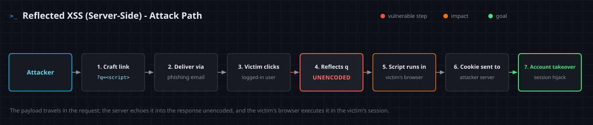

<!--
  Translation bar (added in the translation phase - D1/D10):
  English (this file)
-->

# Reflected XSS (Server-Side)

`A05:2025 – Injection` · Web Vulnerability Knowledge Base

## Summary

Reflected (non-persistent) cross-site scripting occurs when a **server** takes
data from an HTTP request and writes it into the **HTML response it generates**
without proper output encoding. An attacker crafts a link or form whose
parameter carries a script; when a victim triggers it, the server *reflects*
that script into the page and the victim's browser executes it in the security
context of the vulnerable site. Because the payload rides in the request itself,
the attack is delivered to one victim at a time through a crafted URL - nothing
is stored on the server.

This entry covers **server-side** reflected XSS, where the unsafe reflection
happens in server code (here, a Jinja template rendering the value unescaped).
When the same untrusted input is instead written into the page by **client-side
JavaScript**, it is **DOM-based XSS** - the same impact, but a different root
cause and a different place to fix it (covered in
[entry 03](../03-dom-based-xss/)).

## OWASP Top 10 alignment

- **Category:** `A05:2025 – Injection`
- **Why it maps here:** OWASP classifies XSS under **Injection** - reflected XSS
  injects attacker-controlled markup/script into an output context (the HTML
  response) that the browser then interprets and runs. In the Top 10:2025,
  Injection moved from `A03:2021` to **`A05:2025`** (CWE-79 Cross-site Scripting
  is mapped here). XSS was a standalone category as recently as
  `A07:2017 – Cross-Site Scripting` before being folded into Injection.

## How it works

Three things have to line up: an **untrusted source**, a **missing control**,
and a **dangerous sink**.

- **Source** - any request-controlled value: a query-string parameter, a POST
  field, part of the URL path, or even a header the app echoes back (`Referer`,
  `User-Agent`, a search term shown in an error page).
- **Missing control** - the value reaches the response with **no context-aware
  output encoding**: string concatenation into HTML, a template with
  auto-escaping disabled (`|safe`, `raw`, `Html.Raw`, `dangerouslySetInnerHTML`),
  or a raw write to the response stream.
- **Sink** - where the value lands decides which characters are dangerous: HTML
  body (`<`, `>`), an HTML attribute (`"`, `'`), a `<script>` block or event
  handler (JS-string breakout), a `href`/`src` URL (`javascript:`), or a CSS
  context. Encoding must match the sink.

When all three align, the attacker's input stops being *data* and becomes
*markup*. The browser parses the injected `<script>` (or an `onerror`/`onload`
handler) and runs it with the victim's cookies, session, and same-origin
privileges. From there an attacker can steal session tokens, perform actions as
the victim, capture keystrokes, deface the page, or pivot to a full account
takeover.

Reflected XSS differs from its siblings by **where the payload lives** and **who
renders it**: server-side reflected (this entry) bounces straight off a single
request/response, rendered by server code; **stored** XSS is persisted by the
server and served to every viewer; **DOM-based** XSS never reaches the server -
vulnerable client-side JavaScript writes the input into the page in the browser.

## Attack path



1. The attacker finds a parameter (e.g. a site's search field) that is
   reflected into the HTML response without encoding.
2. The attacker crafts a URL embedding a script payload, e.g.
   `https://shop.example/search?q=<script>…</script>`.
3. The attacker delivers the link to a logged-in victim through a phishing
   email, a malicious ad, or a post/DM on another site.
4. The victim clicks; their browser requests the URL and the server reflects
   the payload unencoded into the page.
5. The browser parses and executes the script in the site's origin, running
   with the victim's session.
6. The script reads the victim's session cookie (or token) and sends it to a
   server the attacker controls.
7. The attacker replays the stolen session to take over the victim's account.

## Vulnerable & fixed code

> Each block shows the same flaw and its fix in one language. The pattern is
> identical everywhere: untrusted request data reaches HTML output with no
> context-aware encoding (vulnerable), then is encoded for the HTML context
> (fixed).

<details open><summary><b>Python</b></summary>

**Vulnerable**
```python
from flask import Flask, request

app = Flask(__name__)

@app.get("/search")
def search():
    q = request.args.get("q", "")
    # VULNERABLE: request value concatenated straight into HTML
    return f"<h2>Results for: {q}</h2>"
```
**Fixed**
```python
from flask import Flask, request
from markupsafe import escape

app = Flask(__name__)

@app.get("/search")
def search():
    q = request.args.get("q", "")
    # FIXED: escape() HTML-encodes the value (Jinja autoescaping does the same)
    return f"<h2>Results for: {escape(q)}</h2>"
```
Docs: https://markupsafe.palletsprojects.com/en/stable/escaping/
</details>

<details><summary><b>Java</b></summary>

**Vulnerable**
```java
protected void doGet(HttpServletRequest req, HttpServletResponse resp)
        throws IOException {
    String q = req.getParameter("q");
    PrintWriter out = resp.getWriter();
    // VULNERABLE: parameter written straight into the HTML response
    out.println("<h2>Results for: " + q + "</h2>");
}
```
**Fixed**
```java
import org.owasp.encoder.Encode;

protected void doGet(HttpServletRequest req, HttpServletResponse resp)
        throws IOException {
    String q = req.getParameter("q");
    PrintWriter out = resp.getWriter();
    // FIXED: context-aware HTML entity encoding (OWASP Java Encoder)
    out.println("<h2>Results for: " + Encode.forHtml(q) + "</h2>");
}
```
Docs: https://owasp.org/www-project-java-encoder/
</details>

<details><summary><b>JavaScript</b></summary>

**Vulnerable**
```javascript
const express = require("express");
const app = express();

app.get("/search", (req, res) => {
  const q = req.query.q || "";
  // VULNERABLE: query value concatenated into the HTML response
  res.send(`<h2>Results for: ${q}</h2>`);
});
```
**Fixed**
```javascript
const express = require("express");
const escapeHtml = require("escape-html");
const app = express();

app.get("/search", (req, res) => {
  const q = req.query.q || "";
  // FIXED: HTML-encode untrusted input before embedding it
  res.send(`<h2>Results for: ${escapeHtml(q)}</h2>`);
});
```
Docs: https://www.npmjs.com/package/escape-html
</details>

<details><summary><b>TypeScript</b></summary>

**Vulnerable**
```typescript
import express, { Request, Response } from "express";
const app = express();

app.get("/search", (req: Request, res: Response) => {
  const q = String(req.query.q ?? "");
  // VULNERABLE: untrusted query value flows into HTML unescaped
  res.send(`<h2>Results for: ${q}</h2>`);
});
```
**Fixed**
```typescript
import express, { Request, Response } from "express";
import escapeHtml from "escape-html";
const app = express();

app.get("/search", (req: Request, res: Response) => {
  const q = String(req.query.q ?? "");
  // FIXED: encode before output - types don't stop XSS, encoding does
  res.send(`<h2>Results for: ${escapeHtml(q)}</h2>`);
});
```
Docs: https://www.npmjs.com/package/escape-html
</details>

<details><summary><b>PHP</b></summary>

**Vulnerable**
```php
<?php
$q = $_GET['q'] ?? '';
// VULNERABLE: request value echoed straight into the page
echo "<h2>Results for: " . $q . "</h2>";
```
**Fixed**
```php
<?php
$q = $_GET['q'] ?? '';
// FIXED: htmlspecialchars() encodes < > " ' & for the HTML context
echo "<h2>Results for: " . htmlspecialchars($q, ENT_QUOTES, 'UTF-8') . "</h2>";
```
Docs: https://www.php.net/manual/en/function.htmlspecialchars.php
</details>

<details><summary><b>Ruby</b></summary>

**Vulnerable**
```ruby
require "sinatra"

get "/search" do
  q = params["q"].to_s
  # VULNERABLE: interpolated straight into the response body
  "<h2>Results for: #{q}</h2>"
end
```
**Fixed**
```ruby
require "sinatra"
require "cgi"

get "/search" do
  q = params["q"].to_s
  # FIXED: CGI.escapeHTML encodes the value (Rails ERB <%= %> auto-escapes)
  "<h2>Results for: #{CGI.escapeHTML(q)}</h2>"
end
```
Docs: https://docs.ruby-lang.org/en/3.3/CGI.html#method-c-escapeHTML
</details>

<details><summary><b>Go</b></summary>

**Vulnerable**
```go
package main

import (
	"fmt"
	"net/http"
)

func search(w http.ResponseWriter, r *http.Request) {
	q := r.URL.Query().Get("q")
	// VULNERABLE: fmt.Fprintf does no HTML escaping
	fmt.Fprintf(w, "<h2>Results for: %s</h2>", q)
}
```
**Fixed**
```go
package main

import (
	"html/template"
	"net/http"
)

var tpl = template.Must(template.New("r").Parse("<h2>Results for: {{.}}</h2>"))

func search(w http.ResponseWriter, r *http.Request) {
	q := r.URL.Query().Get("q")
	// FIXED: html/template auto-escapes for the output context
	tpl.Execute(w, q)
}
```
Docs: https://pkg.go.dev/html/template
</details>

<details><summary><b>C#</b></summary>

**Vulnerable**
```csharp
app.MapGet("/search", (string q) =>
{
    // VULNERABLE: raw interpolation returned as text/html
    var html = $"<h2>Results for: {q}</h2>";
    return Results.Content(html, "text/html");
});
```
**Fixed**
```csharp
using System.Text.Encodings.Web;

app.MapGet("/search", (string q) =>
{
    // FIXED: HtmlEncoder encodes untrusted input (Razor's @ does this too)
    var safe = HtmlEncoder.Default.Encode(q);
    return Results.Content($"<h2>Results for: {safe}</h2>", "text/html");
});
```
Docs: https://learn.microsoft.com/en-us/dotnet/api/system.text.encodings.web.htmlencoder
</details>

## Detection signatures

- **Request markers (logs / WAF):** payload fragments in parameters and headers -
  `<script`, `%3Cscript%3E`, `onerror=`, `onload=`, `onmouseover=`,
  `javascript:`, `<`, `document.cookie`, and their URL/HTML/
  Unicode-encoded variants.
- **Reflection test (DAST):** send a unique canary such as `wwa9f2c1'"><svg` and
  check whether it returns **unencoded** in an executable position in the
  response. A safe app returns `&lt;svg`, `&quot;`, `&#39;`.
- **Code review (SAST) patterns:** `|safe` / `render_template_string` on request
  data, `innerHTML =`, `document.write(`, `dangerouslySetInnerHTML`,
  `Html.Raw(`, `echo $_GET`, `out.println(... getParameter`,
  `Fprintf(w, ... Query().Get`.
- **Runtime:** Content-Security-Policy violation reports (`report-to`) and
  unexpected outbound requests originating from a rendered page.
- **Illustrative SIEM query (Splunk-style):**
  ```
  index=web sourcetype=access_combined
  | regex uri_query="(?i)(%3c|<)\s*script|onerror=|javascript:"
  | stats count by src_ip, uri_path, uri_query
  ```

## Remediation checklist

- [ ] **Context-aware output encoding** everywhere untrusted data enters HTML -
  body, attribute, JS, URL, and CSS contexts each need the right encoding.
- [ ] **Keep the framework's auto-escaping on.** Don't reach for `|safe`,
  `raw`, `Html.Raw`, or `dangerouslySetInnerHTML` on untrusted values.
- [ ] **Sanitize, don't encode, when rich HTML is required** - run it through a
  vetted allowlist sanitizer (e.g. DOMPurify) instead of trusting input.
- [ ] **Deploy a strong Content-Security-Policy** (nonce/hash-based, no
  `unsafe-inline`) as defense in depth; adopt **Trusted Types** where supported.
- [ ] **Set session cookies `HttpOnly`** (plus `Secure` and `SameSite`) so
  injected script cannot read them.
- [ ] **Validate and normalize input** at the boundary (type, length, allowlist)
  as hardening - not as the primary defense.
- [ ] **Send correct headers:** `X-Content-Type-Options: nosniff` and an explicit
  `Content-Type` with charset.
- [ ] **Treat a WAF as a compensating control**, never a substitute for encoding.

## References

- OWASP - Cross Site Scripting (XSS): https://owasp.org/www-community/attacks/xss/
- OWASP Cheat Sheet - Cross Site Scripting Prevention: https://cheatsheetseries.owasp.org/cheatsheets/Cross_Site_Scripting_Prevention_Cheat_Sheet.html
- PortSwigger Web Security Academy - Reflected XSS: https://portswigger.net/web-security/cross-site-scripting/reflected
- MDN - Content Security Policy (CSP): https://developer.mozilla.org/en-US/docs/Web/HTTP/CSP

## Lab

A runnable, intentionally vulnerable app lives in [`lab/`](lab/).

```bash
cd lab
docker compose up --build      # build once (needs network), then runs offline
# open http://127.0.0.1:8000
```

**Goal:** the search box reflects your input unescaped, but your own browser
holds no secret. Use the **Report to admin** feature to make the logged-in admin
bot open your crafted link, exploit the reflection to steal the admin's session
cookie into the collector at `/loot`, read the **MD5 flag** from it, and submit
it in the answer box. The flag rotates on every restart.
