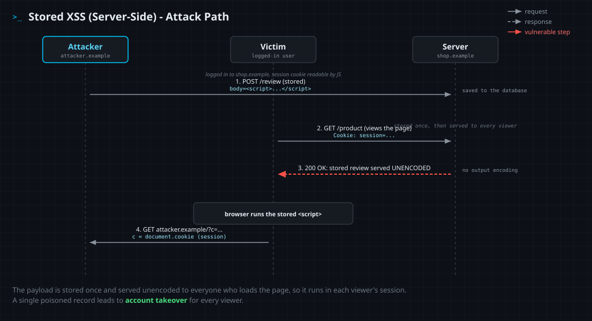

<!--
  Translation bar (added in the translation phase - D1/D10):
  English (this file)
-->

# Stored XSS (Server-Side)

`A05:2025 – Injection` · Web Vulnerability Knowledge Base

## Summary

Stored (persistent) cross-site scripting occurs when a **server saves**
attacker-controlled data - a comment, a review, a profile field - and later
writes it into the **HTML it serves to other users** without proper output
encoding. The attacker submits the payload **once**; the server persists it
(typically in a database) and then replays it into the page for **everyone who
views it**. Each viewer's browser executes the script in the security context of
the vulnerable site, with that viewer's cookies, session, and same-origin
privileges.

This makes stored XSS the most dangerous XSS variant: it needs no per-victim
delivery (no crafted link to send), it fires automatically as users browse
normally, and it tends to land on high-value pages - moderation queues, admin
dashboards, message threads - where staff and other users congregate. A single
poisoned record can compromise many sessions and self-propagate as it is viewed.

This entry covers **server-side** stored XSS, where the server persists the data
and renders it unescaped in server code (here, a Jinja template rendering a
stored value unescaped). When persisted data is instead written into the page by
**client-side JavaScript** (e.g. `el.innerHTML = record.body`), it is
**DOM-based** XSS - the same impact, but the unsafe write happens in the browser,
so it is fixed in client code (this is **stored client-side XSS**, covered in
[entry 04](../04-stored-dom-xss/)). It also differs from
**reflected** XSS ([entry 01](../01-reflected-xss/)), where the payload rides in
a single request and bounces straight back to one victim without being stored.

## OWASP Top 10 alignment

- **Category:** `A05:2025 – Injection`
- **Why it maps here:** OWASP classifies XSS under **Injection** - stored XSS
  injects attacker-controlled markup/script into an output context (the HTML
  response) that the browser then interprets and runs. The only thing that
  changes from reflected is *where the untrusted data comes from* (a datastore
  rather than the current request); the injection and the fix are the same class
  of problem. In the Top 10:2025, Injection moved from `A03:2021` to
  **`A05:2025`** (CWE-79 Cross-site Scripting is mapped here). XSS was a
  standalone category as recently as `A07:2017 – Cross-Site Scripting` before
  being folded into Injection.

## How it works

Three things have to line up: an **untrusted source**, a **missing control**,
and a **dangerous sink** - the same recipe as reflected XSS, but the source is
**persisted** and the payload is served to **many** viewers instead of one.

- **Source** - any stored, attacker-influenced value: a comment or product
  review, a forum post or chat message, a username or display name, a profile
  bio, a support-ticket subject, an uploaded filename, even a log line later
  shown in an admin log viewer. The data is trusted later precisely *because* it
  is "already in our database" - a false assumption.
- **Missing control** - the value is read back and reaches the response with
  **no context-aware output encoding**: string concatenation into HTML, a
  template with auto-escaping disabled (`|safe`, `raw`, `Html.Raw`,
  `dangerouslySetInnerHTML`), or a raw write to the response stream. The bug is
  at the **render** step, not the storage step - storing raw bytes is fine *if*
  every read path encodes for its output context.
- **Sink** - where the value lands decides which characters are dangerous: HTML
  body (`<`, `>`), an HTML attribute (`"`, `'`), a `<script>` block or event
  handler (JS-string breakout), a `href`/`src` URL (`javascript:`), or a CSS
  context. Encoding must match the sink.

When all three align, the attacker's stored input stops being *data* and becomes
*markup*. Every browser that loads the affected page parses the injected
`<script>` (or an `onerror`/`onload` handler) and runs it with that viewer's
cookies, session, and same-origin privileges. From there an attacker can steal
session tokens, perform actions as the victim, capture keystrokes, deface the
page, worm the payload into more records, or pivot to a full account takeover -
and because moderators and admins routinely view user-submitted content, stored
XSS is a classic route to **privilege escalation**.

Stored XSS differs from its siblings by **where the payload lives** and **who
renders it**: stored (this entry) is persisted by the server and served to every
viewer, rendered by server code; **reflected** XSS bounces straight off a single
request/response to one victim; **DOM-based** XSS never depends on the server
rendering - vulnerable client-side JavaScript writes the value into the page in
the browser.

## Attack path



1. The attacker finds an input that is **persisted** and later shown to other
   users (e.g. a product-review field) and is rendered without encoding.
2. The attacker submits a review whose body embeds a script payload, e.g.
   `<script>…</script>` - and the server stores it in its database.
3. The payload now sits in the catalog. No link needs to be sent; the attacker
   simply waits for traffic.
4. A logged-in victim - another customer, or a staff member reviewing content -
   opens the product page in the normal course of browsing.
5. The server reads the stored review and reflects it into the page **unencoded**;
   the victim's browser parses and executes the script in the site's origin,
   running with the victim's session.
6. The script reads the victim's session cookie (or token) and sends it to a
   server the attacker controls.
7. The attacker replays the stolen session to take over the victim's account -
   and the same payload keeps firing for every other viewer of the page.

## Vulnerable & fixed code

> Each block shows the same flaw and its fix in one language. The pattern is
> identical everywhere: a **stored** value is read back and reaches HTML output
> with no context-aware encoding (vulnerable), then is encoded for the HTML
> context on the way out (fixed). The fix lives at the **render** step - data
> being "already in our database" never makes it safe to emit.

<details open><summary><b>Python</b></summary>

**Vulnerable**
```python
from flask import Flask
import sqlite3

app = Flask(__name__)

@app.get("/comments")
def comments():
    db = sqlite3.connect("app.db")
    rows = db.execute("SELECT body FROM comments ORDER BY id DESC").fetchall()
    # VULNERABLE: stored value concatenated straight into HTML
    items = "".join(f"<li>{row[0]}</li>" for row in rows)
    return f"<ul>{items}</ul>"
```
**Fixed**
```python
from flask import Flask
from markupsafe import escape
import sqlite3

app = Flask(__name__)

@app.get("/comments")
def comments():
    db = sqlite3.connect("app.db")
    rows = db.execute("SELECT body FROM comments ORDER BY id DESC").fetchall()
    # FIXED: escape() HTML-encodes each stored value (Jinja autoescaping does the same)
    items = "".join(f"<li>{escape(row[0])}</li>" for row in rows)
    return f"<ul>{items}</ul>"
```
Docs: https://markupsafe.palletsprojects.com/en/stable/escaping/
</details>

<details><summary><b>Java</b></summary>

**Vulnerable**
```java
ResultSet rs = stmt.executeQuery("SELECT body FROM comments ORDER BY id DESC");
PrintWriter out = resp.getWriter();
while (rs.next()) {
    // VULNERABLE: stored value written straight into the response
    out.println("<li>" + rs.getString("body") + "</li>");
}
```
**Fixed**
```java
import org.owasp.encoder.Encode;

ResultSet rs = stmt.executeQuery("SELECT body FROM comments ORDER BY id DESC");
PrintWriter out = resp.getWriter();
while (rs.next()) {
    // FIXED: context-aware HTML entity encoding (OWASP Java Encoder)
    out.println("<li>" + Encode.forHtml(rs.getString("body")) + "</li>");
}
```
Docs: https://owasp.org/www-project-java-encoder/
</details>

<details><summary><b>JavaScript</b></summary>

**Vulnerable**
```javascript
const express = require("express");
const app = express();

app.get("/comments", (req, res) => {
  const rows = db.prepare("SELECT body FROM comments ORDER BY id DESC").all();
  // VULNERABLE: stored values concatenated into the HTML response
  const items = rows.map((r) => `<li>${r.body}</li>`).join("");
  res.send(`<ul>${items}</ul>`);
});
```
**Fixed**
```javascript
const express = require("express");
const escapeHtml = require("escape-html");
const app = express();

app.get("/comments", (req, res) => {
  const rows = db.prepare("SELECT body FROM comments ORDER BY id DESC").all();
  // FIXED: HTML-encode each stored value before embedding it
  const items = rows.map((r) => `<li>${escapeHtml(r.body)}</li>`).join("");
  res.send(`<ul>${items}</ul>`);
});
```
Docs: https://www.npmjs.com/package/escape-html
</details>

<details><summary><b>TypeScript</b></summary>

**Vulnerable**
```typescript
import express, { Request, Response } from "express";
const app = express();

app.get("/comments", (_req: Request, res: Response) => {
  const rows = db.prepare("SELECT body FROM comments ORDER BY id DESC").all() as { body: string }[];
  // VULNERABLE: stored value flows into HTML unescaped
  const items = rows.map((r) => `<li>${r.body}</li>`).join("");
  res.send(`<ul>${items}</ul>`);
});
```
**Fixed**
```typescript
import express, { Request, Response } from "express";
import escapeHtml from "escape-html";
const app = express();

app.get("/comments", (_req: Request, res: Response) => {
  const rows = db.prepare("SELECT body FROM comments ORDER BY id DESC").all() as { body: string }[];
  // FIXED: encode before output - types and a trusted DB don't stop XSS, encoding does
  const items = rows.map((r) => `<li>${escapeHtml(r.body)}</li>`).join("");
  res.send(`<ul>${items}</ul>`);
});
```
Docs: https://www.npmjs.com/package/escape-html
</details>

<details><summary><b>PHP</b></summary>

**Vulnerable**
```php
<?php
$rows = $pdo->query("SELECT body FROM comments ORDER BY id DESC")->fetchAll();
foreach ($rows as $c) {
    // VULNERABLE: stored value echoed straight into the page
    echo "<li>" . $c['body'] . "</li>";
}
```
**Fixed**
```php
<?php
$rows = $pdo->query("SELECT body FROM comments ORDER BY id DESC")->fetchAll();
foreach ($rows as $c) {
    // FIXED: htmlspecialchars() encodes < > " ' & for the HTML context
    echo "<li>" . htmlspecialchars($c['body'], ENT_QUOTES, 'UTF-8') . "</li>";
}
```
Docs: https://www.php.net/manual/en/function.htmlspecialchars.php
</details>

<details><summary><b>Ruby</b></summary>

**Vulnerable**
```ruby
require "sinatra"

get "/comments" do
  rows = DB.execute("SELECT body FROM comments ORDER BY id DESC")
  # VULNERABLE: stored value interpolated straight into the response body
  "<ul>" + rows.map { |r| "<li>#{r['body']}</li>" }.join + "</ul>"
end
```
**Fixed**
```ruby
require "sinatra"
require "cgi"

get "/comments" do
  rows = DB.execute("SELECT body FROM comments ORDER BY id DESC")
  # FIXED: CGI.escapeHTML encodes each value (Rails ERB <%= %> auto-escapes)
  "<ul>" + rows.map { |r| "<li>#{CGI.escapeHTML(r['body'])}</li>" }.join + "</ul>"
end
```
Docs: https://docs.ruby-lang.org/en/3.3/CGI.html#method-c-escapeHTML
</details>

<details><summary><b>Go</b></summary>

**Vulnerable**
```go
func comments(w http.ResponseWriter, r *http.Request) {
	rows, _ := db.Query("SELECT body FROM comments ORDER BY id DESC")
	defer rows.Close()
	for rows.Next() {
		var body string
		rows.Scan(&body)
		// VULNERABLE: Fprintf does no HTML escaping
		fmt.Fprintf(w, "<li>%s</li>", body)
	}
}
```
**Fixed**
```go
var tpl = template.Must(template.New("c").Parse("<li>{{.}}</li>"))

func comments(w http.ResponseWriter, r *http.Request) {
	rows, _ := db.Query("SELECT body FROM comments ORDER BY id DESC")
	defer rows.Close()
	for rows.Next() {
		var body string
		rows.Scan(&body)
		// FIXED: html/template auto-escapes for the output context
		tpl.Execute(w, body)
	}
}
```
Docs: https://pkg.go.dev/html/template
</details>

<details><summary><b>C#</b></summary>

**Vulnerable**
```csharp
app.MapGet("/comments", (AppDb db) =>
{
    var bodies = db.Comments.OrderByDescending(c => c.Id).Select(c => c.Body);
    // VULNERABLE: raw interpolation of stored values returned as text/html
    var html = string.Concat(bodies.Select(b => $"<li>{b}</li>"));
    return Results.Content($"<ul>{html}</ul>", "text/html");
});
```
**Fixed**
```csharp
using System.Text.Encodings.Web;

app.MapGet("/comments", (AppDb db) =>
{
    var bodies = db.Comments.OrderByDescending(c => c.Id).Select(c => c.Body);
    // FIXED: HtmlEncoder encodes stored values (Razor's @ does this too)
    var html = string.Concat(bodies.Select(b => $"<li>{HtmlEncoder.Default.Encode(b)}</li>"));
    return Results.Content($"<ul>{html}</ul>", "text/html");
});
```
Docs: https://learn.microsoft.com/en-us/dotnet/api/system.text.encodings.web.htmlencoder
</details>

## Detection signatures

- **Scan stored data, not just traffic.** Stored XSS hides at rest: grep
  user-content columns (comments, reviews, profile fields, usernames) for
  `<script`, `onerror=`, `onload=`, `onmouseover=`, `javascript:`, `<`, `document.cookie`, and their HTML/URL/Unicode-encoded variants.
- **Second-order (stored) DAST test:** submit a unique canary such as
  `wwa9f2c1'"><svg onload=1>` into every persisted field, then load **every page
  that renders it** (lists, detail views, admin/moderation panels) and check
  whether it returns **unencoded** in an executable position. A safe app returns
  `&lt;svg`, `&quot;`, `&#39;`. The input page and the output page are often
  different - trace input → storage → all read paths.
- **Code review (SAST) patterns on read paths:** `|safe` /
  `render_template_string` on model/DB data, `innerHTML =` from a fetched record,
  `dangerouslySetInnerHTML`, `Html.Raw(model…)`, `echo $row[…]`,
  `out.println(... rs.getString(...))`, `Fprintf(w, ... rows…)`. The tell for
  *stored* XSS is that the tainted value originates from the datastore, not the
  request.
- **Runtime:** Content-Security-Policy violation reports (`report-to`) and
  unexpected outbound requests originating from a rendered page - especially the
  **same** page generating beacons across **many distinct sessions** (a stored
  payload firing for every viewer), which reflected XSS does not produce.
- **Illustrative SIEM query (Splunk-style)** - many sessions beaconing
  cookie-shaped data from one page:
  ```
  index=web sourcetype=access_combined uri_path="/collect" OR uri_query="*document.cookie*"
  | stats dc(src_ip) AS victims values(referer) AS pages BY uri_path
  | where victims > 1
  ```

## Remediation checklist

- [ ] **Treat stored data as untrusted input.** Data from your own database,
  cache, or message queue is still attacker-influenced - encode it on output
  exactly as you would a fresh request value.
- [ ] **Encode at render, in the output context** - body, attribute, JS, URL,
  and CSS contexts each need the right encoding. Prefer encoding on output over
  sanitizing on input; an input filter you add today won't protect data already
  in the table.
- [ ] **Keep the framework's auto-escaping on.** Don't reach for `|safe`,
  `raw`, `Html.Raw`, or `dangerouslySetInnerHTML` on stored values.
- [ ] **Sanitize, don't just encode, when rich HTML is required** (comments that
  allow formatting) - run it through a vetted allowlist sanitizer (e.g.
  DOMPurify) **at render time**, not by trusting what was stored.
- [ ] **Remediate existing rows after a fix.** Audit and re-encode or re-sanitize
  already-stored content; a code fix does not disarm payloads sitting in the DB.
- [ ] **Deploy a strong Content-Security-Policy** (nonce/hash-based, no
  `unsafe-inline`) as defense in depth; adopt **Trusted Types** where supported.
- [ ] **Set session cookies `HttpOnly`** (plus `Secure` and `SameSite`) so an
  injected script can't read them.
- [ ] **Validate and normalize input** at the boundary (type, length, allowlist)
  as hardening - not as the primary defense.
- [ ] **Send correct headers:** `X-Content-Type-Options: nosniff` and an explicit
  `Content-Type` with charset.

## References

- OWASP - Cross Site Scripting (XSS): https://owasp.org/www-community/attacks/xss/
- OWASP - Types of XSS (Stored): https://owasp.org/www-community/Types_of_Cross-Site_Scripting
- OWASP Cheat Sheet - Cross Site Scripting Prevention: https://cheatsheetseries.owasp.org/cheatsheets/Cross_Site_Scripting_Prevention_Cheat_Sheet.html
- PortSwigger Web Security Academy - Stored XSS: https://portswigger.net/web-security/cross-site-scripting/stored
- MDN - Content Security Policy (CSP): https://developer.mozilla.org/en-US/docs/Web/HTTP/CSP

## Lab

A runnable, intentionally vulnerable app lives in [`lab/`](lab/).

```bash
cd lab
docker compose up --build      # build once (needs network), then runs offline
# open http://127.0.0.1:8000
```

**Goal:** the product-reviews board **stores** whatever you post and renders it
back to every visitor without encoding. Your own browser holds no secret - but
the admin bot does. Post a review whose body injects a script, then use **Request
admin review** to make the logged-in admin bot open the *normal* reviews page
(no crafted URL - your **stored** payload is what fires). The script steals the
admin's session cookie into the collector at `/loot`; read the **MD5 flag** from
it and submit it in the answer box. The flag rotates on every restart.
