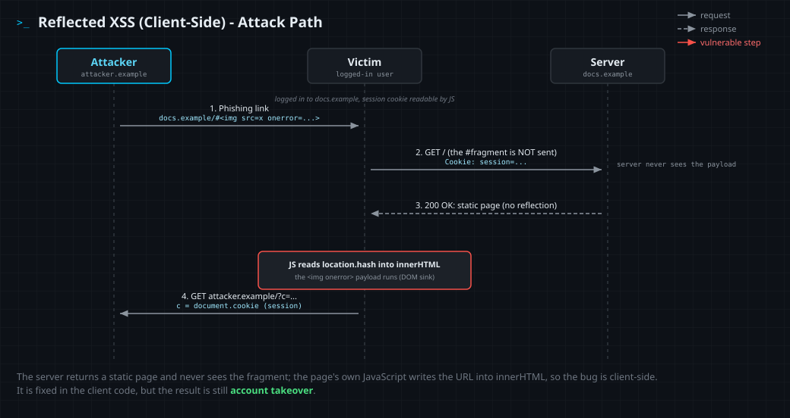

<!--
  Translation bar (added in the translation phase - D1/D10):
  English (this file)
-->

# Reflected XSS (Client-Side)

`A05:2025 – Injection` · Web Vulnerability Knowledge Base

## Summary

Client-side (DOM-based) reflected cross-site scripting occurs when **client-side
JavaScript** reads attacker-controllable data from a source inside the page
(commonly the URL, for example `location.hash` or `location.search`) and writes
it into a **dangerous sink** (such as `element.innerHTML`) without sanitizing it.
The browser parses the injected markup and runs it in the site's origin.

Like server-side reflected XSS ([entry 01](../01-reflected-xss/)), the payload
rides in a single request and targets one victim at a time through a crafted
link. The difference is **where the unsafe step happens**: the server returns
the same static page to everyone and reflects nothing, so the injection occurs
entirely in the browser. When the source is the URL **fragment** (`#...`), the
payload is never even sent to the server, so it leaves no trace in server logs
and no amount of server-side output encoding can fix it. This is **DOM-based
XSS** in its reflected form, and the fix lives in the client code.

## OWASP Top 10 alignment

- **Category:** `A05:2025 – Injection`
- **Why it maps here:** OWASP classifies all XSS under **Injection** (CWE-79).
  DOM-based XSS is the same class realized in the DOM: untrusted data flows into
  an execution sink that the browser interprets and runs. It is distinguished
  from its siblings by **root cause and location** (vulnerable client-side
  JavaScript), not by a different taxonomy. In the Top 10:2025, Injection moved
  from `A03:2021` to **`A05:2025`**.

## How it works

The same three things must line up as in any XSS - an **untrusted source**, a
**missing control**, and a **dangerous sink** - but here all three are in the
**browser**, not in server code.

- **Source** - where untrusted data enters JavaScript: `location.hash`,
  `location.search`, `location.href` / `document.URL`, `document.referrer`,
  `window.name`, the `data` of a `postMessage` event, or values read back from
  `localStorage` / `sessionStorage` / cookies.
- **Missing control** - the value reaches a sink with **no sanitization** and no
  safe-DOM API. A common false sense of security: server-side template
  auto-escaping (Jinja, ERB, Razor) never sees this data path, so it offers no
  protection here.
- **Sink** - where data becomes code. **HTML-parsing sinks:** `innerHTML`,
  `outerHTML`, `insertAdjacentHTML()`, `document.write()` / `writeln()`, jQuery
  `.html()` / `.append()` / `$()`. **JS-execution sinks:** `eval()`,
  `setTimeout()` / `setInterval()` with a string, `new Function()`.
  **Navigation sinks:** assigning to `location` / `location.href` /
  `window.open()` (enables `javascript:` URLs). **Framework escape hatches:**
  React `dangerouslySetInnerHTML`, Angular `bypassSecurityTrustHtml`, Vue
  `v-html`.

Two browser facts shape DOM-XSS exploitation and routinely trip people up:

1. **A `<script>` inserted via `innerHTML` does not execute** (HTML5). So
   `innerHTML` payloads use auto-firing event handlers instead:
   ``, `<svg onload=...>`, `<iframe onload=...>`.
   (Pure JS-execution sinks like `eval()` run supplied JavaScript directly.)
2. **The URL fragment is never sent to the server.** With a `location.hash`
   source the payload never appears in server logs or WAF inspection, and
   server-side encoding is irrelevant. The only effective defenses are in the
   browser: safe sinks, sanitization, and Trusted Types / CSP.

When the source flows to the sink, the attacker's input stops being *data* and
becomes *markup or code*. The browser runs it with the victim's cookies,
session, and same-origin privileges, so the impact is identical to other XSS:
steal session tokens, act as the victim, capture keystrokes, deface the page, or
pivot to a full account takeover.

DOM-based XSS differs from its siblings by **where the unsafe write happens and
who renders it**: server-side reflected ([entry 01](../01-reflected-xss/)) and
**stored** ([entry 02](../02-stored-xss/)) inject in server code and are fixed
there; **DOM-based** (this entry) injects in the browser and is fixed in client
code. The reflected DOM variant covered here carries the payload per-request in
a crafted link; a stored DOM variant reads persisted data (e.g. an API response)
into a sink, so it fires for every viewer (covered in
[entry 04](../04-stored-dom-xss/)).

## Attack path



1. The attacker finds a page whose client JavaScript reads a URL value (e.g.
   `location.hash`) into a sink like `innerHTML` without sanitizing it.
2. The attacker crafts a URL with the payload in the **fragment**, e.g.
   `https://docs.example/#` (an event-handler payload,
   because `innerHTML` will not run a `<script>`), and delivers it to a
   logged-in victim via phishing, a malicious ad, or a DM.
3. The victim clicks; the browser loads the legitimate **static** page. The
   fragment is **not** sent to the server.
4. The page's own JavaScript reads `location.hash` and writes it into the DOM
   via `innerHTML` (the unsafe sink).
5. The browser parses the injected element and its `onerror` handler runs in the
   site's origin, with the victim's session.
6. The script reads the victim's session token and sends it to a server the
   attacker controls.
7. The attacker replays the stolen session to take over the victim's account.

## Vulnerable & fixed code

> DOM-based XSS is a **client-side** flaw: the unsafe write happens in
> JavaScript, in the browser. **JavaScript** and **TypeScript** below show it
> directly. The server languages after them host it only by *shipping* a page
> that contains the vulnerable script - their template escaping never touches
> this data path - so each fix is twofold: correct the client sink (use
> `textContent` / DOMPurify, as in the JavaScript tab) **and** use the one
> server-side lever that helps, a `Content-Security-Policy` response header with
> Trusted Types. No server-side string-encoding function can fix a sink that
> runs after the page loads.

<details open><summary><b>JavaScript</b></summary>

**Vulnerable**
```javascript
// Source: the URL fragment, controlled by whoever crafts the link.
const term = decodeURIComponent(location.hash.slice(1));
// VULNERABLE: innerHTML parses the string as HTML and fires event handlers.
document.getElementById("results").innerHTML = "Results for: " + term;
```
**Fixed**
```javascript
const term = decodeURIComponent(location.hash.slice(1));
// FIXED: textContent never parses HTML - the value is shown as plain text.
document.getElementById("results").textContent = "Results for: " + term;

// If you genuinely need to render HTML, sanitize right before the sink:
//   import DOMPurify from "dompurify";
//   el.innerHTML = DOMPurify.sanitize(term);
```
Docs: https://developer.mozilla.org/en-US/docs/Web/API/Node/textContent
</details>

<details><summary><b>TypeScript</b></summary>

**Vulnerable**
```typescript
const term = decodeURIComponent(location.hash.slice(1));
const el = document.getElementById("results") as HTMLElement;
// VULNERABLE: types describe shape, not safety - innerHTML still parses HTML.
el.innerHTML = `Results for: ${term}`;
```
**Fixed**
```typescript
import DOMPurify from "dompurify";

const term = decodeURIComponent(location.hash.slice(1));
const el = document.getElementById("results") as HTMLElement;
// FIXED: sanitize before innerHTML (or use textContent for plain text).
el.innerHTML = DOMPurify.sanitize(`Results for: ${term}`);
```
Docs: https://github.com/cure53/DOMPurify
</details>

<details><summary><b>Python</b></summary>

**Vulnerable**
```python
from flask import Flask
app = Flask(__name__)

@app.get("/docs")
def docs():
    # The bug is in the inline JS this page ships, NOT in Python. Jinja's
    # autoescaping guards server-rendered values, not this client-side sink.
    return """
      <div id="results"></div>
      <script>
        const t = decodeURIComponent(location.hash.slice(1));
        document.getElementById('results').innerHTML = t;  // VULNERABLE sink
      </script>"""
```
**Fixed**
```python
# FIX the client sink (textContent / DOMPurify). Server-side, the only lever is
# a header: Trusted Types stops a raw string from ever reaching innerHTML.
@app.after_request
def set_csp(resp):
    resp.headers["Content-Security-Policy"] = (
        "default-src 'self'; require-trusted-types-for 'script'"
    )
    return resp
```
Docs: https://developer.mozilla.org/en-US/docs/Web/HTTP/Headers/Content-Security-Policy/require-trusted-types-for
</details>

<details><summary><b>Java</b></summary>

**Vulnerable**
```java
// The sink is the inline JS this page emits; Java never sees the fragment.
protected void doGet(HttpServletRequest req, HttpServletResponse resp)
        throws IOException {
    resp.setContentType("text/html");
    PrintWriter out = resp.getWriter();
    out.println("<div id='results'></div><script>"
        + "document.getElementById('results').innerHTML ="
        + " decodeURIComponent(location.hash.slice(1));"   // VULNERABLE sink
        + "</script>");
}
```
**Fixed**
```java
// FIX the client sink (textContent / DOMPurify). Server-side, send a header:
resp.setHeader("Content-Security-Policy",
    "default-src 'self'; require-trusted-types-for 'script'");
```
Docs: https://owasp.org/www-community/controls/Content_Security_Policy
</details>

<details><summary><b>PHP</b></summary>

**Vulnerable**
```php
<?php
// The flaw is in the client script PHP prints, not in PHP itself.
?>
<div id="results"></div>
<script>
  const t = decodeURIComponent(location.hash.slice(1));
  document.getElementById('results').innerHTML = t;  // VULNERABLE sink
</script>
```
**Fixed**
```php
<?php
// FIX the client sink (textContent / DOMPurify). Server-side, send a header:
header("Content-Security-Policy: default-src 'self'; require-trusted-types-for 'script'");
```
Docs: https://www.php.net/manual/en/function.header.php
</details>

<details><summary><b>Ruby</b></summary>

**Vulnerable**
```ruby
require "sinatra"

get "/docs" do
  # The sink is the inline JS this view renders; Ruby never sees the fragment.
  <<~HTML
    <div id="results"></div>
    <script>
      document.getElementById('results').innerHTML =
        decodeURIComponent(location.hash.slice(1));  // VULNERABLE sink
    </script>
  HTML
end
```
**Fixed**
```ruby
# FIX the client sink (textContent / DOMPurify). Server-side, send a header:
headers "Content-Security-Policy" =>
  "default-src 'self'; require-trusted-types-for 'script'"
```
Docs: https://developer.mozilla.org/en-US/docs/Web/HTTP/Headers/Content-Security-Policy
</details>

<details><summary><b>Go</b></summary>

**Vulnerable**
```go
func docs(w http.ResponseWriter, r *http.Request) {
    // html/template escapes values it interpolates, but here the script reads
    // location.hash at RUNTIME - Go never sees it, so it cannot escape it.
    io.WriteString(w, `<div id="results"></div><script>`+
        `document.getElementById('results').innerHTML =`+
        ` decodeURIComponent(location.hash.slice(1));`+   // VULNERABLE sink
        `</script>`)
}
```
**Fixed**
```go
// FIX the client sink (textContent / DOMPurify). Server-side, send a header:
w.Header().Set("Content-Security-Policy",
    "default-src 'self'; require-trusted-types-for 'script'")
```
Docs: https://pkg.go.dev/net/http#Header.Set
</details>

<details><summary><b>C#</b></summary>

**Vulnerable**
```csharp
app.MapGet("/docs", () =>
{
    // The sink is the inline JS this view emits; C# never sees the fragment.
    var html = "<div id='results'></div><script>" +
        "document.getElementById('results').innerHTML =" +
        " decodeURIComponent(location.hash.slice(1));" +   // VULNERABLE sink
        "</script>";
    return Results.Content(html, "text/html");
});
```
**Fixed**
```csharp
// FIX the client sink (textContent / DOMPurify). Server-side, add a header:
app.Use(async (ctx, next) =>
{
    ctx.Response.Headers.Append("Content-Security-Policy",
        "default-src 'self'; require-trusted-types-for 'script'");
    await next();
});
```
Docs: https://learn.microsoft.com/en-us/aspnet/core/security/content-security-policy
</details>

## Detection signatures

- **Code review (SAST) - trace source to sink in client JS.** Sources:
  `location.hash`, `location.search`, `location.href`, `document.URL`,
  `document.referrer`, `window.name`, a `message` event's `data`. Sinks:
  `innerHTML` / `outerHTML =`, `insertAdjacentHTML(`, `document.write(` /
  `writeln(`, `eval(`, `setTimeout("` / `setInterval("`, `new Function(`,
  `$(...).html(`, `.append(` with markup, `dangerouslySetInnerHTML`,
  `bypassSecurityTrustHtml`, `v-html`, and assignment to `location` /
  `location.href` from a source. Tools: ESLint security plugins, Semgrep
  client-side rules, CodeQL JavaScript taint queries.
- **DAST:** source-to-sink flow is invisible from HTTP alone. Drive a headless
  browser, set the source (e.g. `#">`), and watch
  for sink execution (an `alert`, a Trusted Types violation, an unexpected
  request). PortSwigger DOM Invader and Burp's DOM-based checks automate this.
- **Logs / WAF blind spot:** when the source is the **fragment**, the payload
  never reaches the server, so it appears in **no** access log or WAF rule.
  Query-string DOM XSS may log the parameter, but the server treats it as inert
  data, so a server-side reflection grep finds nothing. Do not rely on
  server-side detection for DOM XSS.
- **Runtime:** CSP `report-to` / `report-uri` and Trusted Types violation
  reports (`require-trusted-types-for 'script'`, run report-only first) surface
  attempts. In DevTools the injected node is visible in the **live DOM** even
  though **View-Source is clean** - a key tell for DOM XSS.
- **Illustrative Semgrep-style pattern:**
  ```
  pattern-either:
    - pattern: $EL.innerHTML = ... location.hash ...
    - pattern: $EL.innerHTML = ... location.search ...
  ```

## Remediation checklist

- [ ] **Prefer safe DOM APIs:** write text with `textContent` / `innerText`,
  build nodes with `createElement` + `append`, set attributes with
  `setAttribute` - never assemble HTML by string concatenation.
- [ ] **Sanitize when HTML is truly required:** run the value through a vetted
  library (DOMPurify) immediately before the sink; do not hand-roll escaping.
- [ ] **Enable Trusted Types** (`Content-Security-Policy:
  require-trusted-types-for 'script'`) so the browser rejects raw strings at
  dangerous sinks; roll out in report-only mode first.
- [ ] **Deploy a strong CSP** (nonce/hash-based `script-src`, no `unsafe-inline`
  / `unsafe-eval`) as defense in depth; restrict `connect-src` / `img-src` to
  limit exfiltration.
- [ ] **Avoid code-from-string sinks** entirely: `eval`, `new Function`, string
  `setTimeout` / `setInterval`, and `document.write`.
- [ ] **Use framework-native binding** (React text, Angular interpolation, Vue
  mustache) and avoid the escape hatches (`dangerouslySetInnerHTML`,
  `bypassSecurityTrust*`, `v-html`) on untrusted data.
- [ ] **Validate / normalize URL-derived data** on the client (allowlist,
  length, expected shape) as hardening, not as the primary defense.
- [ ] **Set session cookies `HttpOnly`** (plus `Secure`, `SameSite`) so injected
  script cannot read them via `document.cookie`.
- [ ] **Remember server-side controls do not cover DOM sinks:** template
  escaping and WAFs cannot fix this - the fix is in client code.

## References

- OWASP - DOM Based XSS: https://owasp.org/www-community/attacks/DOM_Based_XSS
- OWASP Cheat Sheet - DOM based XSS Prevention: https://cheatsheetseries.owasp.org/cheatsheets/DOM_based_XSS_Prevention_Cheat_Sheet.html
- PortSwigger Web Security Academy - DOM-based XSS: https://portswigger.net/web-security/cross-site-scripting/dom-based
- MDN - Trusted Types API: https://developer.mozilla.org/en-US/docs/Web/API/Trusted_Types_API
- DOMPurify: https://github.com/cure53/DOMPurify

## Lab

A runnable, intentionally vulnerable app lives in [`lab/`](lab/).

```bash
cd lab
docker compose up --build      # build once (needs network), then runs offline
# open http://127.0.0.1:8000
```

**Goal:** the docs search reads your term from the URL fragment (`#...`) and
writes it into the page with `innerHTML`, all in client JavaScript, so the
server never sees it and View-Source stays clean. Your own browser holds no
secret. Use the **Report to admin** feature to make the logged-in admin bot open
your crafted `#` link. Because the sink is `innerHTML`, a bare `<script>` will
not run, so use an event-handler payload (`` or
`<svg onload=…>`) to read `document.cookie` and beacon it to the same-origin
collector at `/collect`. Read the **MD5 flag** from `/loot` and submit it in the
answer box. The flag rotates on every restart.
