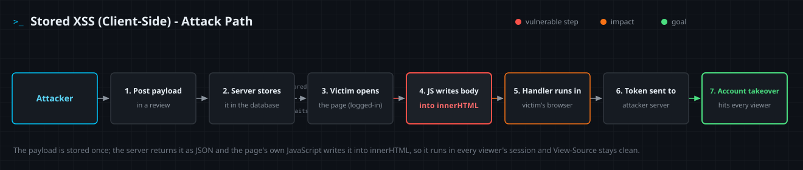

<!--
  Translation bar (added in the translation phase - D1/D10):
  English (this file)
-->

# Stored XSS (Client-Side)

`A05:2025 – Injection` · Web Vulnerability Knowledge Base

## Summary

Stored client-side (DOM-based) cross-site scripting occurs when a server
**persists** attacker-controlled data and later hands it back to the browser as
**data** (typically a JSON API response), and then **client-side JavaScript**
writes that stored value into a **dangerous sink** (such as `element.innerHTML`)
without sanitizing it. The browser parses the injected markup and runs it in the
site's origin.

Like server-side stored XSS ([entry 02](../02-stored-xss/)), the attacker
submits the payload **once**; it is saved and then fires for **every** viewer who
loads the page, with no per-victim link to deliver. The difference is **where
the unsafe step happens**: the server only stores and returns the value (as
JSON, which is correct), and the injection occurs entirely in the browser when
the client renders it. Because the server never emits the payload as markup,
**View-Source is clean** and **server-side output encoding does not apply** - you
encode HTML, but the API returns data. This is **DOM-based XSS** fed by a stored
source, and the fix lives in the client code.

## OWASP Top 10 alignment

- **Category:** `A05:2025 – Injection`
- **Why it maps here:** OWASP classifies all XSS under **Injection** (CWE-79).
  This variant combines two axes: the source is **persisted** (as in stored XSS)
  and the unsafe write is in **client-side JavaScript** (as in DOM-based XSS).
  The injection and its remedy are the same class of problem; only the data's
  origin (a datastore, read back via an API) and the location of the sink (the
  browser) change. In the Top 10:2025, Injection moved from `A03:2021` to
  **`A05:2025`**.

## How it works

The same three ingredients as any XSS - an **untrusted source**, a **missing
control**, and a **dangerous sink** - but the source is **persisted** and the
sink runs in the **browser**.

- **Source** - a stored, attacker-influenced value read back by the client:
  a comment or product review, a username or display name, a profile bio, a chat
  message, a support-ticket subject. The client usually receives it as JSON from
  an API (`fetch('/api/reviews')`), or reads it from `localStorage` /
  `sessionStorage` / `IndexedDB` where it was cached earlier. The data is trusted
  on the way out precisely *because* it is "our own API's data" - a false
  assumption.
- **Missing control** - the value reaches a sink with **no sanitization** and no
  safe-DOM API. Server-side template auto-escaping (Jinja, ERB, Razor) never sees
  this path: the server returned JSON, and a separate client script does the
  unsafe render. JSON encoding is **not** HTML encoding - `JSON.parse` restores
  any `<`/`>` before the value reaches the sink.
- **Sink** - where data becomes code. **HTML-parsing sinks:** `innerHTML`,
  `outerHTML`, `insertAdjacentHTML()`, jQuery `.html()` / `.append()`, framework
  `dangerouslySetInnerHTML` / `v-html`. **JS-execution sinks:** `eval()`,
  `new Function()`. The choice of sink decides which payloads run.

Two browser facts shape exploitation here, exactly as in reflected DOM XSS:

1. **A `<script>` inserted via `innerHTML` does not execute** (HTML5). So a
   stored `innerHTML` payload uses auto-firing event handlers instead:
   ``, `<svg onload=...>`. (A pure JS-execution sink runs
   supplied JavaScript directly.)
2. **The server never renders the payload as HTML.** It lives in the datastore
   and travels as JSON, so it appears in no server-rendered page, no View-Source,
   and no server-side reflection grep. The only effective defenses are in the
   browser: safe sinks, sanitization, Trusted Types / CSP.

When the stored source flows to the sink, the attacker's input stops being
*data* and becomes *markup or code*. **Every** browser that loads the affected
view runs it with that viewer's cookies, session, and same-origin privileges, so
a single poisoned record can compromise many sessions. Because moderators and
admins routinely view user-submitted content, stored XSS (server-side or DOM)
is a classic route to **privilege escalation**.

This variant differs from its siblings by combining *persistence* with a *client
sink*: server-side stored ([entry 02](../02-stored-xss/)) persists the data and
renders it unsafely in **server** code; reflected client-side
([entry 03](../03-dom-based-xss/)) reads a **per-request** URL source into a
client sink; this entry reads a **persisted** source into a client sink, so it
fires for every viewer **and** is fixed in client code.

## Attack path



1. The attacker finds an input that is **persisted** and later rendered by
   client JavaScript from an API response (e.g. a product-review body written
   into `innerHTML`).
2. The attacker submits a review whose body is an event-handler payload, e.g.
   `` (not a `<script>`, which `innerHTML` will not run).
   The server stores it in its database.
3. The payload now sits in the catalog as ordinary data. No link needs to be
   sent; the attacker simply waits for traffic.
4. A logged-in victim - another customer, or a staff member moderating content -
   opens the reviews page in the normal course of browsing.
5. The page's JavaScript fetches the reviews as JSON and writes each stored body
   into the DOM via `innerHTML`; the browser parses the injected element and its
   `onerror` handler runs in the site's origin, with the victim's session.
6. The script reads the victim's session token and sends it to a server the
   attacker controls.
7. The attacker replays the stolen session to take over the account - and the
   same stored payload keeps firing for every other viewer of the page.

## Vulnerable & fixed code

> Stored DOM XSS is a **client-side** flaw: the unsafe write happens in
> JavaScript, in the browser. **JavaScript** and **TypeScript** below show it
> directly (fetch the stored data, then write a record field into `innerHTML`).
> The server languages after them host it only by *shipping* that vulnerable
> client renderer - their JSON API returning the stored value is correct, and
> their template escaping never touches this path - so each fix is twofold:
> correct the client sink (use `textContent` / DOMPurify) **and** use the one
> server-side lever that helps, a `Content-Security-Policy` header with Trusted
> Types. No server-side string-encoding function can fix a sink that runs in the
> browser.

<details open><summary><b>JavaScript</b></summary>

**Vulnerable**
```javascript
// Source: a STORED review body, fetched as JSON from the app's own API.
const reviews = await (await fetch("/api/reviews")).json();
// VULNERABLE: innerHTML parses each stored body as HTML and fires handlers.
list.innerHTML = reviews.map((r) => `<li>${r.body}</li>`).join("");
```
**Fixed**
```javascript
const reviews = await (await fetch("/api/reviews")).json();
// FIXED: build nodes and set text - textContent never parses HTML.
for (const r of reviews) {
  const li = document.createElement("li");
  li.textContent = r.body;        // or: li.innerHTML = DOMPurify.sanitize(r.body)
  list.appendChild(li);
}
```
Docs: https://developer.mozilla.org/en-US/docs/Web/API/Node/textContent
</details>

<details><summary><b>TypeScript</b></summary>

**Vulnerable**
```typescript
interface Review { name: string; body: string; ts: string; }
const reviews: Review[] = await (await fetch("/api/reviews")).json();
// VULNERABLE: types describe shape, not safety - innerHTML still parses HTML.
list.innerHTML = reviews.map((r) => `<li>${r.body}</li>`).join("");
```
**Fixed**
```typescript
import DOMPurify from "dompurify";

interface Review { name: string; body: string; ts: string; }
const reviews: Review[] = await (await fetch("/api/reviews")).json();
// FIXED: sanitize stored HTML before innerHTML (or use textContent for text).
list.innerHTML = reviews.map((r) => `<li>${DOMPurify.sanitize(r.body)}</li>`).join("");
```
Docs: https://github.com/cure53/DOMPurify
</details>

<details><summary><b>Python</b></summary>

**Vulnerable**
```python
from flask import Flask, jsonify
app = Flask(__name__)

@app.get("/api/reviews")
def api_reviews():
    rows = db.execute("SELECT name, body, ts FROM comments").fetchall()
    # Returning JSON DATA is correct - this endpoint is not the bug. The flaw is
    # the inline client script this app ships, which does:
    #   list.innerHTML = rows.map(r => `<li>${r.body}</li>`).join('')   # sink
    return jsonify([dict(r) for r in rows])
```
**Fixed**
```python
# FIX the client renderer (textContent / DOMPurify). The server's lever is a
# header: Trusted Types stops a raw string from ever reaching innerHTML.
@app.after_request
def set_csp(resp):
    resp.headers["Content-Security-Policy"] = (
        "default-src 'self'; require-trusted-types-for 'script'"
    )
    return resp
```
Docs: https://developer.mozilla.org/en-US/docs/Web/HTTP/Headers/Content-Security-Policy/require-trusted-types-for
</details>

<details><summary><b>Java</b></summary>

**Vulnerable**
```java
// The API returns JSON (data) - correct. The sink is in the client JS:
//   list.innerHTML = rows.map(r => `<li>${r.body}</li>`).join('')
resp.setContentType("application/json");
resp.getWriter().print(mapper.writeValueAsString(rows));
```
**Fixed**
```java
// FIX the client renderer (textContent / DOMPurify). Server-side, send a header:
resp.setHeader("Content-Security-Policy",
    "default-src 'self'; require-trusted-types-for 'script'");
```
Docs: https://owasp.org/www-community/controls/Content_Security_Policy
</details>

<details><summary><b>PHP</b></summary>

**Vulnerable**
```php
<?php
// The API returns JSON (data) - correct. The sink is in the client JS:
//   list.innerHTML = rows.map(r => `<li>${r.body}</li>`).join('')
header("Content-Type: application/json");
echo json_encode($rows);
```
**Fixed**
```php
<?php
// FIX the client renderer (textContent / DOMPurify). Server-side, send a header:
header("Content-Security-Policy: default-src 'self'; require-trusted-types-for 'script'");
```
Docs: https://www.php.net/manual/en/function.header.php
</details>

<details><summary><b>Ruby</b></summary>

**Vulnerable**
```ruby
require "sinatra"
require "json"

get "/api/reviews" do
  # The API returns JSON (data) - correct. The sink is in the client JS:
  #   list.innerHTML = rows.map(r => `<li>${r.body}</li>`).join('')
  content_type :json
  DB.execute("SELECT name, body, ts FROM comments").to_json
end
```
**Fixed**
```ruby
# FIX the client renderer (textContent / DOMPurify). Server-side, set a header:
headers "Content-Security-Policy" =>
  "default-src 'self'; require-trusted-types-for 'script'"
```
Docs: https://developer.mozilla.org/en-US/docs/Web/HTTP/Headers/Content-Security-Policy
</details>

<details><summary><b>Go</b></summary>

**Vulnerable**
```go
func apiReviews(w http.ResponseWriter, r *http.Request) {
    // The API returns JSON (data) - correct. The sink is in the client JS:
    //   list.innerHTML = rows.map(r => `<li>${r.body}</li>`).join('')
    w.Header().Set("Content-Type", "application/json")
    json.NewEncoder(w).Encode(rows)
}
```
**Fixed**
```go
// FIX the client renderer (textContent / DOMPurify). Server-side, send a header:
w.Header().Set("Content-Security-Policy",
    "default-src 'self'; require-trusted-types-for 'script'")
```
Docs: https://pkg.go.dev/net/http#Header.Set
</details>

<details><summary><b>C#</b></summary>

**Vulnerable**
```csharp
// The API returns JSON (data) - correct. The sink is in the client JS:
//   list.innerHTML = rows.map(r => `<li>${r.body}</li>`).join('')
app.MapGet("/api/reviews", (AppDb db) =>
    Results.Json(db.Comments.OrderByDescending(c => c.Id).ToList()));
```
**Fixed**
```csharp
// FIX the client renderer (textContent / DOMPurify). Server-side, add a header:
app.Use(async (ctx, next) =>
{
    ctx.Response.Headers.Append("Content-Security-Policy",
        "default-src 'self'; require-trusted-types-for 'script'");
    await next();
});
```
Docs: https://learn.microsoft.com/en-us/aspnet/core/security/content-security-policy
</details>

## Detection signatures

- **Scan stored data, not just traffic.** This XSS hides at rest: grep
  user-content columns (comments, reviews, profile fields, usernames) for
  `<script`, `onerror=`, `onload=`, `onmouseover=`, `javascript:`, `<`, `document.cookie`, and their HTML/URL/Unicode-encoded variants.
- **Code review (SAST) - trace a stored field to a client sink.** The tell is a
  value that originates from an API/`fetch` response or `localStorage` and lands
  in `innerHTML` / `outerHTML =`, `insertAdjacentHTML(`, `$(...).html(`,
  `dangerouslySetInnerHTML`, or `v-html`. Tools: ESLint security plugins,
  Semgrep client-side rules, CodeQL JavaScript taint queries.
- **Second-order (stored) DAST, in a real browser.** Submit a unique canary such
  as `wwa9f2c1` into every persisted field, then load
  **every view that renders it** (lists, detail pages, admin/moderation panels)
  with a headless browser and watch for sink execution. HTTP-only DAST will miss
  it: the server returns JSON, so a response grep finds the payload as inert
  data, not as executable markup.
- **Logs / WAF / View-Source blind spot:** the server never renders the payload,
  so it appears in no server-rendered page and View-Source is clean. In DevTools
  the injected node is visible only in the **live DOM**, built after the
  `fetch`. Do not rely on server-side detection.
- **Runtime:** CSP `report-to` / Trusted Types violation reports, and - a strong
  tell for the *stored* case - the **same** page generating cookie-shaped beacons
  across **many distinct sessions** (one stored payload firing for every viewer),
  which reflected XSS does not produce.

## Remediation checklist

- [ ] **Treat stored data as untrusted on output.** Data from your own API,
  database, or cache is still attacker-influenced - render it safely no matter
  where it came from.
- [ ] **Prefer safe DOM APIs:** write text with `textContent` / `innerText`,
  build nodes with `createElement` + `append` - never assemble HTML from a stored
  string.
- [ ] **Sanitize when stored HTML is truly required** (rich-text comments): run
  it through a vetted library (DOMPurify) **at render time**, not by trusting
  what was stored.
- [ ] **Remediate existing rows after a fix.** A client-code fix does not disarm
  payloads already sitting in the datastore - audit and re-sanitize them.
- [ ] **Enable Trusted Types** (`Content-Security-Policy:
  require-trusted-types-for 'script'`) so the browser rejects raw strings at
  dangerous sinks; roll out in report-only mode first.
- [ ] **Deploy a strong CSP** (nonce/hash-based `script-src`, no `unsafe-inline`
  / `unsafe-eval`) as defense in depth; restrict `connect-src` / `img-src` to
  limit exfiltration.
- [ ] **Use framework-native binding** (React text, Angular interpolation, Vue
  mustache) and avoid the escape hatches (`dangerouslySetInnerHTML`, `v-html`)
  on stored data.
- [ ] **Set session cookies `HttpOnly`** (plus `Secure`, `SameSite`) so injected
  script cannot read them via `document.cookie`.
- [ ] **Remember server-side controls do not cover DOM sinks:** template escaping
  and WAFs cannot fix this - the fix is in client code.

## References

- OWASP - DOM Based XSS: https://owasp.org/www-community/attacks/DOM_Based_XSS
- OWASP - Types of XSS (Stored): https://owasp.org/www-community/Types_of_Cross-Site_Scripting
- OWASP Cheat Sheet - DOM based XSS Prevention: https://cheatsheetseries.owasp.org/cheatsheets/DOM_based_XSS_Prevention_Cheat_Sheet.html
- PortSwigger Web Security Academy - DOM-based XSS: https://portswigger.net/web-security/cross-site-scripting/dom-based
- MDN - Trusted Types API: https://developer.mozilla.org/en-US/docs/Web/API/Trusted_Types_API
- DOMPurify: https://github.com/cure53/DOMPurify

## Lab

A runnable, intentionally vulnerable app lives in [`lab/`](lab/).

```bash
cd lab
docker compose up --build      # build once (needs network), then runs offline
# open http://127.0.0.1:8000
```

**Goal:** the product-reviews board **stores** whatever you post, serves it back
as JSON from `/api/reviews`, and the page's client JavaScript renders each stored
body with `innerHTML`, so the server emits no payload markup and View-Source
stays clean. Your own browser holds no secret. Post a review whose body is an
event-handler payload (a bare `<script>` will not run via `innerHTML`, so use
`` or `<svg onload=…>`), then use **Request admin review**
to make the logged-in admin bot open the *normal* board (no crafted URL - your
**stored** payload is what fires). The script steals the admin's session cookie
into the collector at `/loot`; read the **MD5 flag** from it and submit it in the
answer box. The flag rotates on every restart.
