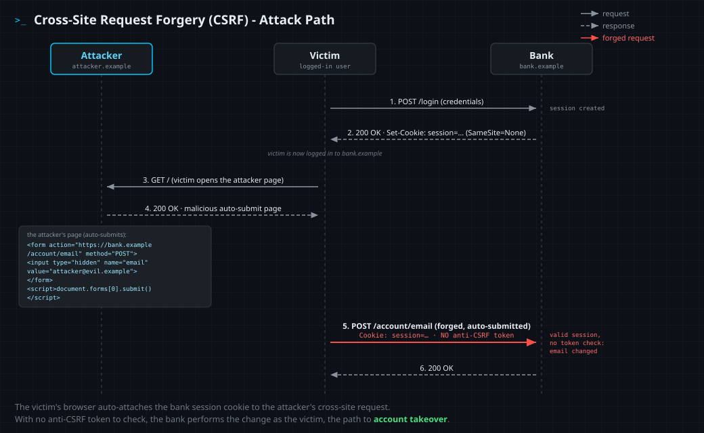

<!--
  Translation bar (added in the translation phase - D1/D10):
  English (this file)
-->

# Cross-Site Request Forgery (CSRF)

`A01:2025 – Broken Access Control` · Web Vulnerability Knowledge Base

## Summary

Cross-site request forgery (CSRF, sometimes XSRF) tricks a victim's browser into
sending a **state-changing request** to an application where the victim is
already logged in, so the action runs **with the victim's privileges** but
**without their intent**. It works because browsers attach a site's cookies to
*every* request to that site, including requests triggered from another site. If
a state-changing endpoint is authenticated by an **ambient credential** (a
session cookie) and validates **no unpredictable, attacker-unknowable value**
(an anti-CSRF token), then any page the victim visits can forge that request.

Unlike XSS, CSRF needs **no script injection** into the target and the attacker
**never reads the response** - the attack is "blind." The attacker only causes a
write: change an email or password, transfer funds, add an admin, toggle a
setting. CSRF is most damaging on actions that bootstrap further access, such as
changing the account's email and then triggering a password reset to it, which
turns a single forged request into full **account takeover**.

## OWASP Top 10 alignment

- **Category:** `A01:2025 – Broken Access Control`
- **Why it maps here:** CSRF is **CWE-352 (Cross-Site Request Forgery)**, which
  OWASP maps under **Broken Access Control**: the application performs a
  privileged action without verifying that the *authenticated user actually
  intended it*, so an attacker exercises access they should not have. CSRF was a
  standalone Top 10 category years ago (`A8:2010`, `A5:2013`) and was then
  dropped as frameworks shipped built-in defenses; it returned folded into
  **Broken Access Control** (`A01:2021`, still `A01:2025`). It is the access-
  control mirror image of its neighbours: not *what* request is made, but
  *whether the user authorized it*.

## How it works

Three conditions must hold at once:

- **A relevant action.** A request that changes server-side state the attacker
  cares about (account email/password, funds transfer, role change, settings).
- **Cookie-based session handling with no other check.** The request is
  authorized purely by a session cookie the browser sends automatically; the app
  does not additionally require a value the attacker cannot supply.
- **No unpredictable request parameters.** Every parameter the attacker needs is
  known or guessable. An **anti-CSRF token** is precisely the unpredictable value
  that breaks this condition.

Given those, the attacker builds a page that issues the request cross-site - most
classically an **auto-submitting HTML form** whose fields carry the attacker's
chosen values:

```html
<form action="https://bank.example/account/email" method="POST">
  <input type="hidden" name="email" value="attacker@evil.example">
</form>
<script>document.forms[0].submit()</script>
```

When a logged-in victim loads that page, the browser submits the form to
`bank.example` and **attaches the victim's session cookie**. The server sees a
valid session and, finding nothing else to check, performs the action as the
victim. A GET-only action is even easier to forge (``,
a link, a redirect).

**SameSite cookies changed the baseline.** Modern browsers default cookies to
`SameSite=Lax`, which stops cookies from riding *cross-site* requests in most
cases - so a cross-site POST no longer carries the session cookie by default,
blunting classic CSRF. But this is **not** a complete defense and is easy to lose:

- `SameSite=Lax` still **sends the cookie on top-level GET navigations**, so any
  state-changing **GET** endpoint remains forgeable (one more reason never to
  change state on GET).
- Apps that set `SameSite=None` (often to support third-party/embedded contexts)
  re-open classic cross-site POST CSRF entirely.
- "Same-site" is not "same-origin": a sibling subdomain or another app on the
  registrable domain is same-site, so `Lax`/`Strict` does not isolate it.

The durable fix is a server-validated **anti-CSRF token** (the synchronizer token
pattern); SameSite and Origin/Referer checks are valuable **defense in depth**.

CSRF is often confused with XSS, but they are opposites. **XSS** runs the
attacker's script *inside* the target's origin (a trust-of-input failure) and can
read responses and steal data. **CSRF** sends a forged request *from outside* and
exploits the browser's automatic, ambient authentication (a trust-of-request
failure); it cannot read the response. Note that an XSS flaw defeats CSRF tokens
(the injected script can read the token), so XSS is the more powerful primitive.

## Attack path



1. The attacker finds a state-changing request (e.g. `POST /account/email`) that
   is authenticated only by the session cookie and validates no anti-CSRF token.
2. The attacker builds a page with an auto-submitting cross-site form (or an
   image/link for a GET action) carrying attacker-chosen values, and hosts it on
   their own site.
3. The attacker lures a logged-in victim to open the page (phishing email, a
   malicious ad, a link on a forum or DM).
4. The victim's browser loads the page and auto-submits the request to the target.
5. The browser **attaches the victim's session cookie** to the cross-site request.
6. The server validates the session, finds no token to check, and performs the
   action as the victim (the account email is changed).
7. The attacker triggers a password reset to the new email and takes over the
   account.

## Vulnerable & fixed code

> The flaw is the **same** everywhere: a state-changing endpoint trusts the
> session cookie and validates no anti-CSRF token. The fix is to use the
> framework's CSRF protection (a server-validated synchronizer token), kept on
> rather than disabled, and to set `SameSite` cookies as defense in depth.

<details open><summary><b>Python</b></summary>

**Vulnerable**
```python
from flask import Flask, request
app = Flask(__name__)

@app.post("/account/email")
def change_email():
    # VULNERABLE: the session cookie alone authorizes the change; no CSRF token
    current_user.email = request.form["email"]
    db.session.commit()
    return "ok"
```
**Fixed**
```python
from flask import Flask
from flask_wtf.csrf import CSRFProtect

app = Flask(__name__)
csrf = CSRFProtect(app)   # FIXED: every POST must carry a valid per-session token
# the form includes {{ csrf_token() }} (or send it as the X-CSRFToken header)
```
Docs: https://flask-wtf.readthedocs.io/en/latest/csrf/
</details>

<details><summary><b>Java</b></summary>

**Vulnerable**
```java
// Spring Security. VULNERABLE: CSRF protection explicitly disabled, so a
// state-changing POST is accepted on the session cookie alone.
http.csrf(csrf -> csrf.disable());
```
**Fixed**
```java
// FIXED: Spring Security enables CSRF tokens by default - keep them on.
// The token is bound to the session and required on modifying requests.
http.csrf(Customizer.withDefaults());
```
Docs: https://docs.spring.io/spring-security/reference/servlet/exploits/csrf.html
</details>

<details><summary><b>JavaScript</b></summary>

**Vulnerable**
```javascript
const express = require("express");
const app = express();

app.post("/account/email", (req, res) => {
  // VULNERABLE: acts on the session cookie, checks no CSRF token
  req.user.email = req.body.email;
  save(req.user);
  res.send("ok");
});
```
**Fixed**
```javascript
const { doubleCsrfProtection } = require("csrf-csrf")({ getSecret: () => SECRET });
// FIXED: require a valid CSRF token (double-submit) on state-changing routes
app.post("/account/email", doubleCsrfProtection, (req, res) => {
  req.user.email = req.body.email;
  save(req.user);
  res.send("ok");
});
```
Docs: https://www.npmjs.com/package/csrf-csrf
</details>

<details><summary><b>TypeScript</b></summary>

**Vulnerable**
```typescript
import express, { Request, Response } from "express";
const app = express();

app.post("/account/email", (req: Request, res: Response) => {
  // VULNERABLE: types don't stop CSRF - the session cookie alone authorizes it
  req.user.email = req.body.email as string;
  save(req.user);
  res.send("ok");
});
```
**Fixed**
```typescript
import { doubleCsrfProtection } from "./csrf"; // configured csrf-csrf instance
// FIXED: validate a CSRF token on every state-changing route
app.post("/account/email", doubleCsrfProtection, (req: Request, res: Response) => {
  req.user.email = req.body.email as string;
  save(req.user);
  res.send("ok");
});
```
Docs: https://www.npmjs.com/package/csrf-csrf
</details>

<details><summary><b>PHP</b></summary>

**Vulnerable**
```php
<?php
session_start();
// VULNERABLE: acts on the session alone, no token check
$_SESSION['email'] = $_POST['email'];
```
**Fixed**
```php
<?php
session_start();
// FIXED: synchronizer token - compare a per-session secret with the form field
if (!hash_equals($_SESSION['csrf'] ?? '', $_POST['csrf'] ?? '')) {
    http_response_code(403);
    exit;
}
$_SESSION['email'] = $_POST['email'];
```
Docs: https://cheatsheetseries.owasp.org/cheatsheets/Cross-Site_Request_Forgery_Prevention_Cheat_Sheet.html
</details>

<details><summary><b>Ruby</b></summary>

**Vulnerable**
```ruby
class AccountsController < ApplicationController
  # VULNERABLE: forgery protection turned off for this action
  skip_before_action :verify_authenticity_token, only: :update_email

  def update_email
    current_user.update!(email: params[:email])
  end
end
```
**Fixed**
```ruby
class ApplicationController < ActionController::Base
  # FIXED: keep Rails' default protection (raises on a bad or missing token);
  # form_with / form_tag emit the authenticity_token automatically.
  protect_from_forgery with: :exception
end
```
Docs: https://guides.rubyonrails.org/security.html#csrf-countermeasures
</details>

<details><summary><b>Go</b></summary>

**Vulnerable**
```go
// VULNERABLE: the POST handler mutates state with no token check
r := mux.NewRouter()
r.HandleFunc("/account/email", changeEmail).Methods("POST")
http.ListenAndServe(":8000", r)
```
**Fixed**
```go
import "github.com/gorilla/csrf"

// FIXED: middleware rejects POSTs without a valid CSRF token; templates embed
// csrf.TemplateField(r) so forms carry it.
http.ListenAndServe(":8000", csrf.Protect(authKey)(r))
```
Docs: https://pkg.go.dev/github.com/gorilla/csrf
</details>

<details><summary><b>C#</b></summary>

**Vulnerable**
```csharp
// ASP.NET Core MVC. VULNERABLE: no antiforgery validation on the state change.
[HttpPost]
public IActionResult ChangeEmail(string email)
{
    _user.Email = email;
    _db.SaveChanges();
    return Ok();
}
```
**Fixed**
```csharp
// FIXED: validate the antiforgery token (paired with @Html.AntiForgeryToken()
// in the form, or the framework's automatic tag-helper token).
[HttpPost]
[ValidateAntiForgeryToken]
public IActionResult ChangeEmail(string email)
{
    _user.Email = email;
    _db.SaveChanges();
    return Ok();
}
```
Docs: https://learn.microsoft.com/en-us/aspnet/core/security/anti-request-forgery
</details>

## Detection signatures

- **CSRF is the absence of a control, so detection is mostly code review.** Flag
  state-changing endpoints (POST/PUT/PATCH/DELETE, or any GET that mutates) that
  do not validate an anti-CSRF token, and any place protection is turned off:
  `@csrf_exempt` / `csrf.exempt`, Spring `.csrf().disable()`, Rails
  `skip_before_action :verify_authenticity_token`, ASP.NET
  `[IgnoreAntiforgeryToken]`, Express apps with no CSRF middleware.
- **Forms and cookies:** HTML forms with no hidden token field; session cookies
  set without a `SameSite` attribute, or with `SameSite=None`.
- **Runtime / traffic:** state-changing requests carrying a valid session cookie
  but an `Origin` / `Referer` that is foreign or missing; the same parameter set
  POSTed across many users in a short window; requests that succeed after the
  token parameter/header is stripped.
- **DAST:** remove or tamper with the token and replay; submit the request from a
  foreign `Origin`; downgrade POST to GET. If the action still succeeds, it is
  forgeable. (PortSwigger Burp and OWASP ZAP both have CSRF checks/generators.)
- There is **no payload signature** to grep for in the request body - the forged
  request looks like a legitimate one. That is the whole point, and why
  server-side controls (tokens, SameSite, Origin checks) matter more than a WAF
  rule.

## Remediation checklist

- [ ] **Validate an anti-CSRF token on every state-changing request** (the
  synchronizer token pattern): a per-session, unpredictable value the server
  issues and verifies. This is the primary fix.
- [ ] **Use the framework's built-in CSRF protection and keep it on** - do not
  disable or exempt endpoints for convenience.
- [ ] **Set session cookies `SameSite=Lax` (or `Strict`)** as defense in depth -
  but do not rely on it alone (GET state changes and same-site contexts slip
  through).
- [ ] **Never perform state changes with GET.** Use POST/PUT/PATCH/DELETE so
  `SameSite=Lax` and method checks actually help.
- [ ] **Verify `Origin` / `Referer`** for state-changing requests and reject
  foreign or missing values (a useful secondary check).
- [ ] **Require re-authentication or step-up** for high-value actions (password
  or email change, payments).
- [ ] **For stateless/cookie-auth APIs**, use the double-submit cookie pattern or
  a required custom header (which forces a CORS preflight). Authenticating with a
  non-cookie token in a custom header (e.g. `Authorization`) is not CSRFable.
- [ ] **Harden the cookie:** `HttpOnly`, `Secure`, and the `__Host-` prefix.
- [ ] **Remember XSS defeats CSRF tokens** - fixing XSS is part of a real CSRF
  defense.

## References

- OWASP - Cross-Site Request Forgery (CSRF): https://owasp.org/www-community/attacks/csrf
- OWASP Cheat Sheet - CSRF Prevention: https://cheatsheetseries.owasp.org/cheatsheets/Cross-Site_Request_Forgery_Prevention_Cheat_Sheet.html
- PortSwigger Web Security Academy - CSRF: https://portswigger.net/web-security/csrf
- MDN - SameSite cookies: https://developer.mozilla.org/en-US/docs/Web/HTTP/Headers/Set-Cookie/SameSite
- MDN - CSRF (glossary): https://developer.mozilla.org/en-US/docs/Glossary/CSRF

## Lab

A runnable, intentionally vulnerable app lives in [`lab/`](lab/).

```bash
cd lab
docker compose up --build      # build once (needs network), then runs offline
# attacker panel: http://127.0.0.1:8000   ·   WildBank target: http://localhost:8000
```

**Goal:** WildBank's `/account/email` changes the logged-in user's email and
checks no anti-CSRF token. It also accepts a **GET**, and the session cookie is
`SameSite=Lax` (the modern default), which still rides a top-level cross-site GET
navigation, the one case Lax does not cover. So the lab is a genuine *cross-site*
attack offline, the app answers on two origins: the **attacker panel** at
`http://127.0.0.1:8000` and the **WildBank** target at `http://localhost:8000`
(different sites, same loopback). You hold no admin session, but the logged-in
admin bot opens any page you host. From the attacker panel, write an exploit page
that auto-submits a cross-site **GET** (a top-level form submission) to the bank's
change-email endpoint, **Store** it, then **Deliver to admin**: the bot's browser
attaches the admin's session cookie to your forged request and the email changes.
The **MD5 flag** then appears on the panel; submit it in the answer box. The flag
rotates on every restart.
