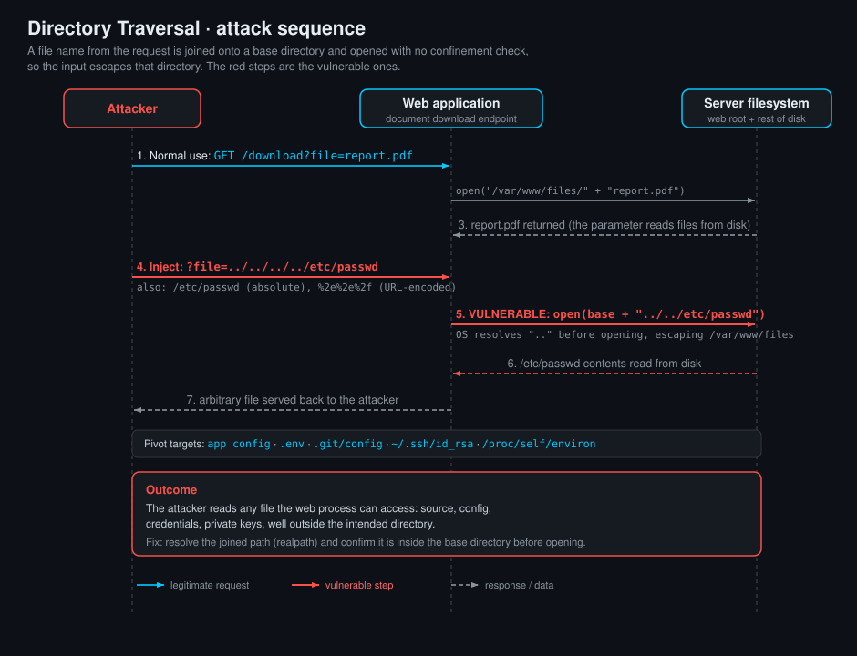

<!--
  Translation bar (added in the translation phase - D1/D10):
  English (this file)

  Writing style: no em dashes in prose. Use commas, colons, parentheses, or
  hyphens. (OWASP IDs keep their official en-dash format.)
-->

# Directory Traversal (Path Traversal)

`A01:2025 – Broken Access Control` · Web Vulnerability Knowledge Base

## Summary

Directory traversal (also called path traversal) happens when an application
builds a filesystem path out of untrusted input and then reads, writes, or serves
that path without confining it to an intended base directory. By inserting
`../` sequences (or an absolute path, or an encoded variant), the attacker walks
out of the directory the developer expected and reaches files anywhere the web
process can read: application source, configuration files, credentials, private
keys, session stores, or the operating system's own files.

The pattern to recognise is any parameter that ends up **inside a file
operation**: a `filename`, `page`, `template`, `doc`, `img`, `download`, `lang`,
or `path` value that is concatenated onto a folder and passed to `open()`,
`read_file()`, `include`, `sendFile()`, `File.ReadAllText()`, or a static-file
handler. A value like `../../../../etc/passwd` turns "show me the terms of
service" into "show me the server's password file". This entry explains directory
listing, the different traversal forms, relative versus absolute paths, the
Windows and Linux path differences, and browser and ASCII encoding, then gives a
large reference of valuable files worth reaching on real servers, followed by a
runnable lab with three real file-operation sinks.

## OWASP Top 10 alignment

- **Category:** `A01:2025 – Broken Access Control`
- **Why it maps here:** path traversal is a failure to enforce that a user may only
  reach the resources they are authorised to reach. The application intends to
  serve files from one directory; the attacker reaches files outside it. It is
  tracked as **CWE-22 (Improper Limitation of a Pathname to a Restricted
  Directory)**, with close relatives **CWE-23 (Relative Path Traversal)**,
  **CWE-36 (Absolute Path Traversal)**, and **CWE-98 (PHP file inclusion / LFI /
  RFI)**. In the Top 10:2025 and 2021 this sits under Broken Access Control
  (`A01`); older editions listed it under "A5:2017 - Broken Access Control" and,
  further back, its own path-traversal entries. When the reachable file is then
  executed (a PHP `include`, a rendered template), traversal becomes Local File
  Inclusion, which can escalate to remote code execution.

## How it works

Three things line up: an **untrusted source** that names a file, a **path built by
joining that name onto a base directory**, and a **file operation** that follows
the resulting path without checking it stays inside the base.

```
base   = "/var/www/app/agreements/"
name   = request.args["doc"]              # attacker controls this
path   = base + name                       # "/var/www/app/agreements/" + "../../../../etc/passwd"
open(path).read()                          # resolves to /etc/passwd
```

The operating system resolves `..` (the parent directory) *before* it opens the
file, so `/var/www/app/agreements/../../../../etc/passwd` collapses to
`/etc/passwd`. Extra `../` beyond the filesystem root are harmless (root's parent
is root), which is why attackers pad with more `../` than strictly needed.

### Directory listing

Directory listing (or directory indexing) is when a web server, asked for a folder
rather than a file, returns an auto-generated HTML index of that folder's contents
instead of a default page. On Apache it is the `Options +Indexes` / `mod_autoindex`
behaviour; on Nginx it is `autoindex on;`; on IIS it is "Directory Browsing".

Listing is not traversal by itself, but the two work together: an exposed index
hands the attacker the exact filenames to request (backup files, `.git/`,
`config.php.bak`, `.env`, database dumps), turning a blind guess into a precise
read. Even without traversal, an open index of a backup or upload directory often
leaks secrets directly. The fix is to disable automatic indexing everywhere it is
not deliberately wanted (`Options -Indexes`, `autoindex off;`) and to keep
sensitive files out of any web-served directory entirely.

### Relative and absolute paths

- A **relative path** is interpreted starting from a base directory: `notice.txt`,
  `sub/notice.txt`, or `../../secret.txt` all mean "relative to where we are".
  Traversal with `../` is the relative-path attack (CWE-23): you climb up from the
  base, then descend into the target.
- An **absolute path** names the file from the filesystem root and ignores the base
  entirely: `/etc/passwd` on Linux, `C:\Windows\win.ini` on Windows. If the code
  does `open(base + name)` an absolute `name` still needs the leading part stripped,
  but many join helpers "helpfully" discard the base when the second argument is
  absolute. For example Python's `os.path.join("/var/www/app", "/etc/passwd")`
  returns `/etc/passwd`, and .NET's `Path.Combine` behaves the same way. That is
  the absolute-path traversal attack (CWE-36): you do not need a single `../`.

Test for both. If `../../../../etc/passwd` is blocked, try `/etc/passwd`
outright; if the absolute form is blocked, try the relative climb.

### Windows and Linux paths

The two families differ in ways that matter for both attack and defence:

| | **Linux / Unix / macOS** | **Windows** |
|---|---|---|
| **Separator** | forward slash `/` | backslash `\` **and** forward slash `/` (the Win32 API accepts both) |
| **Parent directory** | `../` | `..\` and `../` |
| **Root** | single tree from `/` | per-drive: `C:\`, `D:\`, plus UNC `\\server\share` |
| **Case sensitivity** | case-sensitive (`/etc/passwd` is not `/etc/PASSWD`) | case-insensitive (`WIN.INI` = `win.ini`) |
| **Canonical high-value read** | `/etc/passwd`, `/etc/shadow` | `C:\Windows\win.ini`, `C:\Windows\System32\drivers\etc\hosts` |
| **Traversal quirk** | trailing dots/spaces are literal | trailing dots and spaces are stripped; `8.3` short names (`PROGRA~1`); alternate data streams (`file::$DATA`) |

Because Windows accepts both slash styles, a filter that only strips `../` can be
bypassed with `..\`, and vice versa. A robust filter must handle both, or better,
avoid string filtering altogether (see the fix).

### Browser and ASCII encoding

Filters that block the literal string `../` are routinely defeated by encoding the
same bytes a different way. The web stack decodes at several layers (the browser,
the web server, the application framework), so a payload can survive one filter and
be decoded into `../` only after it has passed the check.

| Technique | `../` becomes | Notes |
|---|---|---|
| **Plain ASCII** | `../` , `..\` | the literal sequence; the baseline a naive filter looks for |
| **URL encoding** (percent) | `%2e%2e%2f` , `..%2f` , `%2e%2e/` | `%2e` = `.`, `%2f` = `/`, `%5c` = `\`. The server URL-decodes before the app sees it |
| **Double URL encoding** | `%252e%252e%252f` | `%25` = `%`, so this decodes to `%2e%2e%2f`, then to `../` if a second decode happens (common behind proxies or a misconfigured decoder) |
| **16-bit Unicode / UTF-8 overlong** | `%c0%ae` , `%e0%80%ae` (for `.`), `%c0%af` (for `/`) | overlong UTF-8 encodings of ASCII; historically decoded by IIS/Unicode-lax parsers (the "IIS Unicode" bug) |
| **Non-standard / mixed** | `....//` , `..././` , `..;/` | when a filter strips `../` **once** and non-recursively, `....//` collapses back to `../`; `..;/` abuses path-parameter parsing in some servers and proxies |
| **Null byte** (legacy) | `../../etc/passwd%00.jpg` | `%00` truncated the string at the C layer, dropping a forced `.jpg` suffix. Fixed in modern PHP (>= 5.3.4) and most runtimes, but still worth knowing |

ASCII matters because these are all just different spellings of the same bytes:
`.` is `0x2e`, `/` is `0x2f`, `\` is `0x5c`. A filter that pattern-matches on
characters is fighting an unwinnable battle against the many ways to write those
bytes. The durable fix is to **resolve the path and verify it is inside the base
directory**, which is immune to how the input was spelled (see below).

## Attack path



1. The attacker finds a parameter that names a file: a document viewer
   (`?doc=terms.txt`), an avatar loader (`?img=avatar1.png`), a download link
   (`?file=receipt-001.txt`).
2. They confirm the file is read from disk by requesting a known-good value and
   getting its contents back.
3. They inject a traversal sequence: `../../../../etc/passwd` (relative), then, if
   filtered, `/etc/passwd` (absolute) and the encoded variants (`%2e%2e%2f`,
   `..%2f`, `%252e%252e%252f`, `....//`).
4. A successful read of a file outside the base directory confirms the flaw.
5. They pivot to **valuable files**: application config and source, `.env`,
   database configs and dumps, private keys, `.git/`, container secrets (see the
   reference below).
6. The recovered secret (here an MD5 flag in an `.env_backup` file kept outside the
   web root) confirms the compromise. If the reachable file is also executed
   (`include`), the read becomes Local File Inclusion and can lead to code
   execution.

## Valuable files and default locations

Once traversal works, value comes from knowing *what* to read. These are the files
worth reaching on a typical server, with their default locations. Paths vary by
distribution, version, and install method; treat them as strong starting guesses.

### Web servers

| | **Apache HTTP Server** | **Nginx** |
|---|---|---|
| **Main config (Linux)** | `/etc/apache2/apache2.conf` (Debian/Ubuntu), `/etc/httpd/conf/httpd.conf` (RHEL/CentOS) | `/etc/nginx/nginx.conf` |
| **Site / vhost config** | `/etc/apache2/sites-enabled/*.conf`, `/etc/apache2/sites-available/*` | `/etc/nginx/sites-enabled/*`, `/etc/nginx/conf.d/*.conf` |
| **Per-directory override** | `.htaccess`, `.htpasswd` (in the web dir) | (none; Nginx has no per-dir file) |
| **Default web root** | `/var/www/html/` | `/usr/share/nginx/html/`, `/var/www/html/` |
| **Access / error logs** | `/var/log/apache2/access.log`, `/error.log` (Debian); `/var/log/httpd/` (RHEL) | `/var/log/nginx/access.log`, `/error.log` |
| **Config (Windows)** | `C:\Apache24\conf\httpd.conf`, XAMPP `C:\xampp\apache\conf\httpd.conf` | `C:\nginx\conf\nginx.conf` |

Logs are valuable beyond reconnaissance: if the app also has an include/LFI sink, a
poisoned `User-Agent` or request line written into `access.log` can be included and
executed (log poisoning).

### Databases

| Engine | Main config (Linux) | Data / dumps | Windows | Credentials worth finding |
|---|---|---|---|---|
| **MySQL / MariaDB** | `/etc/mysql/my.cnf`, `/etc/my.cnf`, `/etc/mysql/mariadb.conf.d/*` | `/var/lib/mysql/` | `C:\ProgramData\MySQL\MySQL Server X.Y\my.ini`, XAMPP `C:\xampp\mysql\bin\my.ini` | `debian.cnf` (Debian maintenance login), app `.env` / `config.php` DB creds |
| **PostgreSQL** | `postgresql.conf`, `pg_hba.conf` (in the data dir, e.g. `/etc/postgresql/<ver>/main/` or `/var/lib/pgsql/data/`) | `/var/lib/postgresql/<ver>/main/` | `C:\Program Files\PostgreSQL\<ver>\data\postgresql.conf` | `.pgpass` in the service user's home |
| **Microsoft SQL Server** | `/var/opt/mssql/mssql.conf` (Linux) | `/var/opt/mssql/data/` | `C:\Program Files\Microsoft SQL Server\...`, `ERRORLOG` | connection strings in `web.config` / `appsettings.json` |
| **Oracle** | `init<SID>.ora`, `spfile<SID>.ora`, `listener.ora`, `tnsnames.ora` (under `$ORACLE_HOME/network/admin/`) | `oradata/` | `C:\app\<user>\product\<ver>\...` | `tnsnames.ora` (hosts/SIDs), wallet files |
| **MongoDB (NoSQL)** | `/etc/mongod.conf` | `/var/lib/mongodb/` | `C:\Program Files\MongoDB\Server\<ver>\bin\mongod.cfg` | keyfile referenced by `security.keyFile` |
| **Redis (NoSQL)** | `/etc/redis/redis.conf` | `/var/lib/redis/dump.rdb` | (usually Linux / container) | `requirepass` in `redis.conf`, the `dump.rdb` snapshot |
| **CouchDB / Cassandra (NoSQL)** | `/opt/couchdb/etc/local.ini`; `/etc/cassandra/cassandra.yaml` | data dirs per config | varies | admin creds in `local.ini`, cluster config in `cassandra.yaml` |

### Operating-system files

**Linux / Unix**

| File | Why it is valuable |
|---|---|
| `/etc/passwd` | user accounts, home dirs, shells (world-readable, the canonical proof of traversal) |
| `/etc/shadow` | password hashes (root-readable only, a real prize if the web user is privileged) |
| `/etc/hosts`, `/etc/hostname`, `/etc/resolv.conf` | network layout, internal names |
| `/etc/crontab`, `/etc/cron.d/*` | scheduled jobs, sometimes with inline credentials |
| `/proc/self/environ`, `/proc/self/cmdline` | the web process's environment variables (often DB creds, API keys) and command line |
| `~/.ssh/id_rsa`, `~/.ssh/authorized_keys` | private keys and trust relationships |
| `~/.bash_history`, `~/.mysql_history`, `~/.psql_history` | commands, sometimes with passwords typed inline |
| `/etc/ssh/sshd_config` | SSH server configuration |

**Windows**

| File | Why it is valuable |
|---|---|
| `C:\Windows\win.ini`, `C:\Windows\System32\drivers\etc\hosts` | low-privilege, reliable proof of traversal |
| `C:\Windows\System32\config\SAM`, `SYSTEM` | local account hashes (usually locked while running; try shadow copies) |
| `C:\inetpub\wwwroot\web.config` | IIS app config, connection strings |
| `C:\Windows\Panther\Unattend.xml`, `sysprep.inf` | deployment credentials |
| `C:\Users\<user>\.ssh\id_rsa`, `%APPDATA%` app configs | keys and app secrets |
| `C:\Windows\debug\NetSetup.log`, IIS logs | recon, sometimes credentials |

**macOS**

| File | Why it is valuable |
|---|---|
| `/etc/passwd`, `/etc/hosts` | present as on Unix (account hashes live in the DirectoryService / `.plist` store, not `/etc/shadow`) |
| `/etc/apache2/httpd.conf` | the bundled Apache config |
| `~/Library/Keychains/login.keychain-db` | the user keychain (encrypted, but worth exfiltrating) |
| `~/.ssh/id_rsa`, `~/.aws/credentials`, `~/.zsh_history` | keys, cloud creds, shell history |
| `/Library/Preferences/`, `~/Library/Application Support/` | app configuration and tokens |

### Developer and infrastructure files

| Target | Path(s) | Why it is valuable |
|---|---|---|
| **`.env`** | app root: `.env`, `.env.local`, `.env.production`, and backups `.env.bak`, `.env_backup`, `.env.save`, `.env~` | the single richest file: DB creds, API keys, secret keys, tokens. Backup copies survive `.gitignore` and web-server `.env` deny rules |
| **Git** | `.git/config`, `.git/HEAD`, `.git/index`, `.git/logs/HEAD`, `.git/refs/`, pack files under `.git/objects/` | an exposed `.git/` lets an attacker reconstruct the full source (and its history of removed secrets) |
| **Docker** | `Dockerfile`, `docker-compose.yml`, `.dockerignore`, `/proc/self/environ` inside a container, `/run/secrets/<name>` (swarm secrets), `~/.docker/config.json` (registry auth) | build-time args and env, mounted secrets, registry credentials |
| **App config / source** | `config.php`, `settings.py`, `application.properties`, `appsettings.json`, `wp-config.php`, `web.config`, `config/database.yml` | database and service credentials, secret keys |
| **CI / cloud** | `.aws/credentials`, `.npmrc`, `.git-credentials`, `id_rsa`, `kubeconfig`, `.netrc` | cloud, package-registry, and cluster credentials |

A backup of a secrets file (`.env_backup`, `config.php.bak`, `database.yml~`) is a
recurring win: editors and deploy scripts leave these behind, they usually are not
covered by the deny rules written for the original filename, and they contain the
same secrets. The lab's flag lives in exactly such a file.

## Vulnerable & fixed code

> Every block shows the same flaw and its fix. Vulnerable = user input is joined
> onto a base directory and opened with no confinement check. Fixed = resolve the
> final path to its canonical (real) form and verify it is still **inside** the
> intended base directory before touching it. Resolving-then-checking is immune to
> `../`, absolute paths, slash style, symlinks, and every encoding, because it acts
> on the real path the OS produced, not on the spelling of the input.

<details open><summary><b>Python</b></summary>

**Vulnerable**
```python
import os
from flask import request, send_file

BASE = "/var/www/app/agreements"

def get_doc():
    name = request.args.get("doc", "")
    # VULNERABLE: name is joined and opened with no confinement check.
    # os.path.join also DROPS the base if name is absolute ("/etc/passwd").
    path = os.path.join(BASE, name)
    return send_file(path)
```
**Fixed**
```python
import os
from flask import request, abort, send_file

BASE = os.path.realpath("/var/www/app/agreements")

def get_doc():
    name = request.args.get("doc", "")
    # FIXED: resolve to the real absolute path, then confirm it is inside BASE.
    # os.path.commonpath compares resolved paths, so ../, absolute, encoded, and
    # symlinked inputs all fail the check.
    path = os.path.realpath(os.path.join(BASE, name))
    if os.path.commonpath([BASE, path]) != BASE:
        abort(404)
    return send_file(path)
```
Docs: https://docs.python.org/3/library/os.path.html#os.path.realpath
</details>

<details><summary><b>Java</b></summary>

**Vulnerable**
```java
// VULNERABLE: the request value is resolved against the base with no check
File base = new File("/var/www/app/agreements");
File f = new File(base, request.getParameter("doc"));
return Files.readAllBytes(f.toPath());
```
**Fixed**
```java
// FIXED: canonicalize, then require the result to sit under the base path
Path base = Paths.get("/var/www/app/agreements").toRealPath();
Path f = base.resolve(request.getParameter("doc")).normalize().toRealPath();
if (!f.startsWith(base)) {
    throw new SecurityException("path traversal blocked");
}
return Files.readAllBytes(f);
```
Docs: https://docs.oracle.com/javase/8/docs/api/java/nio/file/Path.html#normalize--
</details>

<details><summary><b>JavaScript</b></summary>

**Vulnerable**
```javascript
const path = require("path");
const BASE = "/var/www/app/agreements";

app.get("/doc", (req, res) => {
  // VULNERABLE: user input joined and sent with no confinement check
  res.sendFile(path.join(BASE, req.query.doc));
});
```
**Fixed**
```javascript
const path = require("path");
const BASE = path.resolve("/var/www/app/agreements");

app.get("/doc", (req, res) => {
  // FIXED: resolve, then verify the result is still under BASE
  const target = path.resolve(BASE, req.query.doc);
  if (target !== BASE && !target.startsWith(BASE + path.sep)) {
    return res.status(404).end();
  }
  res.sendFile(target);
});
```
Docs: https://nodejs.org/api/path.html#pathresolvepaths
</details>

<details><summary><b>TypeScript</b></summary>

**Vulnerable**
```typescript
import path from "path";
const BASE = "/var/www/app/agreements";

// VULNERABLE: types do not stop traversal - this still joins raw input
app.get("/doc", (req, res) => {
  res.sendFile(path.join(BASE, req.query.doc as string));
});
```
**Fixed**
```typescript
import path from "path";
const BASE = path.resolve("/var/www/app/agreements");

app.get("/doc", (req, res) => {
  // FIXED: resolve then confine to BASE
  const target = path.resolve(BASE, req.query.doc as string);
  if (target !== BASE && !target.startsWith(BASE + path.sep)) {
    return res.status(404).end();
  }
  res.sendFile(target);
});
```
Docs: https://nodejs.org/api/path.html#pathresolvepaths
</details>

<details><summary><b>PHP</b></summary>

**Vulnerable**
```php
<?php
$base = "/var/www/app/agreements/";
// VULNERABLE: user input concatenated straight into a file read
// (with include/require this becomes Local File Inclusion => code execution)
$name = $_GET["doc"];
echo file_get_contents($base . $name);
```
**Fixed**
```php
<?php
$base = realpath("/var/www/app/agreements");
// FIXED: realpath() resolves ../, symlinks, and absolute paths; then confirm prefix
$path = realpath($base . DIRECTORY_SEPARATOR . $_GET["doc"]);
if ($path === false || strncmp($path, $base . DIRECTORY_SEPARATOR, strlen($base) + 1) !== 0) {
    http_response_code(404);
    exit;
}
echo file_get_contents($path);
```
Docs: https://www.php.net/manual/en/function.realpath.php
</details>

<details><summary><b>Ruby</b></summary>

**Vulnerable**
```ruby
BASE = "/var/www/app/agreements"
# VULNERABLE: params[:doc] joined and read with no check
send_file File.join(BASE, params[:doc])
```
**Fixed**
```ruby
BASE = File.realpath("/var/www/app/agreements")
# FIXED: expand to the real path, then require it to sit under BASE
path = File.realpath(File.join(BASE, params[:doc])) rescue nil
raise ActionController::RoutingError, "not found" unless
  path && path.start_with?(BASE + File::SEPARATOR)
send_file path
```
Docs: https://docs.ruby-lang.org/en/3.3/File.html#method-c-realpath
</details>

<details><summary><b>Go</b></summary>

**Vulnerable**
```go
base := "/var/www/app/agreements"
// VULNERABLE: filepath.Join cleans ".." but still lets input climb out of base
p := filepath.Join(base, r.URL.Query().Get("doc"))
http.ServeFile(w, r, p)
```
**Fixed**
```go
base, _ := filepath.Abs("/var/www/app/agreements")
// FIXED: resolve, then require the cleaned path to stay within base
p, _ := filepath.Abs(filepath.Join(base, r.URL.Query().Get("doc")))
if p != base && !strings.HasPrefix(p, base+string(os.PathSeparator)) {
    http.NotFound(w, r)
    return
}
http.ServeFile(w, r, p)
```
Docs: https://pkg.go.dev/path/filepath#Clean
</details>

<details><summary><b>C#</b></summary>

**Vulnerable**
```csharp
var baseDir = @"C:\www\app\agreements";
// VULNERABLE: Path.Combine DROPS the base if 'doc' is absolute ("C:\Windows\win.ini")
var path = Path.Combine(baseDir, Request.Query["doc"]);
return File(System.IO.File.ReadAllBytes(path), "application/octet-stream");
```
**Fixed**
```csharp
var baseDir = Path.GetFullPath(@"C:\www\app\agreements");
// FIXED: get the full canonical path, then confirm it is under baseDir
var path = Path.GetFullPath(Path.Combine(baseDir, Request.Query["doc"]));
if (!path.StartsWith(baseDir + Path.DirectorySeparatorChar, StringComparison.Ordinal)) {
    return NotFound();
}
return File(System.IO.File.ReadAllBytes(path), "application/octet-stream");
```
Docs: https://learn.microsoft.com/en-us/dotnet/api/system.io.path.getfullpath
</details>

## Detection signatures

- **Input markers in traffic and logs:** `../`, `..\`, `..%2f`, `%2e%2e%2f`,
  `%252e%252e`, `....//`, `..;/`, `%c0%ae`, a leading `/` or drive letter
  (`C:\`) in a filename parameter, and known target names (`etc/passwd`,
  `win.ini`, `web.config`, `.env`, `.git/`, `/proc/self/environ`) in query
  strings, form bodies, headers, and cookies.
- **Responses that leak file content:** a parameter that echoes back
  `root:x:0:0:` (passwd), `[extensions]` / `[mci extensions]` (win.ini), or the
  literal text of config files is a confirmed read.
- **Behavioural anomalies:** many requests to one file parameter differing only in
  the number of `../` segments (depth brute force), or requests whose filename
  suddenly contains path separators where legitimate values never do.
- **SAST patterns:** user input reaching `open`, `file_get_contents`, `include`,
  `require`, `readFile`, `sendFile`, `send_file`, `ServeFile`,
  `File.ReadAllText`, `new File(base, input)`, or `Path.Combine` / `os.path.join`
  with a request value as the second argument, without a subsequent
  realpath / `startsWith(base)` confinement check.
- **Illustrative SIEM query (Splunk-style)** - traversal markers against a file
  parameter:
  ```
  index=web sourcetype=access_combined
  | regex uri_query="(?i)(\.\.[\/\\]|%2e%2e|%252e|\.\.;|/etc/passwd|win\.ini|\.env|/proc/self)"
  | stats count values(uri_query) BY src_ip, uri_path
  | where count > 5
  ```

## Remediation checklist

- [ ] **Do not build file paths from user input where avoidable.** Map an
  identifier to a fixed, server-side list of allowed files
  (`{"terms": "terms.txt"}`) and serve only from that map. This is the strongest
  control: the user never supplies a path at all.
- [ ] **If you must accept a name, resolve then confine.** Compute the canonical
  absolute path (`realpath` / `Path.GetFullPath` / `toRealPath` / `filepath.Abs`)
  and verify it is inside the intended base directory before opening. This defeats
  `../`, absolute paths, slash style, symlinks, and every encoding at once.
- [ ] **Reject rather than sanitize.** Prefer denying inputs that contain path
  separators, `..`, null bytes, or that decode to them, over trying to strip them:
  recursive and encoded payloads defeat single-pass stripping (`....//`).
- [ ] **Canonicalize once, decode once.** Do the confinement check on the fully
  decoded, resolved path, and avoid decoding again afterwards (double-decoding is a
  classic bypass).
- [ ] **Keep secrets out of any web-served directory.** `.env`, backups, keys, and
  `.git/` should live outside the document root so even a successful read finds
  nothing sensitive.
- [ ] **Disable directory listing** (`Options -Indexes`, `autoindex off;`, IIS
  Directory Browsing off) and add deny rules for dotfiles and backup extensions
  (`.env*`, `*.bak`, `*~`, `.git`).
- [ ] **Run the web process with least privilege** and, where possible, inside a
  chroot / jail or container so the reachable filesystem is small.
- [ ] **Add monitoring / WAF** for the signatures above as a detective layer,
  knowing a WAF is a speed bump, not the fix.

## References

- OWASP - Path Traversal: https://owasp.org/www-community/attacks/Path_Traversal
- OWASP Web Security Testing Guide - Testing Directory Traversal / File Include: https://owasp.org/www-project-web-security-testing-guide/latest/4-Web_Application_Security_Testing/05-Authorization_Testing/01-Testing_Directory_Traversal_File_Include
- OWASP Cheat Sheet - Input Validation: https://cheatsheetseries.owasp.org/cheatsheets/Input_Validation_Cheat_Sheet.html
- PortSwigger Web Security Academy - Directory traversal: https://portswigger.net/web-security/file-path-traversal
- MITRE - CWE-22: https://cwe.mitre.org/data/definitions/22.html
- MITRE - CWE-36 (Absolute Path Traversal): https://cwe.mitre.org/data/definitions/36.html

## Lab

A runnable, intentionally vulnerable app lives in [`lab/`](lab/). "WildFiles
Portal" is a small account app with **three real file-operation sinks**, not a
single text box: a registration agreement viewer, a profile-picture loader, and a
document download. Each joins your input onto a base directory and reads it with no
confinement check.

```bash
cd lab
docker compose up --build      # build once (needs network), then runs offline
# open http://127.0.0.1:8000
```

**Goal:** recover the **MD5 flag** stored in `.env_backup`, a backup of the
environment file kept **outside the web root**
(`/opt/wildfiles/secret/.env_backup` in the container). Reach it through any of the
three sinks, with a **relative** climb
(`../../../../opt/wildfiles/secret/.env_backup`) or an **absolute** path
(`/opt/wildfiles/secret/.env_backup`), and try the encoded variants when you want
to practise filter bypasses. Submit the flag in the answer box. It rotates on every
restart.

The three sinks each read from their own base directory:

```
agreements/  -> terms.txt, privacy.txt        (registration agreement viewer, ?doc=)
avatars/     -> avatar1.svg, avatar2.svg       (profile picture loader, ?img=)
documents/   -> receipt-001.txt, welcome.txt   (document download, ?file=)
secret/.env_backup                             <- the flag, outside every base dir
```
