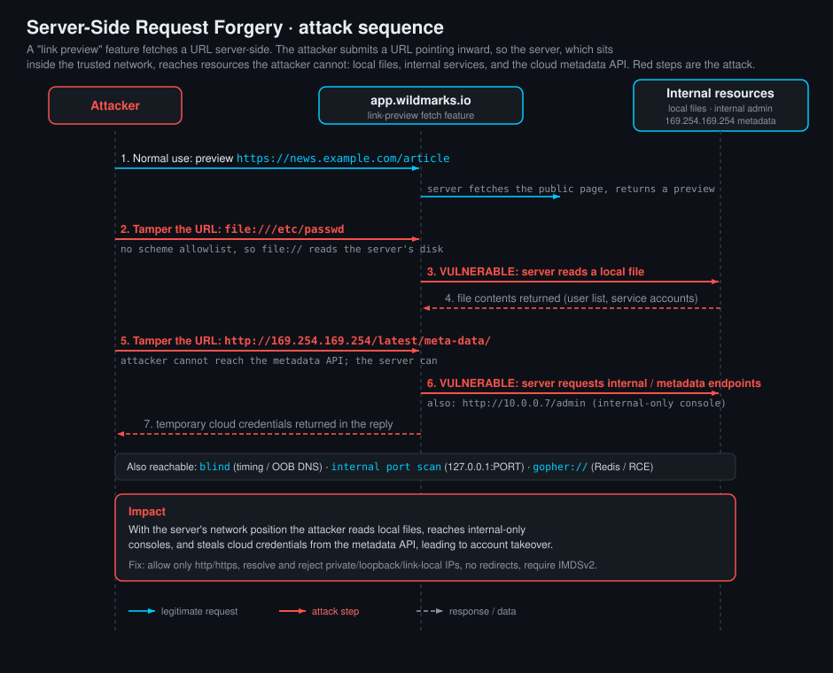

<!--
  Translation bar (added in the translation phase - D1/D10):
  English (this file)

  Writing style: no em dashes in prose. Use commas, colons, parentheses, or
  hyphens. (OWASP IDs keep their official en-dash format.)
-->

# Server-Side Request Forgery (SSRF)

`A01:2025 – Broken Access Control` · Web Vulnerability Knowledge Base

## Summary

Server-Side Request Forgery (SSRF) is a flaw where an attacker persuades a
**server** to make a network request on their behalf, to a destination the
attacker chooses. The application meant to fetch a URL for a normal reason (build
a link preview, pull an image, call a webhook, import a document). The bug is
that it fetches **whatever URL you give it**, so instead of an innocent external
page you point it at somewhere you are not supposed to reach, and the server,
which sits inside the trusted network, dutifully goes and gets it for you.

The mental model that makes SSRF click: you are not attacking with your own
computer any more. You have borrowed the **server's identity and network
position**. Your laptop cannot reach the company's internal admin panel, its
database, or the cloud provider's metadata service, because a firewall stands in
the way. The server can reach all of those, because it lives on the inside. When
you make the server fetch a URL of your choosing, every door that was open to the
server is now open to you.

Picture a "URL preview" box that turns a link you paste into a little card with
the page title. Behind it, the code does roughly `fetch(the URL you typed)`. Paste
`https://example.com` and you get a preview. Paste
`http://169.254.169.254/latest/meta-data/iam/security-credentials/` and, on a
cloud box, the server hands you back the machine's temporary cloud credentials.
Paste `file:///etc/passwd` and it reads a local file off the server's disk. You
did not break in. You asked the server nicely, and it had no reason to say no.

This entry explains where SSRF hides and how to hunt for it, walks through the
**alternative URL schemes** that turn a "fetch a web page" feature into a local
file reader and an internal port scanner, covers the address tricks used to slip
past naive filters, and ends with a runnable lab: a realistic "WildMarks"
saved-links app whose link-preview feature fetches URLs server-side. There is no
URL input box on the page, so you exploit it the way you would a real target,
with Burp Suite: intercept the request and tamper the URL it fetches, reaching a
local file with `file:///etc/passwd` and an **internal** service your own browser
cannot.

## OWASP Top 10 alignment

- **Category:** `A01:2025 – Broken Access Control`
- **Why it maps here:** at heart, SSRF is an access-control failure. The server
  can reach internal resources, the attacker cannot, and SSRF lets the attacker
  borrow the server's access to cross that boundary. The application performs a
  request without checking whether the *requester* should be allowed to reach
  that *destination*. That is broken access control, expressed over the network.
- **CWE:** the primary weakness is **CWE-918 (Server-Side Request Forgery
  (SSRF))**. Related weaknesses you will meet include **CWE-611 (XXE)** as an SSRF
  delivery vehicle, and **CWE-441 (Unintended Proxy or Intermediary /
  "Confused Deputy")**, which is the general shape of the problem: a privileged
  component is tricked into acting for an unprivileged caller.
- **A note on editions:** SSRF was promoted to its own slot as
  **`A10:2021 – Server-Side Request Forgery`** in the 2021 Top 10, largely on the
  strength of the community survey (it was rare in the data but feared in the
  field). In the **2025** edition it stopped being a standalone category and was
  **rolled into `A01:2025 – Broken Access Control`** (shown by the dashed line in
  OWASP's 2025 category-mapping figure). The category label changed; the
  technique, and its impact, did not.

## Where you find it, and where to look

SSRF lives wherever an application takes a **URL, hostname, or IP from the user
and then fetches it server-side**. That pattern is everywhere in modern apps,
because so many features are really "go get something from the network for me".

Hunt for it in:

- **URL fetchers and link previews / unfurlers:** "paste a link and we will show
  a preview", chat apps that unfurl URLs, "import from URL", RSS / feed readers,
  "check this URL". Anything that renders a snippet of a page you named.
- **Webhooks and callbacks:** "we will POST to your URL when X happens", payment
  and CI integrations, OAuth / OIDC discovery (`.well-known` and JWKS URLs), SSO
  metadata imports. You supply a URL and the server calls it, often repeatedly.
- **File and document processors that fetch by URL:** "upload from URL", image
  fetch-and-resize / thumbnailing, avatar-by-URL, PDF and screenshot generators
  (a headless browser will happily load `file://` and internal pages), and
  document converters.
- **Parsers that follow references:** XML with external entities (see the XXE
  entry), SVG that pulls remote or local resources, HTML-to-PDF that follows
  `` and `<link>`, spreadsheet formulas that fetch, and Markdown renderers
  that inline images.
- **Proxy, health-check, and admin plumbing:** "test connection" buttons, API
  gateways, dashboards that probe backends, and anything with a `url=`, `dest=`,
  `feed=`, `callback=`, `target=`, `proxy=`, `image=`, `host=`, or `path=`
  parameter that ends up in an HTTP client.
- **Cloud environments specifically.** On AWS, GCP, Azure, and others, a
  link-local metadata service at `169.254.169.254` answers to any process on the
  instance and returns instance identity and, crucially, **temporary
  credentials**. SSRF that can reach it turns a web bug into cloud account
  compromise. This is the single most valuable SSRF target and the reason the
  bug was promoted in 2021.

In source code, the signal is a **network fetch whose destination comes from user
input**: `urllib.urlopen` / `requests.get(user_url)`, `file_get_contents($url)` /
`curl_exec`, `new URL(url).openStream()`, `fetch(url)` / `axios.get(url)`,
`http.Get(url)`, `HttpClient.GetAsync(url)`, `open(uri)`. The moment the URL, or
any part of it (host, path, scheme), is attacker-controlled and not strictly
validated against an allowlist, you likely have SSRF.

## Alternative URL schemes

A "fetch a web page" feature usually assumes `http://` or `https://`. But most
HTTP clients and URL libraries understand **more schemes than the developer had
in mind**, and each extra scheme is a different capability handed to the
attacker. Enumerating which schemes a target's fetcher accepts is a core SSRF
skill, because the scheme decides what you can actually do.

| Scheme | What it does | Why it matters for SSRF |
|---|---|---|
| `http://` / `https://` | fetch a web resource | the intended use; also how you reach **internal** hosts and the cloud metadata service |
| `file://` | read a file from the server's local disk | turns SSRF into **local file read**: `file:///etc/passwd`, `file:///proc/self/environ`, app config, private keys |
| `ftp://` | connect to an FTP server | reach internal FTP, and a classic vehicle for smuggling into other line-based services |
| `gopher://` | send an almost-arbitrary TCP payload | the most dangerous scheme: you craft raw bytes, so you can forge a full HTTP POST, or talk to **Redis, memcached, SMTP, or a database** and turn read-only SSRF into command execution or data writes |
| `dict://` | query a DICT server | simple **port probing** and banner grabbing against internal services |
| `ldap://` | query a directory server | reach internal LDAP, sometimes read directory data |
| `data:` | inline data in the URL itself | bypass some allowlists and feed a parser content without a network hop |
| `jar://`, `netdoc://`, `phar://` | language-specific handlers (Java, PHP) | niche but real: e.g. PHP's `phar://` can trigger object injection during "file" access |

Two practical points:

- **`file://` is the one to try first when you want data off the box.** It needs
  no listening service, no second host, just the local filesystem. Reliable
  targets: `/etc/passwd` (proves the read and enumerates users), `/etc/hostname`,
  `/proc/self/environ` (environment variables, often secrets), `/proc/self/cwd/`
  paths, cloud credential files (`~/.aws/credentials`), and the app's own config.
- **`gopher://` is the one to reach for when you want *action*, not just a read.**
  Because it lets you write raw bytes to a TCP port, an attacker who can send
  `gopher://` can construct a valid request to an internal service that speaks a
  simple text protocol. The classic result is using SSRF against an unauthenticated
  internal **Redis** to write a cron job or an SSH key, escalating a "fetch a URL"
  bug straight to remote code execution. Many hardened HTTP clients disable
  `gopher://`, which is exactly why you test for it.

> **Note on the lab's fetcher.** The lab uses Python's `urllib`, which speaks
> `http`, `https`, `ftp`, `file`, and `data`. That is enough to demonstrate the
> two headline techniques (local file read via `file://`, and reaching internal
> HTTP services). `gopher://` and `dict://` are covered here for completeness;
> they appear in the wild with clients like PHP's cURL that enable them.

## Reaching what you should not: address and filter tricks

Once you know the server will fetch a URL, the destination is where the real work
is. Developers often bolt on a blocklist ("reject anything containing `localhost`
or `127.0.0.1`") and believe they are safe. They rarely are, because there are
many ways to write the same address. Knowing these is essential both for
exploiting weak filters and for understanding why blocklists are the wrong
defence.

**Many spellings of localhost / loopback:**

| Trick | Example | Note |
|---|---|---|
| Alternate loopback IPs | `127.0.0.1`, `127.1`, `127.0.0.2`, `0.0.0.0` | the whole `127.0.0.0/8` block is loopback; `0.0.0.0` often resolves to local too |
| IPv6 loopback | `[::1]`, `[::ffff:127.0.0.1]` | filters that only check IPv4 miss these |
| Decimal / octal / hex IP | `2130706433`, `0177.0.0.1`, `0x7f000001` | all equal `127.0.0.1`; many parsers accept them |
| Mixed / shortened forms | `127.0.0.1.nip.io`, `0x7f.1` | wildcard DNS and odd notations |
| Your own domain to a private IP | an `A` record you control pointing at `127.0.0.1` or `169.254.169.254` | the string is a normal hostname; it just resolves inward |

**Tricks that defeat a "check the hostname" filter:**

- **DNS rebinding.** The app resolves your hostname, sees a public IP, and
  approves it. Between that check and the actual fetch, your DNS server answers
  again with an internal IP. The validation and the request see different
  addresses. The fix is to resolve once and **connect to that resolved IP**, or
  to re-validate the address you actually connected to.
- **Redirects.** The URL you submit points at a page you control that returns
  `301` / `302` to `http://169.254.169.254/...`. If the client follows redirects,
  the filter (which only inspected your original URL) is bypassed. Fix:
  **disable redirects**, or re-validate every hop.
- **Credential and fragment confusion.** `http://expected-host@169.254.169.254/`
  is parsed by some libraries as a request to the metadata IP with
  `expected-host` as a username. `#` and `?` tricks similarly split what a naive
  regex thinks the host is.
- **Blind cases.** If no response comes back, you may still confirm SSRF by
  **timing** (an internal host that is up connects fast, a filtered one hangs)
  or by pointing the server at **infrastructure you control** (a Burp
  Collaborator style callback) and watching for the DNS or HTTP hit. Data can be
  exfiltrated out-of-band the same way.

The lesson under all of this: a **blocklist of bad strings cannot win**, because
"the address" is not a string, it is whatever the resolver and the HTTP client
ultimately connect to. The durable defence is an **allowlist** plus validating
the **resolved IP**, covered in the remediation section.

## Testing for SSRF

A disciplined methodology, from first signal to full proof:

1. **Find the sink.** Any parameter that is, or contains, a URL / host / IP, and
   any feature described as fetch, import, preview, callback, webhook, or proxy.
   Note whether the response is **reflected** (you see the fetched content) or
   **blind** (you do not). That decides your technique.
2. **Confirm the server is the one fetching.** Point the URL at
   **infrastructure you control** and watch your logs. A hit from the *server's*
   IP (not your browser's) confirms server-side fetching. `http://YOUR-HOST/ssrf`
   or a unique DNS name is the cleanest proof.
3. **Probe the loopback and internal ranges.** Try `http://127.0.0.1:PORT/` for
   common ports (80, 8080, 6379 Redis, 3306 MySQL, 5000, 9200 Elasticsearch),
   and internal hostnames if you know any. Differing responses, errors, or timings
   map the internal surface.
4. **Try alternative schemes.** `file:///etc/passwd` for a local read;
   `dict://127.0.0.1:6379/info` or `gopher://` if you suspect a text-protocol
   service. Which schemes are accepted tells you the client and your options.
5. **Go for the crown jewels on cloud.** `http://169.254.169.254/latest/meta-data/`
   (AWS IMDSv1), the GCP metadata host with its required header, or the Azure
   IMDS path. Credentials there mean account compromise.
6. **If filtered, apply the address tricks.** Alternate IP encodings, IPv6,
   redirects, DNS rebinding, `@`-confusion. If blind, switch to timing and
   out-of-band confirmation.

## Attack path



1. The attacker finds a feature that fetches a URL server-side (here, the
   WildMarks link-preview feature, which does `urllib.urlopen(<the URL>)`). The
   URL is not exposed as a form field; it rides in the request, so the attacker
   tampers it with an intercepting proxy such as Burp Suite.
2. They confirm it is the server fetching, then swap the intended external URL for
   an internal one. Their own browser cannot reach `http://127.0.0.1:8080/`, but
   the server can.
3. **Local file read:** `file:///etc/passwd` makes the server read a file off its
   own disk and return it, exposing the local user and service accounts.
4. **Internal request:** `http://127.0.0.1:8080/internal/status` reaches an
   internal service that is never published to the network and trusts anything
   that can talk to it. It returns its `service_api_key`.
5. **Cloud metadata:** `http://169.254.169.254/latest/meta-data/iam/security-credentials/<role>`
   returns temporary instance credentials.
6. With internal reach established, the attacker maps internal services, reads
   secrets, hits the metadata service for cloud credentials, and where a scheme
   like `gopher://` is available, forges requests to internal databases for a
   full compromise.

## The SSRF variant map

The same flaw appears in a few flavours; which one you have decides your
technique.

### 1. Basic / in-band (reflected) SSRF

The fetched response comes back in the HTTP reply. The easiest case: you read
internal pages, files, and metadata directly. This is what the lab demonstrates.

### 2. Blind SSRF

The server makes the request but you never see the response. Prove and use it by:

- **Out-of-band interaction:** point it at a host you control and watch for the
  DNS / HTTP callback. The hit itself proves SSRF and can carry exfiltrated data
  in the subdomain or path.
- **Timing:** an internal host that exists responds differently (faster, or with
  a distinct delay) than one that does not, letting you port-scan blindly.

### 3. SSRF to the cloud metadata service

A special, high-value case of in-band SSRF. Reaching `169.254.169.254` on a cloud
instance yields identity and temporary credentials. Note **IMDSv2** mitigates
this by requiring a `PUT` to obtain a session token plus a header, which a simple
`GET`-only SSRF cannot satisfy; IMDSv1 (plain `GET`) does not.

### 4. Protocol-smuggling SSRF (gopher / dict)

When a dangerous scheme is available, SSRF stops being read-only. `gopher://`
lets you write raw bytes to an internal TCP service (Redis, memcached, SMTP, an
HTTP API) and forge a complete request, escalating to data writes or code
execution.

### 5. SSRF via a parser (XXE, SVG, PDF, HTML-to-PDF)

The URL is not in an obvious `url=` field; it is a reference inside content the
server parses. An XML external entity, an `<image>` in an SVG, or an `` in
HTML that a headless renderer loads all cause the server to fetch a URL. See the
XXE entry for the XML case.

## Vulnerable & fixed code

> Every block shows the same idea. **Vulnerable** takes a user-supplied URL and
> fetches it with no restriction on scheme or destination, so `file://` reads
> local files and internal / link-local addresses are reachable. **Fixed** applies
> the durable defences: allow only `http` / `https`, **resolve** the hostname,
> **reject** any address in a private, loopback, or link-local range, and do not
> follow redirects (so a redirect cannot bounce you inward after the check). An
> **allowlist** of permitted hosts is stronger still where the set of legitimate
> destinations is known.

<details open><summary><b>Python</b></summary>

**Vulnerable**
```python
import urllib.request

# VULNERABLE: fetches any URL, any scheme, any host.
url = request.form["url"]
body = urllib.request.urlopen(url).read()   # file://, 127.0.0.1, 169.254.169.254
```
**Fixed**
```python
import socket, ipaddress, requests
from urllib.parse import urlparse

url = request.form["url"]
parts = urlparse(url)
if parts.scheme not in ("http", "https"):        # scheme allowlist
    abort(400)
# Resolve once, then check the ACTUAL address we will talk to.
resolved = socket.gethostbyname(parts.hostname)
ip = ipaddress.ip_address(resolved)
if ip.is_private or ip.is_loopback or ip.is_link_local or ip.is_reserved:
    abort(400)
# Do not follow redirects (a 302 could send us inward after the check).
body = requests.get(url, timeout=5, allow_redirects=False).content
```
Docs: https://cheatsheetseries.owasp.org/cheatsheets/Server_Side_Request_Forgery_Prevention_Cheat_Sheet.html
</details>

<details><summary><b>Java</b></summary>

**Vulnerable**
```java
// VULNERABLE: opens whatever URL the user supplied.
String url = req.getParameter("url");
InputStream in = new URL(url).openStream();   // no scheme or host check
```
**Fixed**
```java
// FIXED: allow only http/https, resolve, reject internal ranges, no redirects.
URI u = URI.create(url);
if (!Set.of("http", "https").contains(u.getScheme())) throw new BadRequestException();
InetAddress ip = InetAddress.getByName(u.getHost());
if (ip.isLoopbackAddress() || ip.isSiteLocalAddress()
        || ip.isLinkLocalAddress() || ip.isAnyLocalAddress()) {
    throw new BadRequestException();
}
HttpURLConnection c = (HttpURLConnection) u.toURL().openConnection();
c.setInstanceFollowRedirects(false);
```
Docs: https://cheatsheetseries.owasp.org/cheatsheets/Server_Side_Request_Forgery_Prevention_Cheat_Sheet.html
</details>

<details><summary><b>JavaScript</b></summary>

**Vulnerable**
```javascript
// VULNERABLE: server-side fetch of a user-controlled URL.
const url = req.body.url;
const r = await fetch(url);   // reaches localhost, metadata, and more
```
**Fixed**
```javascript
// FIXED: scheme allowlist + block private ranges via a resolved-address check.
const dns = require("dns").promises;
const ipaddr = require("ipaddr.js");

const u = new URL(url);
if (!["http:", "https:"].includes(u.protocol)) return res.sendStatus(400);
const { address } = await dns.lookup(u.hostname);
if (ipaddr.parse(address).range() !== "unicast") return res.sendStatus(400);
const r = await fetch(url, { redirect: "error" });   // do not follow redirects
```
Docs: https://nodejs.org/api/dns.html#dnspromiseslookuphostname-options
</details>

<details><summary><b>TypeScript</b></summary>

**Vulnerable**
```typescript
// VULNERABLE: same server-side fetch; types do not validate the target.
const url: string = req.body.url;
const r = await fetch(url);
```
**Fixed**
```typescript
import { promises as dns } from "dns";
import ipaddr from "ipaddr.js";

const u = new URL(url);
if (!["http:", "https:"].includes(u.protocol)) throw new Error("bad scheme");
const { address } = await dns.lookup(u.hostname);
if (ipaddr.parse(address).range() !== "unicast") throw new Error("blocked host");
const r = await fetch(url, { redirect: "error" });
```
Docs: https://cheatsheetseries.owasp.org/cheatsheets/Server_Side_Request_Forgery_Prevention_Cheat_Sheet.html
</details>

<details><summary><b>PHP</b></summary>

**Vulnerable**
```php
<?php
// VULNERABLE: file_get_contents follows file://, http://, ftp:// and more.
$url  = $_GET["url"];
$body = file_get_contents($url);   // SSRF and local file read in one call
```
**Fixed**
```php
<?php
// FIXED: allow only http/https, resolve, reject private/reserved ranges.
$u = parse_url($url);
if (!in_array($u["scheme"] ?? "", ["http", "https"], true)) {
    http_response_code(400); exit("bad scheme");
}
$ip = gethostbyname($u["host"]);
if (!filter_var($ip, FILTER_VALIDATE_IP,
        FILTER_FLAG_NO_PRIV_RANGE | FILTER_FLAG_NO_RES_RANGE)) {
    http_response_code(400); exit("blocked host");
}
// Use cURL with redirects disabled rather than a stream wrapper.
$ch = curl_init($url);
curl_setopt($ch, CURLOPT_FOLLOWLOCATION, false);
curl_setopt($ch, CURLOPT_PROTOCOLS, CURLPROTO_HTTP | CURLPROTO_HTTPS);
$body = curl_exec($ch);
```
Docs: https://www.php.net/manual/en/filter.filters.validate.php
</details>

<details><summary><b>Ruby</b></summary>

**Vulnerable**
```ruby
# VULNERABLE: open-uri opens any URL, including file:// and internal hosts.
require "open-uri"
url  = params[:url]
body = URI.open(url).read   # scheme and destination unchecked
```
**Fixed**
```ruby
require "resolv"
require "ipaddr"
require "net/http"

u = URI.parse(url)
raise "bad scheme"  unless %w[http https].include?(u.scheme)
ip = IPAddr.new(Resolv.getaddress(u.host))
raise "blocked host" if ip.private? || ip.loopback? || ip.link_local?
# Net::HTTP does not follow redirects on its own, so no bounce-inward.
body = Net::HTTP.get(u)
```
Docs: https://docs.ruby-lang.org/en/master/IPAddr.html
</details>

<details><summary><b>Go</b></summary>

**Vulnerable**
```go
// VULNERABLE: fetches the user URL with no restrictions.
url := r.FormValue("url")
resp, _ := http.Get(url)   // any scheme handler, any host
```
**Fixed**
```go
// FIXED: scheme allowlist + a DialContext that rejects private/loopback IPs.
u, err := neturl.Parse(url)
if err != nil || (u.Scheme != "http" && u.Scheme != "https") {
    http.Error(w, "bad request", 400); return
}
ips, _ := net.LookupIP(u.Hostname())
for _, ip := range ips {
    if ip.IsLoopback() || ip.IsPrivate() || ip.IsLinkLocalUnicast() {
        http.Error(w, "blocked host", 400); return
    }
}
client := &http.Client{
    CheckRedirect: func(*http.Request, []*http.Request) error {
        return http.ErrUseLastResponse   // do not follow redirects
    },
}
resp, _ := client.Get(url)
```
Docs: https://pkg.go.dev/net#IP.IsPrivate
</details>

<details><summary><b>C#</b></summary>

**Vulnerable**
```csharp
// VULNERABLE: HttpClient fetches whatever URL the user supplied.
var url  = Request.Form["url"].ToString();
var body = await http.GetStringAsync(url);
```
**Fixed**
```csharp
// FIXED: allow only http/https, resolve, reject loopback/private, no redirects.
var u = new Uri(url);
if (u.Scheme != Uri.UriSchemeHttp && u.Scheme != Uri.UriSchemeHttps)
    return BadRequest();
var ip = (await Dns.GetHostAddressesAsync(u.Host))[0];
if (IPAddress.IsLoopback(ip) || IsPrivate(ip) || IsLinkLocal(ip))
    return BadRequest();
var handler = new HttpClientHandler { AllowAutoRedirect = false };
using var client = new HttpClient(handler);
var body = await client.GetStringAsync(url);
```
Docs: https://cheatsheetseries.owasp.org/cheatsheets/Server_Side_Request_Forgery_Prevention_Cheat_Sheet.html
</details>

## Detection signatures

- **Input markers in traffic and logs:** parameters that carry a URL, host, or IP
  (`url`, `dest`, `feed`, `callback`, `target`, `proxy`, `image`, `host`) whose
  value is an **internal or link-local address** (`127.0.0.1`, `localhost`,
  `169.254.169.254`, `10.`, `192.168.`, `172.16-31.`), an **alternate encoding**
  of one (`2130706433`, `0x7f000001`, `[::1]`), or a **non-http scheme**
  (`file:`, `gopher:`, `dict:`, `ftp:`).
- **Suspicious outbound behaviour:** the application server making requests to
  `169.254.169.254`, to loopback, or to internal hosts it does not normally talk
  to, especially right after a user-controlled fetch. Egress logs are gold here.
- **Out-of-band signals:** DNS or HTTP callbacks to unfamiliar external hosts
  originating from the app server indicate blind SSRF or OOB exfiltration.
- **Response anomalies:** a "preview" or "fetch" feature returning the contents of
  `/etc/passwd` (`root:x:0:0:`), a metadata JSON blob with `AccessKeyId` /
  `SecretAccessKey`, or internal error pages, is confirmed SSRF.
- **Timing anomalies:** systematic differences in response time across
  `127.0.0.1:PORT` values point at blind internal port scanning.
- **SAST patterns:** a network fetch whose destination is user input with no
  allowlist / IP-range check: `urlopen(user)`, `requests.get(user)`,
  `file_get_contents($user)`, `new URL(user).openStream()`, `fetch(user)`,
  `http.Get(user)`, `HttpClient.GetAsync(user)`, `URI.open(user)`.
- **Illustrative SIEM query (Splunk-style)** - internal / metadata targets in URL
  parameters:
  ```
  index=web sourcetype=access_combined
  | regex uri_query="(?i)(url|dest|feed|callback|target|proxy|image|host)=.*(127\.0\.0\.1|localhost|169\.254\.169\.254|0x7f|2130706433|%5b%3a%3a1%5d|file:|gopher:|dict:)"
  | stats count values(uri_path) BY src_ip
  | where count > 2
  ```

## Remediation checklist

- [ ] **Allowlist the destination.** Where the set of legitimate targets is known
  (a fixed list of partner APIs, a single image CDN), accept only those hosts.
  An allowlist is the strongest control and should be the first choice.
- [ ] **Restrict the scheme.** Accept only `http` and `https`. Reject `file`,
  `gopher`, `dict`, `ftp`, `data`, and anything else, so the fetcher cannot be
  turned into a local file reader or a protocol smuggler.
- [ ] **Validate the resolved IP, not the string.** Resolve the hostname, then
  reject any address in a **private (RFC 1918), loopback (127/8, ::1),
  link-local (169.254/16, fe80::/10), or reserved** range. Check the address you
  will actually connect to, and pin to it, to defeat **DNS rebinding**.
- [ ] **Do not follow redirects,** or re-validate every hop. A `302` to
  `169.254.169.254` is the classic filter bypass.
- [ ] **Prefer a positive model for cloud metadata.** Block outbound access to
  `169.254.169.254` from application servers, and require **IMDSv2**
  (session-token, `PUT`-based) so a simple `GET` SSRF cannot lift credentials.
- [ ] **Isolate at the network layer.** Put outbound fetches through a controlled
  **egress proxy** on a segment that cannot reach internal services or the
  metadata endpoint. Defence in depth: even a validation bug then reaches nothing
  useful.
- [ ] **Do not reflect raw responses.** Returning the fetched body verbatim turns
  every internal endpoint into a reader for the attacker. Return only what the
  feature needs (a title, a thumbnail), not the whole response.
- [ ] **Disable unused URL handlers / stream wrappers** in the language runtime
  (for example, PHP's `allow_url_fopen` where practical), and set timeouts and
  response-size limits.
- [ ] **Log and alert** on outbound requests to internal / link-local ranges and
  on the OOB / timing signals above.

## References

- OWASP - Server-Side Request Forgery: https://owasp.org/www-community/attacks/Server_Side_Request_Forgery
- OWASP Cheat Sheet - SSRF Prevention: https://cheatsheetseries.owasp.org/cheatsheets/Server_Side_Request_Forgery_Prevention_Cheat_Sheet.html
- OWASP Web Security Testing Guide - Testing for SSRF: https://owasp.org/www-project-web-security-testing-guide/latest/4-Web_Application_Security_Testing/07-Input_Validation_Testing/19-Testing_for_Server-Side_Request_Forgery
- OWASP Top 10:2025 - A01 Broken Access Control (SSRF rolled in): https://owasp.org/Top10/2025/A01_2025-Broken_Access_Control/
- PortSwigger Web Security Academy - SSRF: https://portswigger.net/web-security/ssrf
- MITRE - CWE-918 (Server-Side Request Forgery): https://cwe.mitre.org/data/definitions/918.html
- PayloadsAllTheThings - Server Side Request Forgery: https://github.com/swisskyrepo/PayloadsAllTheThings/tree/master/Server%20Side%20Request%20Forgery

## Lab

A runnable, intentionally vulnerable app lives in [`lab/`](lab/). "WildMarks" is a
realistic saved-links (bookmarks) app. It looks like a normal product: a bookmark
with a preview thumbnail and a **Refresh preview** button. Both are backed by a
feature that fetches a URL **server-side** with `urllib.urlopen`. There is
deliberately **no URL input box** on the page: the URL each feature fetches rides
in the request only, so you exploit it with an intercepting proxy like Burp Suite.

```bash
cd lab
docker compose up --build      # build once (needs network), then runs offline
# open http://127.0.0.1:8000
```

**Two vulnerable parameters** carry the fetched URL, both meant to be tampered in
Burp (send to Repeater and change the URL):

- the thumbnail image proxy: `GET /img?u=<url>` (visible in the page source)
- the Refresh button: `POST /unfurl` with a hidden `url=<url>` field

**Goal:** recover the 32-char **MD5 secret**, reachable several ways (all the same
value):

1. **Local file read (alternative scheme):** set the URL to `file:///etc/passwd`.
   The response contains the file; the value is on the `wm-preview` service-account
   line, after `key=`.
2. **Internal request:** set it to `http://127.0.0.1:8080/internal/status`. That
   internal worker listens **inside the container only** and is never published to
   your host, so your browser cannot reach it, but the vulnerable server can. It
   returns `service_api_key`.
3. **Cloud metadata:** set it to
   `http://169.254.169.254/latest/meta-data/iam/security-credentials/wildmarks-ec2-role`
   and read `SecretAccessKey`. This mirrors the real-world AWS IMDSv1 attack that
   makes SSRF so dangerous on cloud hosts.

Paste the recovered value into the verify box in the collapsed **Training notes**
panel at the bottom of the page. It rotates on every restart. Because there is no
input field, the workflow is exactly the real one: intercept, tamper the URL, read
the response in your proxy.
