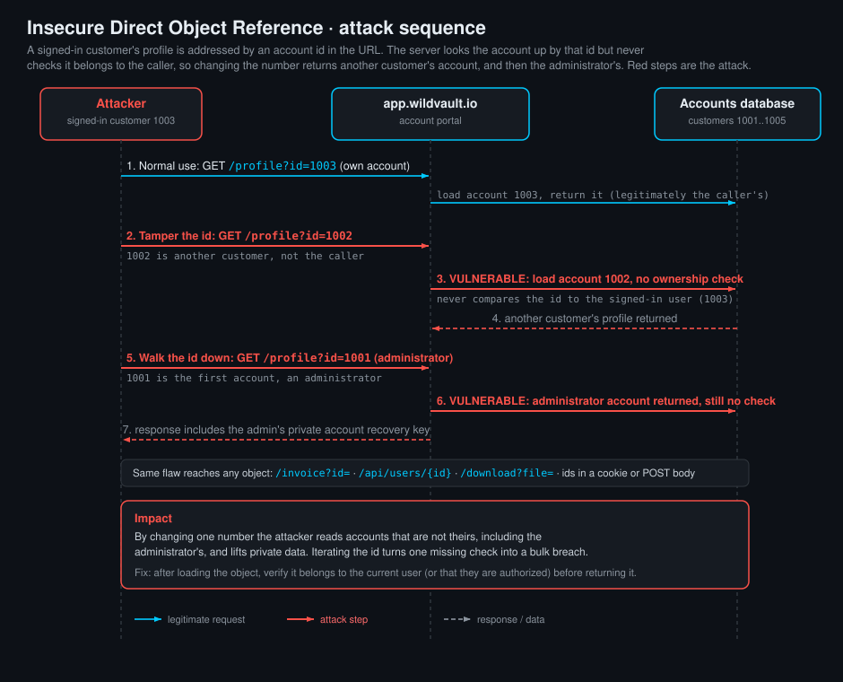

<!--
  Translation bar (added in the translation phase - D1/D10):
  English (this file)

  Writing style: no em dashes in prose. Use commas, colons, parentheses, or
  hyphens. (OWASP IDs keep their official en-dash format.)
-->

# Insecure Direct Object Reference (IDOR)

`A01:2025 – Broken Access Control` · Web Vulnerability Knowledge Base

## Summary

Imagine a coat check at a theatre. You hand over your coat and get ticket number
42. Later you come back, show ticket 42, and get your coat. Now imagine that
instead of matching your face to the ticket, the attendant simply hands over
whatever coat matches the number you say. You walk up, say "37", and walk away
with a stranger's coat. Nothing was hacked. You just asked for something that was
not yours, and no one checked whether you were allowed to have it.

That is an Insecure Direct Object Reference, or IDOR. An application exposes a
**direct reference to an internal object**, a database row, a file, an account, an
invoice, usually as an id in the URL, a form field, a cookie, or a JSON body. When
the server receives that reference, it fetches the object and returns it **without
checking that the current user is actually authorized to access that specific
object**. Change the reference (`?id=1003` becomes `?id=1001`) and you reach data
or actions that belong to someone else.

IDOR is not a niche bug. It is one of the most common and most impactful web
vulnerabilities, precisely because it hides in ordinary, correct-looking code. The
query runs fine, the page renders fine, the only thing missing is the single line
that asks "is this yours?". This entry explains what IDOR is, the different
flavours you will meet, the many places references hide, how to find and test for
it, and how to fix it, followed by a runnable lab where you walk an account id from
your own profile to the administrator's and read a secret you were never meant to
see.

## OWASP Top 10 alignment

- **Category:** `A01:2025 – Broken Access Control`
- **Primary weakness:** **CWE-639 (Authorization Bypass Through User-Controlled
  Key)**, with close relatives **CWE-284 (Improper Access Control)**, **CWE-566
  (Authorization Bypass Through User-Controlled SQL Primary Key)**, and **CWE-863
  (Incorrect Authorization)**.
- **Why it maps here:** IDOR is a textbook access-control failure. The application
  correctly authenticates *who you are* but fails to enforce *what you are allowed
  to touch*. Broken Access Control has been the number one category in the OWASP
  Top 10 since 2021 and remains `A01` in the 2025 edition, and IDOR is the single
  most frequently cited example of it. In the older "IDOR" terminology
  (popularised by the 2007 and 2013 Top 10 as "Insecure Direct Object
  References") this was its own listing; from 2017 onward it was folded into Broken
  Access Control, which is where it lives today.
- **API context:** in the **OWASP API Security Top 10** the same flaw is the number
  one risk, called **API1:2023 - Broken Object Level Authorization (BOLA)**. API
  endpoints like `GET /api/users/{id}/account` are the natural habitat of IDOR
  because they take an object id and return JSON, and the authorization check is
  easy to forget.

## How it works

Three ingredients line up:

1. A **direct object reference** the user can see and change: an id, a filename, a
   key, a slug. `/profile?id=1003`, `/api/orders/5581`, `/download?file=report_88.pdf`.
2. A **server lookup** that uses that reference to fetch the object:
   `db.get_account(id)`, `Order.find(id)`, `open(base + filename)`.
3. A **missing authorization check**: the server returns the object without
   confirming the current user owns it or is otherwise allowed to see it.

```
uid     = request.args["id"]          # attacker controls this: 1003 -> 1001
account = db.get_account(uid)         # server fetches whatever id it is given
return render(account)                # returned with NO "is this yours?" check
```

Authentication asks "who are you?" and is usually done well: the session cookie
proves you are logged in. Authorization asks "are you allowed to do THIS to THIS
object?" and is the part that IDOR skips. The user is genuinely logged in. That is
what makes IDOR different from a broken login: the attacker is an authenticated,
legitimate user of the app who simply reaches sideways into other users' objects.

### Predictable references make it trivial, but they are not the bug

Sequential integer ids (1001, 1002, 1003) are the classic tell, because an attacker
can just count up and down. But the vulnerability is the **missing check**, not the
predictability of the id. Swapping a guessable UUID you obtained from another
response, reading an id out of a JWT and changing it, or harvesting ids from a
"list all" endpoint all defeat "unguessable" identifiers. Replacing predictable ids
with random ones (see "obfuscation is not authorization" below) raises the effort
to *find* objects but does nothing to stop access once a reference is known. The
only real fix is to check authorization on every object access.

## Types of IDOR

IDOR is a family. The distinctions below matter because they change what an
attacker gains and how you test for it.

### By the direction of the access

- **Horizontal IDOR (same privilege level).** You reach objects belonging to
  *another user at your own level*. Member 1003 reading member 1002's profile,
  invoice, messages, or cart. The damage is breadth: one flaw exposes every user's
  data by iterating ids.
- **Vertical IDOR (privilege escalation).** You reach objects or actions that
  belong to a *higher privilege level*. A normal member reading the administrator's
  account, or calling `POST /api/users/1003/role` to make themselves an admin. This
  is IDOR shading into privilege escalation. The lab combines both: you start as an
  ordinary member (horizontal reach across 1002, 1004, 1005) and then reach the
  administrator's account (vertical).

### By what the reference lets you do

- **Read / information disclosure.** `GET /invoice?id=5581` returns someone else's
  invoice. The most common and often the most damaging, because it scales to a full
  data breach.
- **Write / tamper (object manipulation).** `POST /profile/update` with
  `id=1001` edits another user's record. Read access is bad; write access lets you
  change passwords, email addresses (to hijack accounts), balances, or roles.
- **Delete.** `POST /document/delete?id=...` removes an object you do not own.
- **Function-level / action IDOR.** The reference names an *operation* on an object:
  approving a refund, cancelling an order, downloading an export. Sometimes grouped
  with "Broken Function Level Authorization" (API5:2023) when it is the function,
  not just the object, that is unprotected.

### By where the reference lives

The reference is not always a query-string id. Testers miss IDOR by only looking at
the URL. It hides in:

- **Query string:** `?id=`, `?user=`, `?account=`, `?doc=`.
- **Path segment (RESTful):** `/api/users/1003`, `/orders/5581/items`.
- **POST body / form field:** a hidden `account_id` input, a multipart field.
- **JSON body:** `{"userId": 1003, "action": "export"}`.
- **HTTP headers:** custom headers like `X-Account-Id`, or an id inside a cookie.
- **Cookies and tokens:** an `uid=1003` cookie, or a user id baked into a JWT
  payload that the server trusts without re-checking authorization.
- **GraphQL:** node ids and arguments (`node(id: "...")`, `user(id: 1001)`).
- **Filenames and storage keys:** `report_88.pdf`, an S3 object key, a
  `?attachment=` value (this is where IDOR overlaps with path traversal, entry 07).

### By the reference format (and why "unguessable" is not a fix)

- **Sequential integers:** trivial to enumerate.
- **UUID / GUID:** harder to guess blindly, but frequently leaked in other
  responses, logs, emails, or referer headers, then replayed.
- **Hashed or encoded ids:** a base64 or MD5 of the id is *encoding, not
  authorization*. `MTAwMQ==` is just base64 for `1001`; decode, change, re-encode.
- **Composite / scoped ids:** `/org/42/user/1003`. Still IDOR if the server does not
  check you belong to org 42.

**Obfuscation is not authorization.** Making references unpredictable (random UUIDs,
per-user indirect maps) is useful defence in depth because it prevents easy
enumeration, but a known reference must still be authorized on every use.

## Where it is commonly found (and where to look)

IDOR clusters wherever an app turns "my thing" into "a thing addressed by id". High-
value hunting grounds:

- **Account and profile pages:** `/profile?id=`, `/settings/account/{id}`, "view as"
  and impersonation features.
- **Anything financial:** invoices, receipts, statements, transactions, payment
  methods, refunds. `/invoice/5581`, `/api/cards/{id}`.
- **Documents and downloads:** `/download?file=`, `/report/{id}/pdf`, exported CSVs,
  uploaded attachments, medical or legal records.
- **Messaging:** conversation and message ids, `/messages/{threadId}`, ticket
  systems, comments.
- **Orders and carts:** `/order/{id}`, `/cart/{id}`, order status and tracking.
- **Multi-tenant SaaS:** org / workspace / project ids where tenant isolation is the
  whole product. A tenant-crossing IDOR is often critical.
- **Admin and internal tools:** user-management endpoints, feature flags, audit logs,
  where vertical IDOR grants privilege escalation.
- **Mobile and single-page-app backends:** the JSON API behind the app. The mobile
  UI hides the ids, but the API still takes them, and the check is often assumed to
  live "in the app".
- **Password reset and email change flows:** `reset?user=` or an id in the body of a
  change-email request, a classic account-takeover primitive.

**How to look for it (testing methodology):**

1. **Map the objects.** Browse the app as a normal user and note every request that
   carries an object reference: ids, filenames, keys, in the URL, body, headers, and
   cookies. A proxy (Burp, ZAP, mitmproxy) makes these obvious.
2. **Use two accounts.** Create user A and user B (and, if possible, a low-priv and a
   high-priv account). Capture a request that returns *A's* object, then replay it
   from *B's* session with A's id. If B gets A's data, that is IDOR. Two accounts is
   the single most effective IDOR technique.
3. **Swap the reference.** Increment/decrement integer ids, replay UUIDs harvested
   from other responses, decode-and-edit encoded ids, and try ids you should not know
   (0, 1, negative, very large).
4. **Try every verb and location.** The `GET` may be protected while `PUT`/`DELETE`
   are not; the URL id may be checked while a duplicate id in the body is not. Move
   the id between query, path, body, and headers.
5. **Watch for BOLA in APIs.** Hit `/api/.../{id}` endpoints directly, outside the
   UI, where authorization is most often missing.
6. **Automate the auth matrix.** Tools like Burp's Autorize/AuthMatrix replay every
   request under a second user's session and flag responses that should have been
   403 but were not.

A confirmed IDOR is any case where changing a reference returns, or acts on, an
object that the current user should not be able to reach.

## Attack path



1. The attacker logs in as an ordinary user and opens their own object by its
   reference: `GET /profile?id=1003`. It loads, confirming the id addresses the
   record.
2. They observe that the reference is user-controlled and predictable (sequential
   account ids).
3. They change the reference to one they do not own: `GET /profile?id=1002`
   (horizontal), then walk toward `id=1001`, the administrator (vertical).
4. The server looks the account up by that id and returns it **with no ownership or
   role check**. The attacker now sees another user's full profile.
5. They read a field they were never authorized to see, here the administrator's
   private **account recovery key** (the lab flag), and could pivot to account
   takeover or, with a writable endpoint, tamper with the record.
6. Iterating the reference over the whole id range turns one missing check into a
   bulk data breach.

## Vulnerable & fixed code

> Every block shows the same flaw and its fix. Vulnerable = the object is fetched by
> a user-controlled reference and returned with no authorization check. Fixed = after
> loading the object, verify the current user is allowed to access **this specific
> object** (it belongs to them, or they hold a role that permits it) before returning
> it. Scoping the query to the current user (`current_user.accounts.find(id)`) is an
> equally good pattern: the database never returns another user's row in the first
> place.

<details open><summary><b>Python</b></summary>

**Vulnerable**
```python
from flask import request, session, abort

def show_profile():
    # VULNERABLE: the id is user-controlled and returned with no ownership check.
    uid = int(request.args["id"])
    account = db.get_account(uid)
    return render(account)          # any logged-in user can read any id
```
**Fixed**
```python
from flask import request, session, abort

def show_profile():
    # FIXED: load the object, then authorize THIS object for the current user.
    uid = int(request.args["id"])
    account = db.get_account(uid)
    if account is None:
        abort(404)
    if account.owner_id != session["uid"] and not current_user.is_admin:
        abort(403)                  # not yours and you are not an admin
    return render(account)
```
Docs: https://cheatsheetseries.owasp.org/cheatsheets/Insecure_Direct_Object_Reference_Prevention_Cheat_Sheet.html
</details>

<details><summary><b>Java</b></summary>

**Vulnerable**
```java
// VULNERABLE: fetches by the request id and returns it directly
long id = Long.parseLong(req.getParameter("id"));
Account a = repo.findById(id);
return a;                                   // no check that a belongs to the caller
```
**Fixed**
```java
// FIXED: verify ownership (or an admin role) before returning
long id = Long.parseLong(req.getParameter("id"));
Account a = repo.findById(id);
if (a == null) throw new NotFoundException();
if (a.getOwnerId() != session.getUserId() && !session.isAdmin()) {
    throw new ForbiddenException();
}
return a;
```
Docs: https://cheatsheetseries.owasp.org/cheatsheets/Authorization_Cheat_Sheet.html
</details>

<details><summary><b>JavaScript</b></summary>

**Vulnerable**
```javascript
// VULNERABLE: looks up the record by req.params.id with no auth check
app.get("/api/accounts/:id", async (req, res) => {
  const acc = await db.accounts.findById(req.params.id);
  res.json(acc);                            // any authenticated user, any id
});
```
**Fixed**
```javascript
// FIXED: confirm the record belongs to the logged-in user (or an admin)
app.get("/api/accounts/:id", async (req, res) => {
  const acc = await db.accounts.findById(req.params.id);
  if (!acc) return res.sendStatus(404);
  if (acc.ownerId !== req.session.uid && !req.session.isAdmin) {
    return res.sendStatus(403);
  }
  res.json(acc);
});
```
Docs: https://cheatsheetseries.owasp.org/cheatsheets/Authorization_Cheat_Sheet.html
</details>

<details><summary><b>TypeScript</b></summary>

**Vulnerable**
```typescript
// VULNERABLE: types do not authorize - this still returns any id
app.get("/api/accounts/:id", async (req, res) => {
  const acc = await accounts.findById(req.params.id);
  res.json(acc);
});
```
**Fixed**
```typescript
// FIXED: ownership / role check before returning the object
app.get("/api/accounts/:id", async (req, res) => {
  const acc = await accounts.findById(req.params.id);
  if (!acc) return res.sendStatus(404);
  if (acc.ownerId !== req.session.uid && req.session.role !== "admin") {
    return res.sendStatus(403);
  }
  res.json(acc);
});
```
Docs: https://cheatsheetseries.owasp.org/cheatsheets/Authorization_Cheat_Sheet.html
</details>

<details><summary><b>PHP</b></summary>

**Vulnerable**
```php
<?php
// VULNERABLE: selects by the id in the query string and prints it
$id  = (int) $_GET["id"];
$acc = $db->query("SELECT * FROM accounts WHERE id = $id")->fetch();
echo render($acc);                          // no owner check
```
**Fixed**
```php
<?php
// FIXED: load, then require the row to belong to the session user (or admin)
$id  = (int) $_GET["id"];
$stmt = $db->prepare("SELECT * FROM accounts WHERE id = ?");
$stmt->execute([$id]);
$acc = $stmt->fetch();
if (!$acc) { http_response_code(404); exit; }
if ($acc["owner_id"] !== $_SESSION["uid"] && !$_SESSION["is_admin"]) {
    http_response_code(403); exit;
}
echo render($acc);
```
Docs: https://cheatsheetseries.owasp.org/cheatsheets/Insecure_Direct_Object_Reference_Prevention_Cheat_Sheet.html
</details>

<details><summary><b>Ruby</b></summary>

**Vulnerable**
```ruby
# VULNERABLE: finds any record by params[:id] and renders it
acc = Account.find(params[:id])
render json: acc                            # no scoping to the current user
```
**Fixed**
```ruby
# FIXED: scope the lookup to the current user's records (admins may see all).
# The database never returns another user's row, so IDOR cannot happen.
acc = if current_user.admin?
        Account.find_by(id: params[:id])
      else
        current_user.accounts.find_by(id: params[:id])
      end
return head(:not_found) unless acc
render json: acc
```
Docs: https://guides.rubyonrails.org/security.html#insecure-direct-object-references-or-forceful-browsing
</details>

<details><summary><b>Go</b></summary>

**Vulnerable**
```go
// VULNERABLE: reads the id from the request and returns the record
id := r.URL.Query().Get("id")
acc := store.Get(id)
json.NewEncoder(w).Encode(acc)              // no owner check
```
**Fixed**
```go
// FIXED: verify the record's owner matches the session user (or admin)
id := r.URL.Query().Get("id")
acc := store.Get(id)
if acc == nil {
    http.Error(w, "not found", http.StatusNotFound)
    return
}
if acc.OwnerID != session.UserID && !session.IsAdmin {
    http.Error(w, "forbidden", http.StatusForbidden)
    return
}
json.NewEncoder(w).Encode(acc)
```
Docs: https://cheatsheetseries.owasp.org/cheatsheets/Authorization_Cheat_Sheet.html
</details>

<details><summary><b>C#</b></summary>

**Vulnerable**
```csharp
// VULNERABLE: returns the account named by the id, no authorization
var acc = await _db.Accounts.FindAsync(id);
return Ok(acc);
```
**Fixed**
```csharp
// FIXED: check ownership (or an admin role) before returning
var acc = await _db.Accounts.FindAsync(id);
if (acc == null) return NotFound();
if (acc.OwnerId != User.GetUserId() && !User.IsInRole("Admin")) {
    return Forbid();
}
return Ok(acc);
// Better still: resource-based authorization,
//   await _authz.AuthorizeAsync(User, acc, "ReadAccount")
```
Docs: https://learn.microsoft.com/en-us/aspnet/core/security/authorization/resourcebased
</details>

## Detection signatures

- **Sequential-id sweeps:** one endpoint requested many times with an object
  reference that only increments or decrements (`id=1001`, `1002`, `1003`, ...),
  especially from a single session, is enumeration in progress.
- **Cross-user access in logs:** a request whose object id resolves to a record owned
  by a *different* user than the authenticated session. If you log
  `session_user_id` and `object_owner_id`, a mismatch that still returned `200` is a
  confirmed IDOR.
- **403/404 ratios:** a healthy authorized endpoint returns some 403/404 to probing;
  an IDOR endpoint returns `200` for ids it should refuse. A sudden run of `200`s
  across many distinct ids from one user is a red flag.
- **References in unexpected places:** ids appearing in headers, cookies, or hidden
  form fields that differ from the session user, and duplicated ids (one in the URL,
  one in the body) that disagree.
- **SAST patterns:** a request value (`params[:id]`, `req.query.id`,
  `Request.Form["id"]`) flowing into `find`, `findById`, `get`, `FindAsync`,
  `SELECT ... WHERE id =`, or a file open, with **no** subsequent ownership or role
  comparison before the object is returned. Look for lookups by primary key that are
  not scoped to the current user.
- **Illustrative SIEM query (Splunk-style)** - one user hitting many distinct object
  ids on a sensitive endpoint:
  ```
  index=web sourcetype=access_combined uri_path="/profile" OR uri_path="/api/accounts/*"
  | rex field=uri_query "id=(?<obj_id>\d+)"
  | stats dc(obj_id) AS distinct_ids values(status) AS codes BY session_user
  | where distinct_ids > 15
  ```

## Remediation checklist

- [ ] **Enforce authorization on every object access.** After loading an object by
  its reference, verify the current user is allowed to access *that specific object*
  (ownership or an explicit role/permission) before reading, returning, updating, or
  deleting it. This is the fix; everything else is defence in depth.
- [ ] **Scope queries to the user where you can.** Prefer
  `current_user.orders.find(id)` over `Order.find(id)`. If the query is scoped to the
  caller, the database cannot return another user's row, and the check cannot be
  forgotten.
- [ ] **Deny by default.** Authorization should be a positive allow decision, not the
  absence of a block. Every new endpoint starts forbidden until a rule grants access.
- [ ] **Centralise the check.** Use a shared policy layer (resource-based
  authorization, Pundit/CanCanCan, ASP.NET authorization handlers, a middleware) so
  the rule is applied consistently and cannot be omitted per-endpoint.
- [ ] **Check every verb and every entry point.** `GET`, `POST`, `PUT`, `PATCH`,
  `DELETE`, and the JSON/mobile API behind the UI. Do not rely on the front end
  hiding an id: the API is the trust boundary.
- [ ] **Do not trust ids from the client for identity.** Derive the acting user from
  the authenticated session or token, never from a `user_id` field the client sends.
- [ ] **Use unpredictable references as defence in depth.** Random UUIDs or per-user
  indirect reference maps (session-scoped index -> real id) slow enumeration, but do
  **not** replace the authorization check.
- [ ] **Log and alert on cross-user access and id sweeps** (see detection) so an
  attempt in progress is visible.
- [ ] **Test with two accounts in CI.** Automated tests that replay user A's requests
  as user B and assert `403`/`404` catch regressions before they ship.

## References

- OWASP - Insecure Direct Object Reference: https://owasp.org/www-community/attacks/Insecure_Direct_Object_Reference
- OWASP Cheat Sheet - IDOR Prevention: https://cheatsheetseries.owasp.org/cheatsheets/Insecure_Direct_Object_Reference_Prevention_Cheat_Sheet.html
- OWASP Cheat Sheet - Authorization: https://cheatsheetseries.owasp.org/cheatsheets/Authorization_Cheat_Sheet.html
- OWASP API Security Top 10 - API1:2023 Broken Object Level Authorization: https://owasp.org/API-Security/editions/2023/en/0xa1-broken-object-level-authorization/
- OWASP Top 10:2021 - A01 Broken Access Control: https://owasp.org/Top10/A01_2021-Broken_Access_Control/
- OWASP WSTG - Testing for IDOR: https://owasp.org/www-project-web-security-testing-guide/latest/4-Web_Application_Security_Testing/05-Authorization_Testing/04-Testing_for_Insecure_Direct_Object_References
- PortSwigger Web Security Academy - IDOR: https://portswigger.net/web-security/access-control/idor
- MITRE - CWE-639: https://cwe.mitre.org/data/definitions/639.html
- MITRE - CWE-284 (Improper Access Control): https://cwe.mitre.org/data/definitions/284.html

## Lab

A runnable, intentionally vulnerable app lives in [`lab/`](lab/). "WildVault" is a
members' account portal that looks like a real product: an account dashboard with a
**My profile** button, membership summary, and recent activity. You arrive signed in
as an ordinary customer, **Carol Nguyen (account id 1003)**. To keep it realistic
there is deliberately no account picker on the page: your profile is addressed by
your account id in the URL, and all the teaching material (how it works, hints, code,
the answer box) is tucked into a collapsed **Training notes** panel at the bottom.

```bash
cd lab
docker compose up --build      # build once (needs network), then runs offline
# open http://127.0.0.1:8000
```

**Goal:** recover the **MD5 value** stored as the **administrator's private account
recovery key** (in the Security section of their profile). Five accounts exist with
plain sequential ids:

```
1001  Alice Reyes     administrator   <- the value is this account's recovery key
1002  David Okoro     customer
1003  Carol Nguyen    customer         <- YOU (the signed-in session)
1004  Emma Thompson   customer (premium)
1005  Bob Carter      customer
```

Open your own profile with **My profile** (`/profile?id=1003`), then tamper the id in
the URL, in the address bar or with an intercepting proxy like Burp Suite. The server
looks each account up by its id and returns it with **no check that it belongs to
you**, so `/profile?id=1002` shows another customer (horizontal IDOR) and
`/profile?id=1001` shows the administrator (vertical IDOR). Read the administrator's
account recovery key and submit it in the Training notes answer box. It rotates on
every restart.

The flaw is a single missing line: the profile endpoint never compares the requested
id against the signed-in session's id. Compare the **Vulnerable** and **Fixed** tabs
in the Training notes to see exactly where the ownership check belongs.
