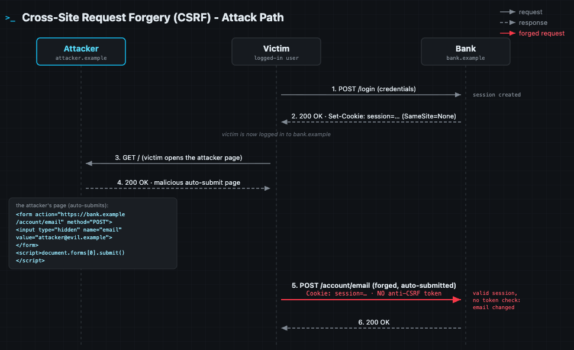
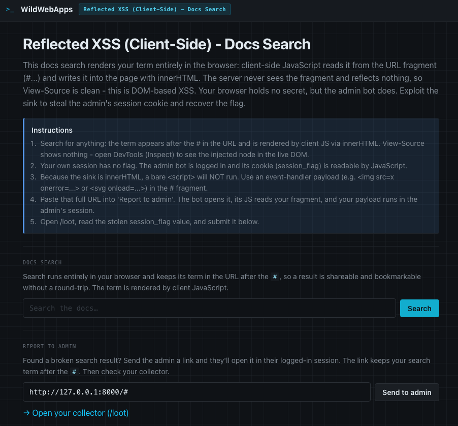
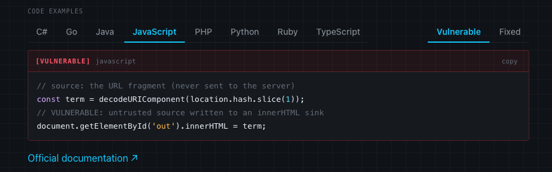

<!--
  Translation bar (added in the translation phase - D1/D10):
  English (this file) · [other languages will link here]
-->


# WildWebApps

> A hands-on knowledge base of **web vulnerabilities** - clear writeups,
> vulnerable & fixed code in 8 languages, attack-path diagrams, and a
> runnable, intentionally vulnerable lab for each one.

**Who it's for:** AppSec engineers, pentesters, developers, and anyone preparing
for HTB, OffSec **OSWA / OSWE**.

Each entry is a type of vulnerability (e.g. SQL Injection, XSS), not a
specific CVE. The goal is to understand the nature of the flaw, see it in code,
break it in a lab, and learn to fix it.

---

## Index

| # | Vulnerability | OWASP Top 10 | Lab | Status |
|---|---------------|--------------|-----|--------|
| 01 | [Reflected XSS (Server-Side)](01-reflected-xss/) | `A05:2025 – Injection` | [Run](01-reflected-xss/lab/) | Ready |
| 02 | [Stored XSS (Server-Side)](02-stored-xss/) | `A05:2025 – Injection` | [Run](02-stored-xss/lab/) | Ready |
| 03 | [Reflected XSS (Client-Side)](03-dom-based-xss/) | `A05:2025 – Injection` | [Run](03-dom-based-xss/lab/) | Ready |
| 04 | [Stored XSS (Client-Side)](04-stored-dom-xss/) | `A05:2025 – Injection` | [Run](04-stored-dom-xss/lab/) | Ready |
| 05 | [Cross-Site Request Forgery (CSRF)](05-csrf/) | `A01:2025 – Broken Access Control` | [Run](05-csrf/lab/) | Ready |

<!-- Index rows are added per vulnerability; later auto-generated (C11). -->

## Protection mechanisms

Defenses that mitigate the vulnerabilities above. Each has its own writeup and a
runnable lab that demonstrates the mechanism (what it stops, and what it does not).

| # | Protection | Protects against | Lab | Status |
|---|------------|------------------|-----|--------|
| 01 | [HttpOnly cookie flag](protections/01-httponly-cookie/) | Cookie theft via XSS (`document.cookie`) | [Run](protections/01-httponly-cookie/lab/) | Ready |
| 02 | [Same-Origin Policy](protections/02-same-origin-policy/) | Cross-origin data theft (read isolation); CORS misconfiguration | [Run](protections/02-same-origin-policy/lab/) | Ready |
| 03 | [SameSite cookie attribute](protections/03-samesite-cookie/) | Cross-Site Request Forgery (CSRF); cross-site cookie attachment | [Run](protections/03-samesite-cookie/lab/) | Ready |
| 04 | [Cross-Origin Resource Sharing (CORS)](protections/04-cors/) | Insecure cross-origin sharing; cross-origin data theft | [Run](protections/04-cors/lab/) | Ready |

## How each entry is structured

Every vulnerability lives in its own folder:

```
02-stored-xss/
├─ readme.md      # the writeup (English; translations later in i18n/)
├─ diagram.drawio # attack-path diagram (+ exported diagram.svg)
└─ lab/           # the runnable, intentionally vulnerable app
```

A writeup contains: summary → OWASP Top 10 alignment → how it works →
attack-path diagram → vulnerable code (8 languages) → fixed code (8 languages) →
detection signatures → remediation checklist → references → lab instructions.

## Diagrams

WildWebApps has sequence diagrams — a more intuitive way to understand how complex web vulnerabilities work.



## Running a lab

Each lab is a self-contained Docker image that runs **fully offline** after
build and is reachable **only from `127.0.0.1`**.

```bash
git clone https://github.com/ErSilh0x/WildWebApps.git

cd 01-reflected-xss/lab
docker compose up --build      # build once (needs network), then runs offline
# open http://127.0.0.1:8000
```

Every lab generates a **fresh random hash flag on each start**. Exploit the
vulnerability to recover the flag, then paste it into the answer box to confirm
the solve. Restarting the container rotates the flag.

## Inside lab

Lab contains simple web application with several forms for vulnerability demonstration and practice.



## Code examples are also available



---

## Responsible use

These labs are **intentionally vulnerable** and exist for education and
authorized testing only. **Do not deploy
them on a public or shared network**. Use the techniques shown here only against
systems you own or have explicit written permission to test. The authors accept
no liability for misuse.
