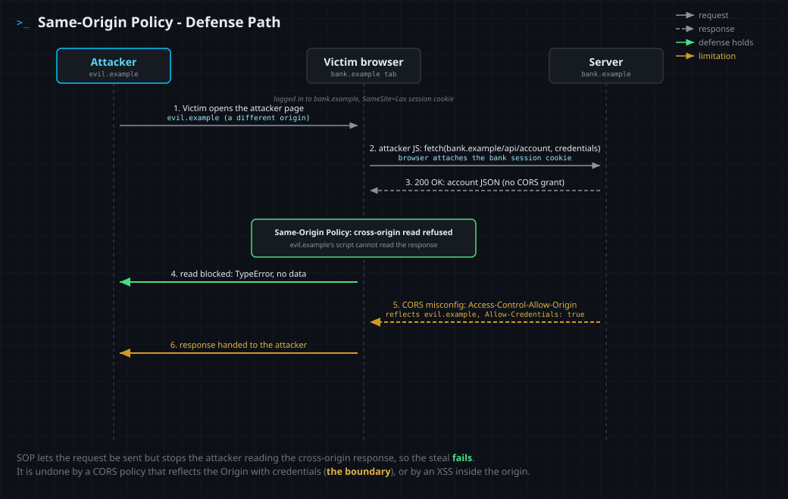

<!--
  Translation bar (added in the translation phase - D1/D10):
  English (this file)
-->

# Same-Origin Policy

`Defense: Same-Origin Policy (browser-enforced origin isolation)` · Web Vulnerability Knowledge Base

## Summary

The Same-Origin Policy (SOP) is the foundational security boundary of the web. The
browser enforces it automatically for every page: script running on one **origin**
may not read the responses, DOM, cookies, or storage of a **different** origin. An
origin is the triple **scheme + host + port** (`https://shop.example:443`), and all
three must match for two URLs to be same-origin. SOP is why a malicious page you
open in one tab cannot quietly read your webmail or your bank in another tab. It is
always on, it is not something you switch on in code, and almost every other browser
defense (cookies, CORS, postMessage, storage) is defined relative to it.

## What it protects against

Cross-origin data theft. Without SOP, any page could open a hidden request to a site
where you are logged in, read the authenticated response, and exfiltrate it. SOP
removes that read path: the attacker's script can cause a request to be *sent* (the
browser may even attach your cookies), but it cannot *read what comes back*. It also
stops a malicious page from reaching into a cross-origin `<iframe>` to scrape its DOM,
from reading another origin's `localStorage` or cookies, and from reading the pixels
of a cross-origin image drawn to a `<canvas>`.

SOP is the boundary that gives cross-site scripting (XSS) its value to an attacker:
the whole reason injecting script *into the target origin* is powerful is that, once
inside, the attacker's code is same-origin and SOP no longer holds it back.

## How it works

The browser tags every piece of script-reachable state with the origin that created
it, and refuses cross-origin **reads**:

- Script CANNOT read a cross-origin `fetch` / `XMLHttpRequest` response body (unless
  the responding server opts in with CORS).
- Script CANNOT touch a cross-origin frame's `contentDocument` / `contentWindow`
  document (a `SecurityError` is thrown).
- Script CANNOT read another origin's cookies, `localStorage`, `sessionStorage`, or
  IndexedDB.
- Script CANNOT read back the pixels of a cross-origin image once it is drawn to a
  canvas (the canvas becomes "tainted").

What SOP deliberately does **not** block, because the web would not work otherwise:

- **Embedding** cross-origin resources: ``, `<script>`, `<link>` stylesheets,
  fonts, and `<iframe>` may all be *loaded* from other origins. You can display them,
  you just cannot *read* them.
- **Sending** cross-origin requests: a form may POST to another origin and a link or
  redirect may navigate there. The request goes out (and carries cookies the browser
  decides to attach); SOP only stops the initiating page from reading the response.
  This send-but-not-read gap is exactly why CSRF exists.

Because SOP would otherwise make legitimate cross-origin APIs impossible, the platform
provides **controlled relaxations**: **CORS** lets a server name the specific origins
allowed to read its responses; **`postMessage`** lets two windows exchange messages
across origins on purpose; the legacy `document.domain` mechanism (now deprecated) let
same-site pages drop to a shared origin. Each of these is a hole you open in SOP on
purpose, and each is dangerous if opened too wide. The most common real-world failure
is a **CORS misconfiguration**: a server that reflects the request's `Origin` header
straight back into `Access-Control-Allow-Origin` while also sending
`Access-Control-Allow-Credentials: true` has told the browser that *every* site may
read its authenticated responses, which hands the protected data right back to the
attacker.

A subtle but important distinction: **"origin" is not "site."** Origin (used by SOP)
is scheme + host + **port**; "site" (used by `SameSite` cookies) is scheme + the
registrable domain and **ignores the port**. So two servers on the same host but
different ports, say `http://127.0.0.1:8000` and `http://127.0.0.1:8001`, are a
**different origin** (SOP keeps them apart) yet the **same site** (a `SameSite=Lax`
cookie is still sent between them). The demonstration lab is built on exactly this
gap.

## Mechanism



1. A victim who is logged in to `bank.example` opens the attacker's page on
   `evil.example`.
2. The attacker's script issues a credentialed cross-origin `fetch` to
   `bank.example`. The browser sends it and attaches the victim's cookies.
3. The bank returns the authenticated response, with no CORS headers granting
   `evil.example` access.
4. SOP (green): the browser refuses to let the attacker's script read the response
   body. The cross-origin read fails and the data stays protected.
5. Boundary (amber): if the bank instead reflects the `Origin` header into
   `Access-Control-Allow-Origin` and sets `Access-Control-Allow-Credentials: true`,
   the browser hands the attacker the response. A careless CORS policy, or an XSS that
   runs *inside* the bank's origin, defeats SOP.

## Enable it

You do not enable SOP; the browser enforces it for every origin automatically. What
you control is how far you **relax** it, and the relaxation that most often goes wrong
is CORS. The pattern below contrasts a **dangerous** CORS configuration (reflecting
whatever `Origin` the caller sends and allowing credentials, which lets any site read
authenticated responses) with a **safe** one (an explicit allowlist of trusted
origins). Reflecting the Origin with credentials is the single most common way teams
accidentally turn SOP off.

<details open><summary><b>Python (Flask, flask-cors)</b></summary>

**Without (dangerous)**
```python
from flask_cors import CORS
# DANGEROUS: with credentials on, '*' reflects the caller's Origin, so ANY site
# can read authenticated responses. SOP is effectively off for this app.
CORS(app, supports_credentials=True, origins="*")
```
**With (safe)**
```python
from flask_cors import CORS
# SAFE: explicit allowlist; only these origins may read credentialed responses.
CORS(app, resources={r"/api/*": {"origins": ["https://app.example.com"]}},
     supports_credentials=True)
```
Docs: https://flask-cors.readthedocs.io/en/latest/
</details>

<details><summary><b>JavaScript (Express, cors)</b></summary>

**Without (dangerous)**
```javascript
const cors = require("cors");
// DANGEROUS: origin:true echoes the request Origin; with credentials, any site reads.
app.use(cors({ origin: true, credentials: true }));
```
**With (safe)**
```javascript
const cors = require("cors");
const ALLOW = new Set(["https://app.example.com"]);
app.use(cors({
  origin: (o, cb) => cb(null, !o || ALLOW.has(o)),  // allowlist only
  credentials: true,
}));
```
Docs: https://expressjs.com/en/resources/middleware/cors.html
</details>

<details><summary><b>TypeScript (Express, cors)</b></summary>

**Without (dangerous)**
```typescript
import cors from "cors";
// DANGEROUS: reflects any Origin back with credentials enabled.
app.use(cors({ origin: true, credentials: true }));
```
**With (safe)**
```typescript
import cors, { CorsOptions } from "cors";
const allow = new Set(["https://app.example.com"]);
const options: CorsOptions = {
  origin: (o, cb) => cb(null, !o || allow.has(o)),
  credentials: true,
};
app.use(cors(options));
```
Docs: https://expressjs.com/en/resources/middleware/cors.html
</details>

<details><summary><b>PHP</b></summary>

**Without (dangerous)**
```php
// DANGEROUS: reflects the caller's Origin and allows credentials.
header("Access-Control-Allow-Origin: " . $_SERVER['HTTP_ORIGIN']);
header("Access-Control-Allow-Credentials: true");
```
**With (safe)**
```php
$allow = ['https://app.example.com'];
$origin = $_SERVER['HTTP_ORIGIN'] ?? '';
if (in_array($origin, $allow, true)) {           // explicit allowlist
    header("Access-Control-Allow-Origin: $origin");
    header("Access-Control-Allow-Credentials: true");
    header("Vary: Origin");                        // cache safety
}
```
Docs: https://developer.mozilla.org/en-US/docs/Web/HTTP/Guides/CORS
</details>

<details><summary><b>Java (Spring)</b></summary>

**Without (dangerous)**
```java
// DANGEROUS: allowed-origin pattern '*' reflects the Origin, paired with credentials.
config.addAllowedOriginPattern("*");
config.setAllowCredentials(true);
```
**With (safe)**
```java
// SAFE: explicit origins; credentials only for those.
config.setAllowedOrigins(List.of("https://app.example.com"));
config.setAllowCredentials(true);
```
Docs: https://docs.spring.io/spring-framework/reference/web/webmvc-cors.html
</details>

<details><summary><b>Ruby (Rack::Cors)</b></summary>

**Without (dangerous)**
```ruby
# DANGEROUS: the regex matches every Origin, with credentials enabled.
allow do
  origins(/.*/)
  resource "*", headers: :any, credentials: true
end
```
**With (safe)**
```ruby
allow do
  origins "https://app.example.com"             # explicit allowlist
  resource "/api/*", headers: :any, credentials: true
end
```
Docs: https://github.com/cyu/rack-cors
</details>

<details><summary><b>Go (rs/cors)</b></summary>

**Without (dangerous)**
```go
// DANGEROUS: AllowOriginFunc returns true for everything, with credentials on.
c := cors.New(cors.Options{
    AllowOriginFunc:  func(origin string) bool { return true },
    AllowCredentials: true,
})
```
**With (safe)**
```go
c := cors.New(cors.Options{
    AllowedOrigins:   []string{"https://app.example.com"},
    AllowCredentials: true,
})
```
Docs: https://github.com/rs/cors
</details>

<details><summary><b>C# (ASP.NET Core)</b></summary>

**Without (dangerous)**
```csharp
// DANGEROUS: reflect any origin and allow credentials.
policy.SetIsOriginAllowed(_ => true)
      .AllowAnyHeader().AllowCredentials();
```
**With (safe)**
```csharp
policy.WithOrigins("https://app.example.com")    // explicit allowlist
      .AllowAnyHeader().AllowCredentials();
```
Docs: https://learn.microsoft.com/en-us/aspnet/core/security/cors
</details>

## Demonstration lab

The lab in [`lab/`](lab/) shows SOP isolating two origins, and shows the one CORS
mistake that undoes it.

```bash
cd lab
docker compose up --build      # build once, then runs offline
# bank (victim):   http://127.0.0.1:8000
# attacker panel:  http://127.0.0.1:8001
```

The two ports are **different origins** (so SOP keeps them apart) but the **same
site** (so the bank's `SameSite=Lax` session cookie still rides a cross-origin
request between them, no `SameSite=None` needed). WildBank serves your account data on
two endpoints: `/api/balance` is a normal, SOP-protected endpoint, and `/api/profile`
is a legacy endpoint with a broken CORS policy that reflects the request `Origin` and
allows credentials.

From the attacker panel, try to read `/api/balance` cross-origin: the browser blocks
the read (`TypeError: Failed to fetch`). That is SOP working. You cannot read the
admin's data yourself because the session cookie lives only in the admin's browser.
But the logged-in admin bot will open any page you host. Write an exploit that does a
credentialed cross-origin `fetch` to the misconfigured `/api/profile`, reads the
returned API key, and beacons it to your collector, then deliver it to the admin. The
key it leaks is the **MD5 flag**; submit it in the answer box. The flag rotates on
every restart.

## Limitations (what it does not stop)

- **It does not stop cross-origin *requests*, only cross-origin *reads*.** A form can
  still POST to another origin with your cookies attached, which is the gap that CSRF
  exploits. Pair SOP with anti-CSRF tokens and `SameSite` cookies.
- **It does not survive XSS.** An attacker who injects script into an origin is running
  *as* that origin, so SOP no longer protects it. Output encoding and a
  Content-Security-Policy are what stop that.
- **You can switch it off by accident.** A reflected-Origin CORS policy with
  credentials, a `postMessage` handler that does not check `event.origin`, a `*`
  target on `postMessage`, JSONP endpoints, or a legacy `document.domain` relaxation
  all punch holes in it. Configure CORS with an explicit allowlist.
- **It does not cover everything about framing or side channels.** Clickjacking needs
  `X-Frame-Options` / CSP `frame-ancestors`; cross-origin leak hardening (Spectre-class)
  needs `Cross-Origin-Opener-Policy`, `Cross-Origin-Embedder-Policy`, and
  `Cross-Origin-Resource-Policy`.

## References

- MDN - Same-origin policy: https://developer.mozilla.org/en-US/docs/Web/Security/Same-origin_policy
- MDN - Cross-Origin Resource Sharing (CORS): https://developer.mozilla.org/en-US/docs/Web/HTTP/Guides/CORS
- OWASP - CORS OriginHeaderScrutiny / misconfiguration: https://owasp.org/www-community/attacks/CORS_OriginHeaderScrutiny
- PortSwigger Web Security Academy - CORS: https://portswigger.net/web-security/cors
- W3C - Same Origin Policy (wiki): https://www.w3.org/Security/wiki/Same_Origin_Policy
</content>
</invoke>
