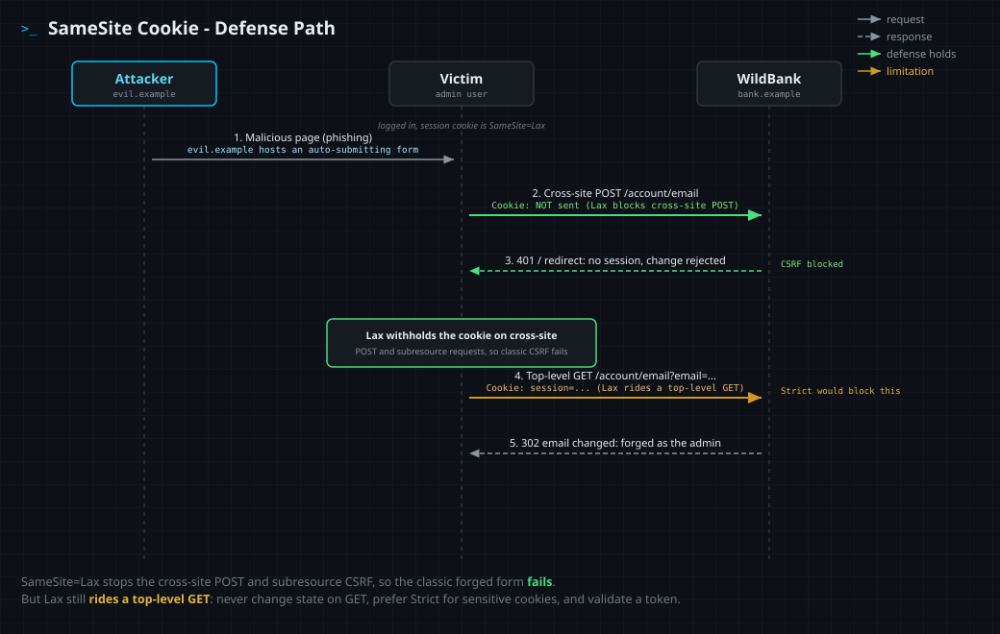

<!--
  Translation bar (added in the translation phase - D1/D10):
  English (this file)

  Writing style: no em dashes in prose. Use commas, colons, parentheses, or hyphens.
-->

# SameSite Cookie

`Defense: SameSite cookie attribute` · Web Vulnerability Knowledge Base

## Summary

The `SameSite` attribute on a `Set-Cookie` response tells the browser when a cookie
may ride a **cross-site** request. Its whole purpose is to break the automatic,
ambient attachment of cookies that makes Cross-Site Request Forgery (CSRF) work: if
the session cookie is not sent on a request triggered by another site, a forged
cross-site request arrives unauthenticated and the action is rejected. It takes three
values, `Strict`, `Lax`, and `None`, and modern browsers now default an attribute-less
cookie to `Lax`. It is a high-value, one-line defense, but it is defense-in-depth: it
keys off "site" (not "origin"), it leaves a deliberate gap for top-level GET
navigations under `Lax`, and `None` switches it off entirely. Pair it with a
server-validated anti-CSRF token.

## What it protects against

Cross-Site Request Forgery. A logged-in victim opens an attacker's page; that page
auto-submits a form (or loads an image, or issues a `fetch`) to a site where the
victim has a session. Normally the browser attaches the victim's cookie to that
cross-site request, so the target acts on it as the victim. A session cookie set
`SameSite=Lax` or `SameSite=Strict` is **withheld** from that cross-site POST or
subresource request, so the forged request is anonymous and the state change does not
happen.

`SameSite` also reduces cross-site information leakage and cookie-based cross-site
tracking, because third-party contexts (an `<iframe>`, an ``, a cross-site
`fetch`) no longer receive the cookie unless it is explicitly `None; Secure`.

## How it works

The browser computes the **site for cookies** of every request: the site of the
top-level document that initiated it, compared against the site of the request's
target. A "site" here is the scheme plus the **registrable domain** (eTLD+1), for
example `https://wildbank.example`. It deliberately ignores the **port** and the
**subdomain**, so `app.wildbank.example` and `pay.wildbank.example` are the *same
site*, while `wildbank.example` and `evil.example` are *cross-site*. Modern browsers
are also "schemeful": `http` and `https` of the same host count as cross-site. If a
request is cross-site, the cookie is sent only when its `SameSite` value allows it:

| Value | Same-site request | Cross-site top-level GET | Cross-site POST / subresource | Requires `Secure` |
|---|---|---|---|---|
| `Strict` | sent | **not sent** | **not sent** | no |
| `Lax` (modern default) | sent | sent | **not sent** | no |
| `None` | sent | sent | sent | **yes** |
| *(attribute absent)* | sent | sent | **not sent** | no (treated as `Lax`) |

Reading the table tells you exactly what each value buys:

- **`Strict`** is the strongest: the cookie never rides any cross-site request, not
  even a user clicking a link from another site into yours. That maximum safety has a
  usability cost: a victim arriving from an external link starts logged out for that
  first navigation.
- **`Lax`** is the pragmatic default: it still sends the cookie on **top-level GET
  navigations** (so following a link keeps you logged in) but blocks it on the
  cross-site **POST** and on **subresource** requests (``, `<iframe>`,
  `fetch`/`XHR`). This stops the classic auto-submitting CSRF form while keeping normal
  navigation working.
- **`None`** turns the protection off and re-allows the cookie on every cross-site
  request. The browser requires `Secure` (HTTPS, or a secure context such as
  `localhost`) before it will honor `None`. Use it only for cookies that genuinely
  need a third-party context (an embedded widget, a cross-site SSO flow), and protect
  those endpoints another way.

What `SameSite` does **not** do:

- It does **not** cover the `Lax` top-level **GET** gap. A state-changing endpoint
  that accepts GET is still forgeable under `Lax`, which is one more reason never to
  change state on GET. `Strict` closes this; a token closes it regardless of method.
- It does **not** isolate **same-site** attackers. A sibling subdomain or another app
  on the registrable domain is same-site, so a malicious or XSS-compromised
  `blog.wildbank.example` can still ride a `wildbank.example` cookie. ("Same-site" is a
  weaker boundary than "same-origin"; see the Same-Origin Policy entry.)
- It is **not** a token. Browser coverage varies, some clients ignore the attribute,
  and Chrome's "Lax+POST" compatibility carve-out sends a *freshly set* `Lax`/default
  cookie on a top-level cross-site POST for the first 2 minutes. Treat `SameSite` as
  defense-in-depth behind a server-validated anti-CSRF token.

## Mechanism



1. The attacker hosts a page on another site and lures the logged-in victim to open it.
2. The page auto-submits a **cross-site POST** to the bank's change-email endpoint. The
   session cookie is `SameSite=Lax`, so the browser **does not attach it**: the request
   is anonymous and the bank rejects the change. The classic CSRF form is blocked
   (green).
3. The attacker escalates to a **top-level cross-site GET** navigation to the same
   endpoint. `Lax` **does** ride a top-level GET, so the cookie is attached and the
   email changes (amber). `SameSite=Strict` would have withheld the cookie here too.

## Enable it

Setting the session cookie **without** (left) and **with** (right) a `SameSite`
attribute. Use `Lax` as the baseline (it is also the modern default) and `Strict` for
cookies that never need to survive an inbound cross-site link. Keep `HttpOnly` and
`Secure` on as well.

<details open><summary><b>Python (Flask)</b></summary>

**Without**
```python
resp.set_cookie('session', token)  # no SameSite: rides cross-site POSTs
```
**With**
```python
# Lax baseline (Strict for high-value cookies that never need an inbound link)
resp.set_cookie('session', token, samesite='Lax', secure=True, httponly=True)
```
Docs: https://flask.palletsprojects.com/en/stable/api/#flask.Response.set_cookie
</details>

<details><summary><b>JavaScript (Express)</b></summary>

**Without**
```javascript
res.cookie('session', token);
```
**With**
```javascript
res.cookie('session', token, { sameSite: 'lax', secure: true, httpOnly: true });
```
Docs: https://expressjs.com/en/api.html#res.cookie
</details>

<details><summary><b>TypeScript (Express)</b></summary>

**Without**
```typescript
res.cookie('session', token);
```
**With**
```typescript
import { CookieOptions } from 'express';
const opts: CookieOptions = { sameSite: 'lax', secure: true, httpOnly: true };
res.cookie('session', token, opts);
```
Docs: https://expressjs.com/en/api.html#res.cookie
</details>

<details><summary><b>PHP</b></summary>

**Without**
```php
setcookie('session', $token);
```
**With**
```php
setcookie('session', $token, ['samesite' => 'Lax', 'secure' => true, 'httponly' => true]);
```
Docs: https://www.php.net/manual/en/function.setcookie.php
</details>

<details><summary><b>Java (Servlet 6+)</b></summary>

**Without**
```java
Cookie c = new Cookie("session", token);
response.addCookie(c);
```
**With**
```java
// Servlet has no setSameSite(); set the attribute on the header (or use the
// container's session-cookie config / a SameSite filter).
response.setHeader("Set-Cookie",
    "session=" + token + "; Path=/; SameSite=Lax; Secure; HttpOnly");
```
Docs: https://jakarta.ee/specifications/servlet/6.0/apidocs/jakarta.servlet/jakarta/servlet/http/cookie
</details>

<details><summary><b>Ruby (Rails / Rack)</b></summary>

**Without**
```ruby
cookies[:session] = token
```
**With**
```ruby
cookies[:session] = { value: token, same_site: :lax, secure: true, httponly: true }
```
Docs: https://api.rubyonrails.org/classes/ActionDispatch/Cookies.html
</details>

<details><summary><b>Go</b></summary>

**Without**
```go
http.SetCookie(w, &http.Cookie{Name: "session", Value: token})
```
**With**
```go
http.SetCookie(w, &http.Cookie{
    Name: "session", Value: token,
    SameSite: http.SameSiteLaxMode, Secure: true, HttpOnly: true,
})
```
Docs: https://pkg.go.dev/net/http#Cookie
</details>

<details><summary><b>C# (ASP.NET Core)</b></summary>

**Without**
```csharp
Response.Cookies.Append("session", token);
```
**With**
```csharp
Response.Cookies.Append("session", token, new CookieOptions {
    SameSite = SameSiteMode.Lax, Secure = true, HttpOnly = true,
});
```
Docs: https://learn.microsoft.com/en-us/dotnet/api/microsoft.aspnetcore.http.cookieoptions
</details>

## Demonstration lab

The lab in [`lab/`](lab/) lets you **see and practice all three `SameSite` values**,
then uses the control against a real CSRF.

```bash
cd lab
docker compose up --build      # build once, then runs offline
# attacker console: http://127.0.0.1:8000   ·   WildBank target: http://localhost:8000
```

`localhost` (the bank, where the admin bot is logged in) and `127.0.0.1` (your attacker
console) are **different sites** on the same loopback, so requests between them are
genuinely cross-site, offline.

**Playground.** WildBank sets three marker cookies, one for each SameSite value
(`Strict`, `Lax`, `None`). From the console, fire each kind of cross-site request (a
subresource `fetch`, a top-level GET, a top-level POST) at the bank's inspector and
watch exactly which cookies arrive. You will see `None` ride everything, `Strict` ride
nothing cross-site, and `Lax` ride only the top-level GET. That matrix *is* the
mechanism. (A cookie with no `SameSite` attribute behaves like `Lax`; it is left out of
the live markers because Chrome's transitional "Lax+POST" window can briefly let a
freshly set one ride a cross-site POST.)

**Challenge.** WildBank's `/account/email` is authenticated by its `SameSite=Lax`
session cookie and validates no anti-CSRF token. You hold no admin session, but the
logged-in admin bot opens any page you host. First try the classic auto-submitting
cross-site **POST**: `Lax` withholds the cookie, so it is rejected (the defense
working). Then escalate to a top-level cross-site **GET** (the one case `Lax` still
allows), deliver it to the admin, and the forged change lands. The **MD5 flag** then
appears on the console; submit it. The flag rotates on every restart.

## Limitations (what it does not stop)

- **The `Lax` top-level GET gap.** State-changing GET endpoints stay forgeable under
  `Lax`. Use `Strict` for sensitive cookies and never mutate state on GET.
- **Same-site is not same-origin.** A sibling subdomain or co-hosted app on the
  registrable domain is same-site, so `SameSite` does not protect against an attacker
  (or an XSS) living there.
- **`None` disables it,** and Chrome's short "Lax+POST" window briefly re-allows a
  freshly set default cookie on a cross-site POST.
- **It is not a CSRF token.** Browser support and behavior vary; pair `SameSite` with a
  server-validated anti-CSRF token, an Origin/Referer check, `HttpOnly`, `Secure`, and
  the `__Host-` cookie prefix.

## References

- MDN - Set-Cookie SameSite: https://developer.mozilla.org/en-US/docs/Web/HTTP/Reference/Headers/Set-Cookie#samesitesamesite-value
- OWASP Cheat Sheet - CSRF Prevention (SameSite): https://cheatsheetseries.owasp.org/cheatsheets/Cross-Site_Request_Forgery_Prevention_Cheat_Sheet.html#samesite-cookie-attribute
- OWASP Cheat Sheet - Session Management (SameSite): https://cheatsheetseries.owasp.org/cheatsheets/Session_Management_Cheat_Sheet.html
- PortSwigger Web Security Academy - SameSite cookies: https://portswigger.net/web-security/csrf/bypassing-samesite-restrictions
- IETF RFC 6265bis - Cookies (SameSite): https://datatracker.ietf.org/doc/html/draft-ietf-httpbis-rfc6265bis
