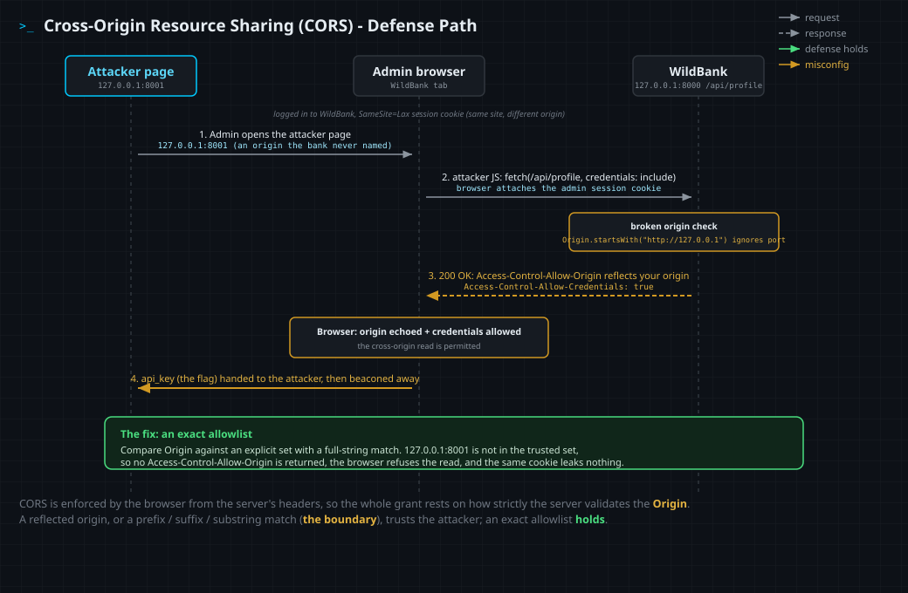

<!--
  Translation bar (added in the translation phase - D1/D10):
  English (this file)

  Writing style: no em dashes in prose. Use commas, colons, parentheses, or hyphens.
-->

# Cross-Origin Resource Sharing (CORS)

`Defense: Cross-Origin Resource Sharing (server-controlled cross-origin access)` · Web Vulnerability Knowledge Base

## Summary

Cross-Origin Resource Sharing (CORS) is the controlled way to relax the Same-Origin
Policy. The Same-Origin Policy (SOP) blocks one origin from reading another origin's
responses; CORS is the protocol a server uses to **opt specific origins back in** by
returning a small set of `Access-Control-*` response headers that tell the browser
"this named origin is allowed to read me." Done correctly it is a precise, allowlist
based grant: only the origins you name can read, and credentialed access is given only
to exact origins. Done carelessly it is the single most common way teams hand an
attacker the very data SOP was protecting. CORS is enforced by the **browser**, not the
server: the server only emits headers, and the browser decides, from those headers,
whether to reveal the response to the calling script. The whole security of CORS lives
in one decision: how strictly the server validates the request's `Origin`.

## What it protects against

CORS, used correctly, is what lets you share an API across origins **without** reaching
for the dangerous alternatives that expose everything: a blanket `Access-Control-Allow-Origin: *`
on authenticated data, a reflected `Origin` with credentials, a JSONP endpoint, or
turning SOP off in the browser. It protects against **over-permissive cross-origin
sharing**: instead of "any site may read this," a correct CORS policy says "only
`https://app.example.com` may read this, and only it may read it with credentials."

Put another way, the threat CORS addresses is **cross-origin data theft through a too
wide sharing rule**. The attacker's goal is to get the victim's browser to read an
authenticated cross-origin response (an account profile, an API key, a CSRF token) and
hand it back. A tight CORS allowlist denies that read to every origin except the ones
you trust, so the attacker's page, served from an origin you never named, is refused
the response by the browser even though the request was sent with the victim's cookies.

## How it works

When a script makes a cross-origin request, the browser adds an `Origin` header naming
the calling site. The server inspects that `Origin` and, if it chooses to grant access,
echoes back CORS headers. The browser reads those headers and decides whether to let the
calling script see the response. The full header set:

| Header | Direction | What it controls |
|---|---|---|
| `Access-Control-Allow-Origin` (ACAO) | response | Which origin may read the response. Either `*` or **one** echoed origin (never a list). |
| `Access-Control-Allow-Credentials` (ACAC) | response | If `true`, the browser exposes a response made with cookies/credentials. Requires an **exact** origin, never `*`. |
| `Access-Control-Allow-Methods` | preflight response | Which HTTP methods the actual request may use. |
| `Access-Control-Allow-Headers` | preflight response | Which request headers the actual request may send. |
| `Access-Control-Expose-Headers` | response | Which **response** headers the script may read (beyond the safelisted ones). |
| `Access-Control-Max-Age` | preflight response | How long the browser may cache the preflight result. |
| `Vary: Origin` | response | Tells caches the response depends on `Origin`, so a grant for one origin is not served to another. |

### Simple requests vs preflighted requests

Not every cross-origin request is checked the same way:

- A **simple request** (method `GET`, `HEAD`, or `POST`; only CORS-safelisted headers;
  a `Content-Type` of `application/x-www-form-urlencoded`, `multipart/form-data`, or
  `text/plain`) is sent straight to the server. The browser applies CORS only when
  deciding whether the **response** may be read.
- A **preflighted request** (any other method such as `PUT`/`DELETE`/`PATCH`, any custom
  header, or a `Content-Type` like `application/json`) triggers an automatic `OPTIONS`
  **preflight** first. The browser sends `Access-Control-Request-Method` and
  `Access-Control-Request-Headers`; the server must answer with matching
  `Access-Control-Allow-Methods` and `Access-Control-Allow-Headers` (and may cache the
  answer with `Access-Control-Max-Age`). Only if the preflight is approved does the real
  request go out.

### Credentialed requests and the wildcard rule

By default a cross-origin `fetch` sends **no** cookies. A request opts into credentials
with `fetch(url, { credentials: 'include' })` (or `XMLHttpRequest.withCredentials`). For
the browser to reveal a credentialed response, the server must return
`Access-Control-Allow-Credentials: true` **and** an `Access-Control-Allow-Origin` that
names the **exact** caller origin. The combination `Access-Control-Allow-Origin: *` with
credentials is **invalid**: the browser refuses to expose the response. This rule is the
reason a server that wants credentialed sharing must echo a specific origin, which is
exactly where origin validation gets sloppy.

### The policy matrix (all the cases)

| ACAO returned | ACAC | Anonymous read | Credentialed read | Verdict |
|---|---|---|---|---|
| *(no header)* | - | **blocked** | **blocked** | SOP default, nothing shared |
| `*` | *(absent)* | allowed (public) | **blocked** (`*` invalid with credentials) | safe for public, non-credentialed data only |
| exact origin, echoed | *(absent)* | allowed for that origin | **blocked** (no ACAC) | safe public sharing with a named origin |
| exact origin, from an **allowlist** | `true` | (n/a) | allowed for allowlisted origins only | the correct credentialed pattern |
| **reflected** (any `Origin` echoed) | `true` | any site | **any site** | misconfiguration: SOP effectively off |
| `null` | `true` | a null-origin context | a null-origin context | misconfiguration: any sandboxed iframe qualifies |

The last two rows are where CORS becomes a vulnerability. Reflecting whatever `Origin`
arrives turns the allowlist into "everyone." Trusting the literal `null` origin looks
harmless but any attacker can produce a `null` origin on demand (a sandboxed
`<iframe sandbox="allow-scripts">`, a `data:` document, some redirect chains), so
`Access-Control-Allow-Origin: null` with credentials is readable by an attacker too.

### Where validation goes wrong

Because a credentialed grant must echo one specific origin, servers compare the incoming
`Origin` against an allowlist, and the comparison is where the bug lives. Anything other
than an **exact, full-string match** is bypassable:

- **Reflecting** the `Origin` with no check at all: every origin is trusted.
- **Prefix match** (`origin.startsWith("https://app.example")`): `https://app.example.evil.com`
  passes. A prefix match that also ignores the **port** trusts a different origin on the
  same host.
- **Suffix match** (`origin.endsWith("example.com")`): `https://evilexample.com` and
  `https://example.com.attacker.net` pass.
- **Substring / unanchored regex** (`"example.com" in origin`): `https://example.com.attacker.net`
  passes.

The fix for all of these is the same: compare the `Origin` against an explicit set with
an exact match, return the origin only on a hit, and add `Vary: Origin`.

## Mechanism



1. The victim is logged in to the bank, holding a session cookie, and opens the
   attacker's page on an origin the bank never intended to trust.
2. The attacker's script issues a credentialed cross-origin `fetch` to the bank's
   profile API. The browser sends it and attaches the victim's cookie.
3. The bank means to allow only its own dashboard, but validates the `Origin` with a
   broken check (a prefix match that ignores the port), so it reflects the attacker's
   origin into `Access-Control-Allow-Origin` and sets `Access-Control-Allow-Credentials: true`.
4. Boundary (amber): the browser, seeing its own origin echoed with credentials allowed,
   hands the authenticated response (the API key) to the attacker's script, which
   beacons it away.
5. Defense (green): an **exact allowlist** would not have matched the attacker's origin.
   The browser would refuse the read, and the same request, with the same cookie, leaks
   nothing.

## Configure it safely

The CORS grant is only as strong as the origin check behind it. Each example contrasts a
**dangerous** check (reflecting the origin, or a prefix/suffix/substring match that an
attacker can satisfy) with a **safe** one (exact membership in an explicit allowlist,
plus `Vary: Origin`). Never pair credentials with `*` or with a reflected origin.

<details open><summary><b>Python (Flask, flask-cors)</b></summary>

**Without (dangerous)**
```python
# DANGEROUS: reflects the caller's Origin if it merely STARTS WITH a trusted string,
# so https://app.example.com.evil.net (and any port on the host) passes the check.
origin = request.headers.get("Origin", "")
if origin.startswith("https://app.example.com"):
    resp.headers["Access-Control-Allow-Origin"] = origin
    resp.headers["Access-Control-Allow-Credentials"] = "true"
```
**With (safe)**
```python
from flask_cors import CORS
# SAFE: exact allowlist; only these origins may read credentialed responses.
CORS(app, resources={r"/api/*": {"origins": ["https://app.example.com"]}},
     supports_credentials=True)   # flask-cors adds Vary: Origin for you
```
Docs: https://flask-cors.readthedocs.io/en/latest/
</details>

<details><summary><b>JavaScript (Express, cors)</b></summary>

**Without (dangerous)**
```javascript
// DANGEROUS: a suffix test, so https://evil-app.example.com passes.
app.use(cors({
  origin: (o, cb) => cb(null, !o || o.endsWith("app.example.com")),
  credentials: true,
}));
```
**With (safe)**
```javascript
const cors = require("cors");
const ALLOW = new Set(["https://app.example.com"]);
app.use(cors({
  origin: (o, cb) => cb(null, !o || ALLOW.has(o)),   // exact membership
  credentials: true,
}));
```
Docs: https://expressjs.com/en/resources/middleware/cors.html
</details>

<details><summary><b>TypeScript (Express, cors)</b></summary>

**Without (dangerous)**
```typescript
// DANGEROUS: unanchored substring test, so https://app.example.com.attacker.net passes.
app.use(cors({
  origin: (o, cb) => cb(null, !o || o.includes("app.example.com")),
  credentials: true,
}));
```
**With (safe)**
```typescript
import cors, { CorsOptions } from "cors";
const allow = new Set(["https://app.example.com"]);
const options: CorsOptions = {
  origin: (o, cb) => cb(null, !o || allow.has(o)),   // exact membership
  credentials: true,
};
app.use(cors(options));
```
Docs: https://expressjs.com/en/resources/middleware/cors.html
</details>

<details><summary><b>PHP</b></summary>

**Without (dangerous)**
```php
// DANGEROUS: reflects whatever Origin arrives, with credentials. Any site can read.
header("Access-Control-Allow-Origin: " . ($_SERVER['HTTP_ORIGIN'] ?? ''));
header("Access-Control-Allow-Credentials: true");
```
**With (safe)**
```php
$allow  = ['https://app.example.com'];               // exact allowlist
$origin = $_SERVER['HTTP_ORIGIN'] ?? '';
if (in_array($origin, $allow, true)) {
    header("Access-Control-Allow-Origin: $origin");
    header("Access-Control-Allow-Credentials: true");
    header("Vary: Origin");                            // cache safety
}
```
Docs: https://developer.mozilla.org/en-US/docs/Web/HTTP/Guides/CORS
</details>

<details><summary><b>Java (Spring)</b></summary>

**Without (dangerous)**
```java
// DANGEROUS: a wildcard PATTERN reflects the Origin, paired with credentials.
config.addAllowedOriginPattern("https://*.example.com");
config.setAllowCredentials(true);   // *.example.com also matches evil.example.com subdomains
```
**With (safe)**
```java
// SAFE: explicit, fully qualified origins; credentials only for those.
config.setAllowedOrigins(List.of("https://app.example.com"));
config.setAllowCredentials(true);
```
Docs: https://docs.spring.io/spring-framework/reference/web/webmvc-cors.html
</details>

<details><summary><b>Ruby (Rack::Cors)</b></summary>

**Without (dangerous)**
```ruby
# DANGEROUS: an unanchored regex matches app.example.com.attacker.net too.
allow do
  origins(/app\.example\.com/)
  resource "*", headers: :any, credentials: true
end
```
**With (safe)**
```ruby
allow do
  origins "https://app.example.com"             # exact string, explicit allowlist
  resource "/api/*", headers: :any, credentials: true
end
```
Docs: https://github.com/cyu/rack-cors
</details>

<details><summary><b>Go (rs/cors)</b></summary>

**Without (dangerous)**
```go
// DANGEROUS: HasPrefix lets https://app.example.com.evil.net through, credentials on.
c := cors.New(cors.Options{
    AllowOriginFunc:  func(o string) bool { return strings.HasPrefix(o, "https://app.example.com") },
    AllowCredentials: true,
})
```
**With (safe)**
```go
c := cors.New(cors.Options{
    AllowedOrigins:   []string{"https://app.example.com"},   // exact allowlist
    AllowCredentials: true,
})
```
Docs: https://github.com/rs/cors
</details>

<details><summary><b>C# (ASP.NET Core)</b></summary>

**Without (dangerous)**
```csharp
// DANGEROUS: predicate accepts any origin ending in the domain, with credentials.
policy.SetIsOriginAllowed(o => o.EndsWith("example.com"))
      .AllowAnyHeader().AllowCredentials();
```
**With (safe)**
```csharp
policy.WithOrigins("https://app.example.com")    // exact allowlist
      .AllowAnyHeader().AllowCredentials();
```
Docs: https://learn.microsoft.com/en-us/aspnet/core/security/cors
</details>

## Demonstration lab

The lab in [`lab/`](lab/) lets you **see and probe every CORS policy**, then exploits the
one misconfiguration that hands over the data.

```bash
cd lab
docker compose up --build      # build once, then runs offline
# bank (victim):   http://127.0.0.1:8000
# attacker panel:  http://127.0.0.1:8001
```

The two ports are **different origins** (so the browser applies CORS between them) but
the **same site** (so the bank's `SameSite=Lax` session cookie still rides a credentialed
cross-origin request, no `SameSite=None` needed).

**Policy playground.** The bank exposes one endpoint per CORS policy. From the console
you fire a cross-origin read at each, with credentials on or off, and watch which reads
the browser permits:

- `/api/no-cors` returns no CORS headers, so the read is **blocked** (SOP).
- `/api/wildcard` returns `Access-Control-Allow-Origin: *`, so an anonymous read is
  **allowed** but a credentialed read is **blocked** (the wildcard-plus-credentials rule).
- `/api/exact` echoes one named partner origin that is **not** your console, so your read
  is **blocked**: an exact allowlist working.
- `/api/preflight` requires a custom header, so the browser sends an `OPTIONS` preflight
  first; the response carries `Access-Control-Allow-Methods`, `-Allow-Headers`, `-Max-Age`,
  and (because it echoes your exact origin) `-Allow-Credentials`, and the GET exposes a
  header via `-Expose-Headers`. Both a plain and a credentialed read are **allowed**: the
  correct credentialed pattern behind a preflight.
- `/api/null-origin` trusts the literal `null` origin with credentials; a sandboxed
  iframe (whose origin is `null`) can read it.

**Challenge.** `/api/profile` holds the admin's API key. The bank means to share it only
with its own dashboard, but it validates the `Origin` with a **prefix match that ignores
the port**, so it wrongly trusts your console origin too, reflects it, and allows
credentials. You hold no admin session; the logged-in admin bot opens any page you host.
Write a credentialed cross-origin `fetch` to `/api/profile`, read `api_key`, beacon it to
your collector, and deliver the page to the admin. The captured key is the **MD5 flag**;
submit it. The flag rotates on every restart.

## Limitations (what it does not stop)

- **It is only as strong as the origin check.** A reflected origin, or a prefix / suffix
  / substring / unanchored-regex match, defeats the whole point. Compare against an
  explicit allowlist with an exact match.
- **`null` is not a safe value to trust.** Any attacker can produce a `null` origin
  (sandboxed iframe, `data:` document). Never allowlist `null`, especially with
  credentials.
- **A wildcard does not protect authenticated data.** `Access-Control-Allow-Origin: *`
  is fine for genuinely public resources, but it must never be paired with credentials,
  and it should not sit in front of anything that varies by user.
- **CORS does not stop the request, only the read.** Like SOP, it lets the request be
  sent (cookies and all); it only governs whether the calling script may read the
  response. It is not a defense against CSRF, which abuses the **send**. Pair it with
  `SameSite` cookies and anti-CSRF tokens.
- **It does not survive XSS.** Script injected into a trusted origin is same-origin and
  reads the response directly, no CORS grant required. Output encoding and CSP are what
  stop that.
- **It is not authentication or authorization.** CORS decides which origin may read a
  response; it never replaces a server-side check that the caller is allowed the data.

## References

- MDN - Cross-Origin Resource Sharing (CORS): https://developer.mozilla.org/en-US/docs/Web/HTTP/Guides/CORS
- OWASP - CORS OriginHeaderScrutiny / misconfiguration: https://owasp.org/www-community/attacks/CORS_OriginHeaderScrutiny
- PortSwigger Web Security Academy - CORS: https://portswigger.net/web-security/cors
- W3C / WHATWG Fetch - CORS protocol: https://fetch.spec.whatwg.org/#http-cors-protocol
- MDN - Access-Control-Allow-Origin: https://developer.mozilla.org/en-US/docs/Web/HTTP/Reference/Headers/Access-Control-Allow-Origin
